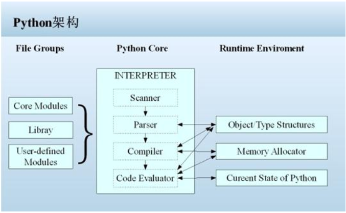

# 初识Python

## Python简介

### 1、发展历史
1. 1989年圣诞节：Guido von Rossum开始写Python语言的编译器。
2. 1991年2月：第一个Python编译器（同时也是解释器）诞生，它是用C语言实现的（后面），可以调用C语言的库函数。在最早的版本中，Python已经提供了对“类”，“函数”，“异常处理”等构造块的支持，还有对列表、字典等核心数据类型，同时支持以模块为基础来构造应用程序。
3. 1994年1月：Python 1.0正式发布。
4. 2000年10月16日：Python 2.0发布，增加了完整的[垃圾回收](https://zh.wikipedia.org/wiki/%E5%9E%83%E5%9C%BE%E5%9B%9E%E6%94%B6_(%E8%A8%88%E7%AE%97%E6%A9%9F%E7%A7%91%E5%AD%B8))，提供了对[Unicode](https://zh.wikipedia.org/wiki/Unicode)的支持。与此同时，Python的整个开发过程更加透明，社区对开发进度的影响逐渐扩大，生态圈开始慢慢形成。
5. 2008年12月3日：Python 3.0发布，它并不完全兼容之前的Python代码，不过因为目前还有不少公司在项目和运维中使用Python 2.x版本，所以Python 3.x的很多新特性后来也被移植到Python 2.6/2.7版本中。

目前我们使用的Python 3.7.x的版本是在2018年发布的，Python的版本号分为三段，形如A.B.C。其中A表示大版本号，一般当整体重写，或出现不向后兼容的改变时，增加A；B表示功能更新，出现新功能时增加B；C表示小的改动（例如：修复了某个Bug），只要有修改就增加C。如果对Python的历史感兴趣，可以阅读名为[《Python简史》](http://www.cnblogs.com/vamei/archive/2013/02/06/2892628.html)的博文。

### 2、Python的优缺点

Python的优点很多，简单的可以总结为以下几点。

1. 简单和明确，做一件事只有一种方法。
2. 学习曲线低，跟其他很多语言相比，Python更容易上手。
3. 开放源代码，拥有强大的社区和生态圈。
4. 解释型语言，天生具有平台可移植性。
5. 对两种主流的编程范式（面向对象编程和函数式编程）都提供了支持。
6. 可扩展性和可嵌入性，例如在Python中可以调用C/C++代码。
7. 代码规范程度高，可读性强，适合有代码洁癖和强迫症的人群。

Python的缺点主要集中在以下几点。

1. 执行效率稍低，因此计算密集型任务可以由C/C++编写。
2. 代码无法加密，但是现在很多公司都不销售卖软件而是销售服务，这个问题会被弱化。
3. 在开发时可以选择的框架太多（如Web框架就有100多个），有选择的地方就有错误。

### 3、Python的应用领域

目前Python在Web应用开发、云基础设施、DevOps、网络数据采集（爬虫）、数据分析挖掘、机器学习等领域都有着广泛的应用，因此也产生了Web后端开发、数据接口开发、自动化运维、自动化测试、科学计算和可视化、数据分析、量化交易、机器人开发、自然语言处理、图像识别等一系列相关的职位。

## Python安装

如果只安装Pytohn环境的话选择官方提供的用C语言实现的CPython解释器

但是学习的话推荐安装[Anaconda](https://www.anaconda.com/products/individual)这个软件，里面集成了很多工具，包括Python、conda、jupyter、jupyterLab等，我就是比较喜欢这样的集成工具，使用起来比较方便，最主要的是可以切换不同的环境

Anaconda软件傻瓜式安装,疯狂下一步即可,只是里面的工具很多,使用的时候需要多百度和google  
安装好Anaconda就相当于你安装好了Python,它包含Python解释器和它的核心库

## Python架构

## Python开发工具

PyCharm - Python开发神器，跟Intellij IDEA一个爹，使用起来很顺手

PyCharm的安装、配置和使用在[《玩转PyCharm》](../玩转PyCharm.md)进行了介绍，有兴趣的读者可以选择阅读。  

PyCharm专业版的话需要自行破解，网上教程很多，我用的是[无限重置30天免费使用期限的插件](https://zhishiku.casstime.com/pages/viewpage.action?pageId=69709908)这个软可以破解JetBrains全家桶
