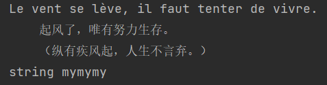
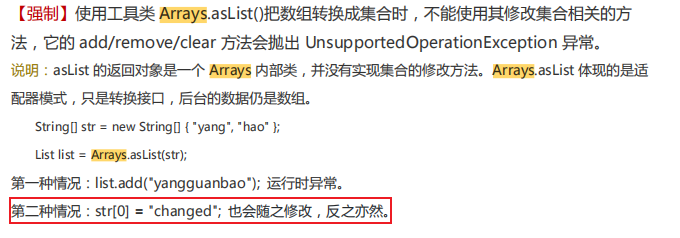

# 标准数据类型

::: tip Tip：

 在 Python 中，变量就是变量，它没有类型，我们所说的"类型"是变量所指的内存中对象的类型。

:::

**Python 中有六个标准的数据类型：**

1. Number（数字）
2. String（字符串）
3. List（列表）
4. Tuple（元组）
5. Set（集合）
6. Dictionary（字典）

**Python3 的六个标准数据类型中：**
- 不可变数据（3 个）：Number（数字）、String（字符串）、Tuple（元组） 
- 可变数据（3 个）：List（列表）、Dictionary（字典）、Set（集合）

## Numbers（数字）
Python3 支持 int、float、bool、complex（复数）

内置的 type() 和 isinstance() 函数可以用来查询变量所指的对象类型

::: tip Tip：

在 Python2 中是没有布尔型的，它用数字 0 表示 False，用 1 表示 True。到 Python3 中，把 True 和 False 定义成关键字了，但它们的值还是 1 和 0，它们可以和数字相加

:::

```python
a, b, c, d = 20, 5.5, True, 4+3j;
print(type(a), type(b), type(c), type(d))
```

`<class 'int'> <class 'float'> <class 'bool'> <class 'complex'>`


```python
a=111.11
isinstance(a,int)
```

`False`


```python
a=111
isinstance(a,int)
```

`True`


==**isinstance和type的区别：**==

- type() 不会认为子类是一种父类类型  

- isinstance() 会认为子类是一种父类类型


```python
class A:
    pass

'''
Python中的继承，这里B是A的子类
'''
class B(A):
    pass
```


```python
isinstance(A(),A)
```

`True`


```python
isinstance(B(), A)
```

`True`


```python
type(B()) == A
```

`False`


### 创建Number对象
当你指定一个值时，Number 对象就会被创建


```python
var = 1.0
var_a = 1
var_b = 10
```

### 删除对象引用
对象只能由垃圾回收器回收，我们能删除的只是引用


```python
del var  # 删除单个引用
del var_a, var_b  # 同时删除多个引用
```

### 数值运算


```python
5 + 4  # 加法

4.3 - 2 # 减法

3 * 7  # 乘法

2 / 4  # 除法，得到一个浮点数

2 // 4 # 除法，得到一个整数

17 % 3 # 取余 

2 ** 5 # 乘方

```

### 注意

1. Python 可以同时为多个变量赋值，如 a, b = 1, 2  
2. 一个变量可以通过赋值指向不同类型的对象。
3. 数值的除法（/）总是返回一个浮点数，要获取整数使用//操作符。
4. 在混合计算时，Python 会把整型转换成为浮点数。

**验证：**


```python
a, b = 1, 2
print(a)
print(b)
```

`1`

`2`

```python
var = A()
var = B()
type(var)
```

`__main__.B`


```python
4/4
```

`1.0`


```python
4//5
```

`0`


## String（字符串）

### 字符串赋值
Python 中的字符串 str 用单引号(' ')或双引号 (" ") 括起来，同时使用反斜杠 (\) 转义特殊字符


```python
answer = 'Yes,he doesn\'t'
print(answer, type(answer), len(answer))
```

`Yes,he doesn't <class 'str'> 14`


### 字符串的格式化输出
如果你**不想让反斜杠发生转义**，可以在字符串前面添加一个 r，表示原始字符串


```python
print('C:\some\name\n')
print(r'C:\some\name')
```

`C:\some`

`ame`


`C:\some\name`


**带有运算的格式化输出**


```python
a, b = 5, 10
print('%d * %d = %d' % (a, b, a * b))
```

`5 * 10 = 50`


或者用字符串提供的方法来完成字符串的格式


```python
a, b = 5, 10
print('{0} * {1} = {2}'.format(a, b, a * b))
```

`5 * 10 = 50`


Python 3.6以后，格式化字符串还有更为简洁的书写方式，就是在字符串前加上字母`f`，我们可以使用下面的**语法糖**来简化上面的代码


```python
a, b = 5, 15
print(f'{a} * {b} = {a * b}')
```

`5 * 15 = 75`


### 字符串拼接
另外，反斜杠可以作为续行符，表示下一行是上一行的延续。还可以使用"""..."""或者'''...'''跨越多行。
字符串可以使用 + 运算符串连接在一起，或者用 * 运算符重复


```python
# 字符串跨多行
str2 = '''Le vent se lève, il faut tenter de vivre. 
起风了，唯有努力生存。
（纵有疾风起，人生不言弃。）'''
print(str2)
print('str'+'ing', 'my'*3)
```



### 字符串成员运算

可以使用`in`和`not in`来判断一个字符串是否包含另外一个字符串（成员运算


```python
str1 = 'hello ' * 3
print(str1) 
str2 = 'world'
str1 += str2
print(str1) 
print('ll' in str1) 
print('good' not in str1) 
```

`hello hello hello `

`hello hello hello world`

`True`

`True`


### 字符串索引
Python 中的字符串有两种索引方式，第一种是从左往右，从 0 开始依次增加；第二种是从右往左，从 -1 开始依次减少。   
<font color="red">注意：</font>没有单独的字符类型，一个字符就是长度为 1 的字符串


```python
word = 'Python'
print(word[0], word[5])
print(word[-1], word[-6])
```

`P n`

`n P`


### 字符串切片
还可以对字符串进行切片，获取一段子串。用冒号分隔两个索引，形式为变量[头下标:尾下标]  
截取的范围是<font color="red" size=5>左闭右开</font>的，并且两个索引都可以省略(代表截取整个字符串)


```python
word = 'ilovepython'
print(word[1:5])
print(word[:])
print(word[5:])
print(word[-10:-6])
```

`love`

`ilovepython`

`python`

`love`


### 字符串的常用处理


```python
str1 = 'hello, world!'
```

**1. 通过内置函数len计算字符串的长度**


```python
print(len(str1)) 
```

`13`

**2. 获得字符串首字母大写的拷贝**


```python
print(str1.capitalize())
```

`Hello, world!`

**3. 获得字符串每个单词首字母大写的拷贝**


```python
print(str1.title())
```

`Hello, World!`

**4. 获得字符串变大写后的拷贝**


```python
print(str1.upper())
```

`HELLO, WORLD!`

**5. 从字符串中查找子串所在位置**


```python
print(str1.find('or'))
print(str1.find('shit'))
```

`8`

`-1`


**6. 与find类似但找不到子串时会引发异常**


```python
print(str1.index('or'))
print(str1.index('shit'))
```

    8
    ---------------------------------------------------------------------------
    
    ValueError                                Traceback (most recent call last)
    
    <ipython-input-90-751eec63acd1> in <module>
          1 print(str1.index('or'))
    ----> 2 print(str1.index('shit'))
    ValueError: substring not found


**7. 检查字符串是否以指定的字符串开头**


```python
print(str1.startswith('He'))
print(str1.startswith('hel'))
```

`False`

`True`

**8. 检查字符串是否以指定的字符串结尾**


```python
print(str1.endswith('!'))
```

`True`


**9. 将字符串以指定的宽度居中并在两侧填充指定的字符**


```python
print(str1.center(50, '*'))
```

`******************hello, world!*******************`

**10. 将字符串以指定的宽度靠右放置左侧填充指定的字符**


```python
print(str1.rjust(50, '-'))
```

`-------------------------------------hello, world!`


**11. 检查字符串是否由数字构成**


```python
str2 = 'abc123456'
print(str2.isdigit())
```

`False`


**12. 检查字符串是否以字母构成**


```python
print(str2.isalpha()) 
```

`False`

**13. 检查字符串是否以数字和字母构成**


```python
print(str2.isalnum())
```

`True`


**14. 获得字符串修剪左右两侧空格之后的拷贝**


```python
str3 = '  jackfrued@126.com '
print(str3.strip())
```

`jackfrued@126.com`


与 C 语言中的字符串不同的是，Python 字符串不能被改变（这一点跟Java是一样的）。向一个索引位置赋值，比如 word[0] = 'm' 会导致错误

### 注意

1. 反斜杠可以用来转义，使用 r 可以让反斜杠不发生转义
2. 字符串可以用 + 运算符连接在一起，用 * 运算符重复
3. Python 中的字符串有两种索引方式，从左往右以 0 开始，从右往左以 -1 开始
4. Python 中的字符串不能改变

## List（列表）
List（列表） 是 Python 中使用最频繁的数据类型

列表是写在方括号之间、用逗号分隔开的元素列表。列表中元素的类型可以不相同


```python
list_a = ['him', 25, 100, 'her']
print(a)
```

`5`


### 列表的切片
和字符串一样，列表同样可以被索引和切片，列表被切片后返回一个包含所需元素的新列表


```python
list_a = [1, 2, 3, 4, 5]
print(list_a[0:3])
print(list_a[:])
print(list_a[-2:-1])
print(list_a[-2:])
```

`[1, 2, 3]`

`[1, 2, 3, 4, 5]`

`[4]`

`[4, 5]`


### 列表的拼接


```python
list_comb = list_a + [6, 7, 8]
print(list_comb)
```

`[1, 2, 3, 4, 5, 6, 7, 8]`


### 对列表的增删改查
与 Python 字符串不一样的是，列表中的元素是可以改变的，List 内置了有很多方法，例如 append()、pop() 等


```python
fruits = ['grape', 'apple', 'strawberry', 'waxberry']
fruits += ['pitaya', 'pear', 'mango']
```

**1. 列表切片实现截取、删除**


```python
fruits2 = fruits[1:4]
print(fruits2) 
```

`['apple', 'strawberry', 'waxberry']`


**2. 列表切片实现删除**


```python
fruits[4:] = []
print(fruits)
```

`['grape', 'apple', 'strawberry', 'waxberry']`


**3. 可以通过完整切片操作来复制列表**


```python
fruits3 = fruits[:]
print(fruits3)
fruits4 = fruits[-3:-1]
print(fruits4)
```

`['grape', 'apple', 'strawberry', 'waxberry']`

`['apple', 'strawberry']`


**4. 可以通过反向切片操作来获得倒转后的列表的拷贝**


```python
fruits5 = fruits[::-1]
print(fruits5)
```

`['waxberry', 'strawberry', 'apple', 'grape']`


### 列表的遍历

**1. 通过循环用下标遍历列表元素**


```python
list_a = ['tomcat1', 'tomcat2', 'tomcat3']
for index in range(len(list_a)):
    print(list_a[index])
```

`tomcat1`

`tomcat2`

`tomcat3`

**2. 通过for循环遍历列表元素**


```python
for elem in list_a:
    print(elem)
```

`tomcat1`

`tomcat2`

`tomcat3`


**3. 通过enumerate函数处理列表之后再遍历可以同时获得元素索引和值**


```python
for index, elem in enumerate(list_a):
    print(index, elem)
```

`0 tomcat1`

`1 tomcat2`

`2 tomcat3`


### 列表的排序


```python
list1 = ['orange', 'apple', 'zoo', 'internationalization', 'blueberry']
```

**1. sorted函数返回列表排序后的拷贝<font color=red>不会修改传入的列表</font>，函数的设计就应该像sorted函数一样尽可能不产生副作用**


```python
list2 = sorted(list1)
print(list1)
print(list2)
```

`['orange', 'apple', 'zoo', 'internationalization', 'blueberry']`

`['apple', 'blueberry', 'internationalization', 'orange', 'zoo']`


**2. 通过key关键字参数指定根据字符串长度进行排序而不是默认的字母表顺序**


```python
list3 = sorted(list1, key=len)
print(list3)
```

`['zoo', 'apple', 'orange', 'blueberry', 'internationalization']`


**3. 列表元素反转**(<font color=red>先自然排序后再进行顺序的反转</font>)


```python
list4 = sorted(list1, reverse=True)
print(list4)
```

`['zoo', 'orange', 'internationalization', 'blueberry', 'apple']`


**4. 给列表对象发出排序消息直接在列表对象上进行排序**


```python
list1.sort()
print(list1)

list1.sort(reverse=True)
print(list1)
```

`['apple', 'blueberry', 'internationalization', 'orange', 'zoo']`

`['zoo', 'orange', 'internationalization', 'blueberry', 'apple']`


### 注意
1. List 写在方括号之间，元素用逗号隔开
2. 和字符串一样，List 可以被索引和切片
3. List 可以使用 + 操作符进行拼接
4. List 中的元素是可以改变的

## Tuple（元组）
元组（tuple）与列表类似，不同之处在于<font color="red" size=3>元组的元素不能修改</font>。元组写在小括号里，元素之间用逗号隔开,元组中的元素类型也可以不相同

### 元组的构造

以小括号包裹元素的方式直接赋值, 构造包含 0 个或 1 个元素的 tuple 是个特殊的问题，所以有一些额外的语法规则


```python
tuple_a = (1991, 2014, 'physics', 'math')
print(tuple_a, type(tuple_a), len(tuple_a))

tup_b = () # 空元组
tup_c = (20,) # 一个元素，需要在元素后添加逗号
```

`(1991, 2014, 'physics', 'math') <class 'tuple'> 4`


```python
tuple_a[0] = 11  # 修改元组元素的操作是非法的
```


    ---------------------------------------------------------------------------
    
    TypeError                                 Traceback (most recent call last)
    
    <ipython-input-53-d4249f7271ce> in <module>
    ----> 1 tuple_a[0] = 11  # 修改元组元素的操作是非法的
    
    TypeError: 'tuple' object does not support item assignment


虽然 tuple 的元素不可改变，但它可以包含可变的对象，比如 list 列表  


```python
list_a = [1, "2", 3, True]
tuple_d = (list_a,)
print(tuple_d)
list_a[3] = False
print(tuple_d)
```

`([1, '2', 3, True],)`

`([1, '2', 3, False],)`


### 元组的切片

元组与字符串类似，可以被索引且下标索引从 0 开始，也可以进行截取/切片

其实，可以把字符串看作一种特殊的元组


```python
tuple_a = (1991, 2014, 'physics', 'math')
print(tuple_a[:])
print(tuple_a[0:2])
print(tuple_a[1:-2])
print(tuple_a[3:-1])
```

`(1991, 2014, 'physics', 'math')`

`(1991, 2014)`

`(2014,)`

`()`


### 元组的拼接

元组也支持用 + 操作符  
思考：底层只是重新创建了一个元组？


```python
tup1, tup2 = (1, 2, 3), (4, 5, 6)
print(tup1+tup2)
```

`(1, 2, 3, 4, 5, 6)`


### 注意
1. string、list 和 tuple 都属于 sequence（顺序表，都可以直接索引元素）。
2. 与字符串一样，元组的元素不能修改。
3. 元组也可以被索引和切片，方法一样。
4. 注意构造包含 0 或 1 个元素的元组的特殊语法规则。
5. 元组也可以使用 + 操作符进行拼接。

## Sets（集合）
集合（set）是一个无序不重复元素的集，基本功能是进行成员关系测试和消除重复元素。

### 集合的创建
可以使用大括号 或者 set() 函数创建 set 集合，注意：创建一个空集合必须用 set() 而不是 { }，因为{ }是用来创建一个空字典的


```python
student = {'Tom', 'Jim', 'Mary', 'Tom', 'Jack', 'Rose'}
print(student)   # 重复的元素被自动去掉
judge= 'Rose' in student  # membership testing（成员测试）
print(judge)
```

`{'Jack', 'Tom', 'Rose', 'Mary', 'Jim'}`

`True`


### 集合的运算


```python
set_a = set('abracadabra')
set_b = set('alacazam')

print(set_a)
print(set_b)
```

`{'b', 'd', 'c', 'a', 'r'}`

`{'z', 'c', 'a', 'm', 'l'}`


**差集运算用 "-" 号**


```python
set_c = set_a - set_b
print(set_c)
```

`{'b', 'd', 'r'}`

```python
set_c = set_b - set_a
print(set_c)
```

`{'m', 'z', 'l'}`


**并集运算用 "|"**


```python
set_c = set_a | set_b
print(set_c)
```

`{'z', 'b', 'd', 'c', 'a', 'm', 'l', 'r'}`


**交集运算用 "&"**


```python
set_c = set_a & set_b
print(set_c)
```

`{'a', 'c'}`


**交集的补集用 "^"** ——set_a和set_b中不同时存在的元素


```python
set_c = set_a ^ set_b
print(set_c)
```

`{'z', 'b', 'r', 'm', 'd', 'l'}`


## Dictionaries（字典）
字典（dictionary）是 Python 中另一个非常有用的内置数据类型。

字典是一种映射类型（mapping type），它是一个**无序的** 键 : 值对集合。

关键字必须使用不可变类型，也就是说：list 和包含可变类型的 tuple 不能做关键字。

在同一个字典中，关键字还必须互不相同

### 字典的创建


```python
dic_empty = {}  # 创建空字典
print(dic_empty)
dic_a = {'Jack':1557, 'Tom':1320, 'Rose':1886}
print(dic_a)
```

`{}`

`{'Jack': 1557, 'Tom': 1320, 'Rose': 1886}`

**构造函数 dict()**  

构造函数 dict() 可直接从键值对 sequence 中构建字典，当然也可以进行推导


```python
dic_b = dict([('sape', 4139), ('guido', 4127), ('jack', 4098)])
print(dic_b)
```

`{'sape': 4139, 'guido': 4127, 'jack': 4098}`

```python
dic_c = dict(sape=4139, guido=4127, jack=4098)
print(dic_c)
```

`{'sape': 4139, 'guido': 4127, 'jack': 4098}`


**推导**


```python
dic_d = {x: x**2 for x in (2, 4, 6)}
print(dic_d)
```

`{2: 4, 4: 16, 6: 36}`


### 字典的操作

**主要的操作：通过key查询**


```python
dic_val = dic_a['Jack']
print(dic_val)
```

`1557`


**删除一个键值对**


```python
del dic_a['Rose']
print(dic_a)
```

`{'Jack': 1557, 'Tom': 1320}`


**添加一个键值对**


```python
dic_a['Mary'] = 4127  # 添加一个键值对
print(dic_a)
```

`{'Jack': 1557, 'Tom': 1320, 'Mary': 4127}`


**返回所有 key 组成的 list**


```python
dic_val_list = list(dic_a.keys())
print(dic_val_list)
```

`['Jack', 'Tom', 'Mary']`


**按key排序**


```python
sorted(dic_a.keys())
print(dic_a)
```

`{'Jack': 1557, 'Tom': 1320, 'Mary': 4127}`


**成员测试**


```python
print('Tom' in dic_a)
print('Mary' not in dic_a)
```

`True`

`False`


另外，字典类型也有一些内置的函数，例如 clear()、keys()、values() 等


```python
dic_a = {'Jack':1557, 'Tom':1320, 'Rose':1886}

dic_vals = dic_a.values()
print(dic_vals)

dic_vals = list(dic_a.values())
print(dic_vals)
dic_vals = set(dic_a.values())
print(dic_vals)
dic_vals = tuple(dic_a.values())
print(dic_vals)
```

`dict_values([1557, 1320, 1886])`

`[1557, 1320, 1886]`

`{1320, 1557, 1886}`

`(1557, 1320, 1886)`

<font color="red">Tip：</font>通过dic_a.values()我们拿到的应该只是一个引用，因为我们调用clear()函数的时候，dic_vals对应也没有数据了，运行下面的代码验证。有点类似于Java中的Arrays.asList()


```python
dic_vals = list(dic_a.values())
print(dic_vals)

dic_a.clear()
print(dic_a)
```

    [1557, 1320, 1886]
    {}




### 注意
1. 字典是一种映射类型，它的元素是键值对  
2. 字典的关键字必须为不可变类型，且不能重复。
3. 创建空字典使用 { }

# 变量命名

对于每个变量我们需要给它取一个名字，就如同我们每个人都有属于自己的响亮的名字一样。在Python中，变量命名需要遵循以下这些必须遵守硬性规则和强烈建议遵守的非硬性规则。

- 硬性规则：

  1、变量名由字母（广义的Unicode字符，不包括特殊字符）、数字和下划线构成，数字不能开头。

  2、大小写敏感（大写的`a`和小写的`A`是两个不同的变量）。

  3、不要跟关键字（有特殊含义的单词，后面会讲到）和系统保留字（如函数、模块等的名字）冲突。
- PEP 8要求：

  4、用小写字母拼写，多个单词用下划线连接。

  5、受保护的实例属性用单个下划线开头（后面会讲到）。

  6、私有的实例属性用两个下划线开头（后面会讲到）。

当然，作为一个专业的程序员，给变量（事实上应该是所有的标识符）命名时做到见名知意也是非常重要的。 
其次，每个公司可能都有自己的规范，为了代码的可读性，<font color=#5d2b2b size=3>一切以公司的规范为准！！！</font>
