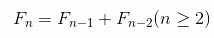
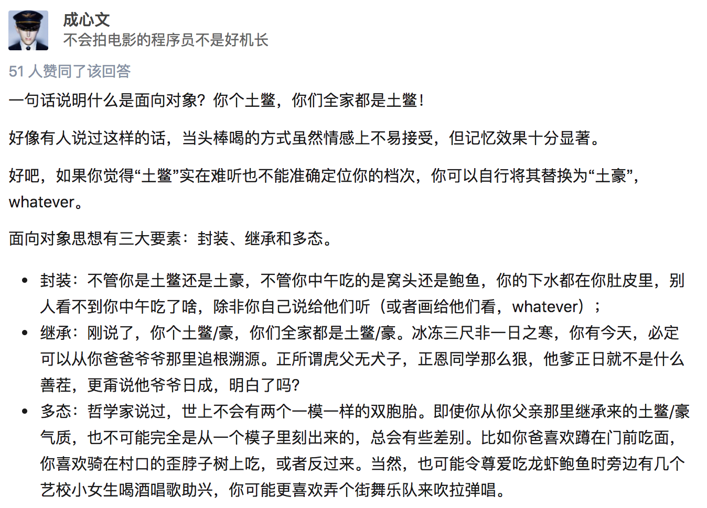

# Python基础
字数：{{this.$page.readingTime.words}} 字

预计阅读时间：{{this.$page.readingTime.minutes}} 分钟

## 一、初识Python

### 01 | Python简介

#### 发展历史
1. 1989年圣诞节：Guido von Rossum开始写Python语言的编译器。
2. 1991年2月：第一个Python编译器（同时也是解释器）诞生，它是用C语言实现的（后面），可以调用C语言的库函数。在最早的版本中，Python已经提供了对“类”，“函数”，“异常处理”等构造块的支持，还有对列表、字典等核心数据类型，同时支持以模块为基础来构造应用程序。
3. 1994年1月：Python 1.0正式发布。
4. 2000年10月16日：Python 2.0发布，增加了完整的[垃圾回收](https://zh.wikipedia.org/wiki/%E5%9E%83%E5%9C%BE%E5%9B%9E%E6%94%B6_(%E8%A8%88%E7%AE%97%E6%A9%9F%E7%A7%91%E5%AD%B8))，提供了对[Unicode](https://zh.wikipedia.org/wiki/Unicode)的支持。与此同时，Python的整个开发过程更加透明，社区对开发进度的影响逐渐扩大，生态圈开始慢慢形成。
5. 2008年12月3日：Python 3.0发布，它并不完全兼容之前的Python代码，不过因为目前还有不少公司在项目和运维中使用Python 2.x版本，所以Python 3.x的很多新特性后来也被移植到Python 2.6/2.7版本中。

目前我们使用的Python 3.7.x的版本是在2018年发布的，Python的版本号分为三段，形如A.B.C。其中A表示大版本号，一般当整体重写，或出现不向后兼容的改变时，增加A；B表示功能更新，出现新功能时增加B；C表示小的改动（例如：修复了某个Bug），只要有修改就增加C。如果对Python的历史感兴趣，可以阅读名为[《Python简史》](http://www.cnblogs.com/vamei/archive/2013/02/06/2892628.html)的博文。

#### Python的优缺点

Python的优点很多，简单的可以总结为以下几点。

1. 简单和明确，做一件事只有一种方法。
2. 学习曲线低，跟其他很多语言相比，Python更容易上手。
3. 开放源代码，拥有强大的社区和生态圈。
4. 解释型语言，天生具有平台可移植性。
5. 对两种主流的编程范式（面向对象编程和函数式编程）都提供了支持。
6. 可扩展性和可嵌入性，例如在Python中可以调用C/C++代码。
7. 代码规范程度高，可读性强，适合有代码洁癖和强迫症的人群。

Python的缺点主要集中在以下几点。

1. 执行效率稍低，因此计算密集型任务可以由C/C++编写。
2. 代码无法加密，但是现在很多公司都不销售卖软件而是销售服务，这个问题会被弱化。
3. 在开发时可以选择的框架太多（如Web框架就有100多个），有选择的地方就有错误。

#### Python的应用领域

目前Python在Web应用开发、云基础设施、DevOps、网络数据采集（爬虫）、数据分析挖掘、机器学习等领域都有着广泛的应用，因此也产生了Web后端开发、数据接口开发、自动化运维、自动化测试、科学计算和可视化、数据分析、量化交易、机器人开发、自然语言处理、图像识别等一系列相关的职位。

### 02 | Python安装

如果只安装Pytohn环境的话选择官方提供的用C语言实现的CPython解释器

但是学习的话推荐安装[Anaconda](https://www.anaconda.com/products/individual)这个软件，里面集成了很多工具，包括Python、conda、jupyter、jupyterLab等，我就是比较喜欢这样的集成工具，使用起来比较方便，最主要的是可以切换不同的环境

Anaconda软件傻瓜式安装,疯狂下一步即可,只是里面的工具很多,使用的时候需要多百度和google  
安装好Anaconda就相当于你安装好了Python,它包含Python解释器和它的核心库

### 03 | Python架构


### 04 | Python开发工具

PyCharm - Python开发神器，跟Intellij IDEA一个爹，使用起来很顺手

PyCharm的安装、配置和使用在[《玩转PyCharm》](../玩转PyCharm.md)进行了介绍，有兴趣的读者可以选择阅读。  

PyCharm专业版的话需要自行破解，网上教程很多，我用的是[无限重置30天免费使用期限的插件](https://zhishiku.casstime.com/pages/viewpage.action?pageId=69709908)这个软可以破解JetBrains全家桶


## 二、标准数据类型

::: tip

 在 Python 中，变量就是变量，它没有类型，我们所说的"类型"是变量所指的内存中对象的类型。

:::

**Python 中有六个标准的数据类型：**

1. Number（数字）
2. String（字符串）
3. List（列表）
4. Tuple（元组）
5. Set（集合）
6. Dictionary（字典）

**Python3 的六个标准数据类型中：**

- 不可变数据（3 个）：Number（数字）、String（字符串）、Tuple（元组） 
- 可变数据（3 个）：List（列表）、Dictionary（字典）、Set（集合）

### 01 | Numbers（数字）

Python3 支持 int、float、bool、complex（复数）

内置的 type() 和 isinstance() 函数可以用来查询变量所指的对象类型

::: tip

在 Python2 中是没有布尔型的，它用数字 0 表示 False，用 1 表示 True。到 Python3 中，把 True 和 False 定义成关键字了，但它们的值还是 1 和 0，它们可以和数字相加

:::

```python
a, b, c, d = 20, 5.5, True, 4+3j;
print(type(a), type(b), type(c), type(d))
```

`<class 'int'> <class 'float'> <class 'bool'> <class 'complex'>`


```python
a=111.11
isinstance(a,int)
```

`False`


```python
a=111
isinstance(a,int)
```

`True`


==**isinstance和type的区别：**==

- type() 不会认为子类是一种父类类型  

- isinstance() 会认为子类是一种父类类型


```python
class A:
    pass

'''
Python中的继承，这里B是A的子类
'''
class B(A):
    pass
```


```python
isinstance(A(),A)
```

`True`


```python
isinstance(B(), A)
```

`True`


```python
type(B()) == A
```

`False`


#### 创建Number对象

当你指定一个值时，Number 对象就会被创建


```python
var = 1.0
var_a = 1
var_b = 10
```

#### 删除对象引用

对象只能由垃圾回收器回收，我们能删除的只是引用


```python
del var  # 删除单个引用
del var_a, var_b  # 同时删除多个引用
```

#### 数值运算


```python
5 + 4  # 加法

4.3 - 2 # 减法

3 * 7  # 乘法

2 / 4  # 除法，得到一个浮点数

2 // 4 # 除法，得到一个整数

17 % 3 # 取余 

2 ** 5 # 乘方

```

#### 注意

1. Python 可以同时为多个变量赋值，如 a, b = 1, 2  
2. 一个变量可以通过赋值指向不同类型的对象。
3. 数值的除法（/）总是返回一个浮点数，要获取整数使用//操作符。
4. 在混合计算时，Python 会把整型转换成为浮点数。

**验证：**


```python
a, b = 1, 2
print(a)
print(b)
```

`1`

`2`

```python
var = A()
var = B()
type(var)
```

`__main__.B`


```python
4/4
```

`1.0`


```python
4//5
```

`0`


### 02 | String（字符串）

#### 字符串赋值

Python 中的字符串 str 用单引号(' ')或双引号 (" ") 括起来，同时使用反斜杠 (\) 转义特殊字符


```python
answer = 'Yes,he doesn\'t'
print(answer, type(answer), len(answer))
```

`Yes,he doesn't <class 'str'> 14`


#### 字符串的格式化输出

如果你**不想让反斜杠发生转义**，可以在字符串前面添加一个 r，表示原始字符串


```python
print('C:\some\name\n')
print(r'C:\some\name')
```

`C:\some`

`ame`


`C:\some\name`


**带有运算的格式化输出**


```python
a, b = 5, 10
print('%d * %d = %d' % (a, b, a * b))
```

`5 * 10 = 50`


或者用字符串提供的方法来完成字符串的格式


```python
a, b = 5, 10
print('{0} * {1} = {2}'.format(a, b, a * b))
```

`5 * 10 = 50`


Python 3.6以后，格式化字符串还有更为简洁的书写方式，就是在字符串前加上字母`f`，我们可以使用下面的**语法糖**来简化上面的代码


```python
a, b = 5, 15
print(f'{a} * {b} = {a * b}')
```

`5 * 15 = 75`


#### 字符串拼接

另外，反斜杠可以作为续行符，表示下一行是上一行的延续。还可以使用"""..."""或者'''...'''跨越多行。
字符串可以使用 + 运算符串连接在一起，或者用 * 运算符重复


```python
# 字符串跨多行
str2 = '''Le vent se lève, il faut tenter de vivre. 
起风了，唯有努力生存。
（纵有疾风起，人生不言弃。）'''
print(str2)
print('str'+'ing', 'my'*3)
```


#### 字符串成员运算

可以使用`in`和`not in`来判断一个字符串是否包含另外一个字符串（成员运算


```python
str1 = 'hello ' * 3
print(str1) 
str2 = 'world'
str1 += str2
print(str1) 
print('ll' in str1) 
print('good' not in str1) 
```

`hello hello hello `

`hello hello hello world`

`True`

`True`


#### 字符串索引

Python 中的字符串有两种索引方式，第一种是从左往右，从 0 开始依次增加；第二种是从右往左，从 -1 开始依次减少。   
<font color="red">注意：</font>没有单独的字符类型，一个字符就是长度为 1 的字符串


```python
word = 'Python'
print(word[0], word[5])
print(word[-1], word[-6])
```

`P n`

`n P`


#### 字符串切片

还可以对字符串进行切片，获取一段子串。用冒号分隔两个索引，形式为变量[头下标:尾下标]  
截取的范围是<font color="red" size=5>左闭右开</font>的，并且两个索引都可以省略(代表截取整个字符串)


```python
word = 'ilovepython'
print(word[1:5])
print(word[:])
print(word[5:])
print(word[-10:-6])
```

`love`

`ilovepython`

`python`

`love`


#### 字符串的常用处理方法


```python
str1 = 'hello, world!'
```

**1. 通过内置函数len计算字符串的长度**


```python
print(len(str1)) 
```

`13`

**2. 获得字符串首字母大写的拷贝**


```python
print(str1.capitalize())
```

`Hello, world!`

**3. 获得字符串每个单词首字母大写的拷贝**


```python
print(str1.title())
```

`Hello, World!`

**4. 获得字符串变大写后的拷贝**


```python
print(str1.upper())
```

`HELLO, WORLD!`

**5. 从字符串中查找子串所在位置**


```python
print(str1.find('or'))
print(str1.find('shit'))
```

`8`

`-1`


**6. 与find类似但找不到子串时会引发异常**


```python
print(str1.index('or'))
print(str1.index('shit'))
```

    8
    ---------------------------------------------------------------------------
    
    ValueError                                Traceback (most recent call last)
    
    <ipython-input-90-751eec63acd1> in <module>
          1 print(str1.index('or'))
    ----> 2 print(str1.index('shit'))
    ValueError: substring not found


**7. 检查字符串是否以指定的字符串开头**


```python
print(str1.startswith('He'))
print(str1.startswith('hel'))
```

`False`

`True`

**8. 检查字符串是否以指定的字符串结尾**


```python
print(str1.endswith('!'))
```

`True`


**9. 将字符串以指定的宽度居中并在两侧填充指定的字符**


```python
print(str1.center(50, '*'))
```

`******************hello, world!*******************`

**10. 将字符串以指定的宽度靠右放置左侧填充指定的字符**


```python
print(str1.rjust(50, '-'))
```

`-------------------------------------hello, world!`


**11. 检查字符串是否由数字构成**


```python
str2 = 'abc123456'
print(str2.isdigit())
```

`False`


**12. 检查字符串是否以字母构成**


```python
print(str2.isalpha()) 
```

`False`

**13. 检查字符串是否以数字和字母构成**


```python
print(str2.isalnum())
```

`True`


**14. 获得字符串修剪左右两侧空格之后的拷贝**


```python
str3 = '  jackfrued@126.com '
print(str3.strip())
```

`jackfrued@126.com`


与 C 语言中的字符串不同的是，Python 字符串不能被改变（这一点跟Java是一样的）。向一个索引位置赋值，比如 word[0] = 'm' 会导致错误

#### 注意

1. 反斜杠可以用来转义，使用 r 可以让反斜杠不发生转义
2. 字符串可以用 + 运算符连接在一起，用 * 运算符重复
3. Python 中的字符串有两种索引方式，从左往右以 0 开始，从右往左以 -1 开始
4. Python 中的字符串不能改变

### 03 | List（列表）

List（列表） 是 Python 中使用最频繁的数据类型

列表是写在方括号之间、用逗号分隔开的元素列表。列表中元素的类型可以不相同


```python
list_a = ['him', 25, 100, 'her']
print(a)
```

`5`

#### 生成式和生成器

我们可以使用列表的生成式语法来创建列表，代码如下所示。

```Python
f = [x for x in range(1, 10)]
print(f)
f = [x + y for x in 'ABCDE' for y in '1234567']
print(f)
# 用列表的生成表达式语法创建列表容器
# 用这种语法创建列表之后元素已经准备就绪所以需要耗费较多的内存空间
```

`[1, 2, 3, 4, 5, 6, 7, 8, 9]`

`['A1', 'A2', 'A3', 'A4', 'A5', 'A6', 'A7', 'B1', 'B2', 'B3', 'B4', 'B5', 'B6', 'B7', 'C1', 'C2', 'C3', 'C4', 'C5', 'C6', 'C7', 'D1', 'D2', 'D3', 'D4', 'D5', 'D6', 'D7', 'E1', 'E2', 'E3', 'E4', 'E5', 'E6', 'E7']`

```python
f = [x ** 2 for x in range(1, 1000)]
print(sys.getsizeof(f))  # 查看对象占用内存的字节数
print(f)

```

`9016`

`[1, 4, 9, 16, 25, 36, 49, 64, 81, 100, 121, 144, 169, 196, 225, 256, 289, 324, 361, 400, 441, 484, 529, 576, 625, 676, 729, 784, 841, 900, 961, 1024, 1089, 1156, 1225, 1296, 1369, 1444, 1521, 1600, 1681, 1764, 1849, 1936, 2025, 2116, 2209, 2304, 2401, 2500, ......, 990025, 992016, 994009, 996004, 998001]`


```python
# 请注意下面的代码创建的不是一个列表而是一个生成器对象
# 通过生成器可以获取到数据但它不占用额外的空间存储数据
# 每次需要数据的时候就通过内部的运算得到数据(需要花费额外的时间)
f = (x ** 2 for x in range(1, 1000))
print(sys.getsizeof(f))  # 相比生成式生成器不占用存储数据的空间
print(f)
for val in f:
    print(val)
```

`112
`

`<generator object <genexpr> at 0x7fc5d9f78900>
`

`1
`

`4
`

`9
`

`16
`

`25
`

`.
`

`.
`

`.
`

`996004
`

`998001`


除了上面提到的生成器语法，Python中还有另外一种定义生成器的方式，就是通过`yield`关键字将一个普通函数改造成生成器函数。下面的代码演示了如何实现一个生成[斐波拉切数列](https://zh.wikipedia.org/wiki/%E6%96%90%E6%B3%A2%E9%82%A3%E5%A5%91%E6%95%B0%E5%88%97)的生成器。所谓斐波拉切数列可以通过下面[递归](https://zh.wikipedia.org/wiki/%E9%80%92%E5%BD%92)的方法来进行定义：





```python
def fib(n):
    a, b = 0, 1
    for _ in range(n):
        a, b = b, a + b
        yield a


def main():
    for val in fib(20):
        print(val)


if __name__ == '__main__':
    main()
```

`1
`

`1
`

`2
`

`3
`

`5
`

`8
`

`13
`

`21
`

`.`

`.`

`.`

`6765`


#### 列表的切片

和字符串一样，列表同样可以被索引和切片，列表被切片后返回一个包含所需元素的新列表


```python
list_a = [1, 2, 3, 4, 5]
print(list_a[0:3])
print(list_a[:])
print(list_a[-2:-1])
print(list_a[-2:])
```

`[1, 2, 3]`

`[1, 2, 3, 4, 5]`

`[4]`

`[4, 5]`


#### 列表的拼接


```python
list_comb = list_a + [6, 7, 8]
print(list_comb)
```

`[1, 2, 3, 4, 5, 6, 7, 8]`


#### 对列表的增删改

与 Python 字符串不一样的是，列表中的元素是可以改变的，List 内置了有很多方法，例如 append()、pop() 等


```python
fruits = ['grape', 'apple', 'strawberry', 'waxberry']
fruits += ['pitaya', 'pear', 'mango']
```

**1. 列表切片实现截取、删除**


```python
fruits2 = fruits[1:4]
print(fruits2) 
```

`['apple', 'strawberry', 'waxberry']`

**2. 列表切片实现删除**


```python
# ['grape', 'apple', 'strawberry', 'waxberry'，'pitaya', 'pear', 'mango']
fruits[4:] = []
print(fruits)
```

`['grape', 'apple', 'strawberry', 'waxberry']` 截取了前四个

**3. 可以通过完整切片操作来复制列表**


```python
fruits3 = fruits[:]
print(fruits3)
fruits4 = fruits[-3:-1]
print(fruits4)
```

`['grape', 'apple', 'strawberry', 'waxberry']`

`['apple', 'strawberry']`


**4. 可以通过反向切片操作来获得倒转后的列表的拷贝**


```python
# [开始:结束:步长]
fruits5 = fruits[::-1]
print(fruits5)
```

`['waxberry', 'strawberry', 'apple', 'grape']`

#### 列表的遍历

**1. 通过循环用下标遍历列表元素**


```python
list_a = ['tomcat1', 'tomcat2', 'tomcat3']
for index in range(len(list_a)):
    print(list_a[index])
```

`tomcat1`

`tomcat2`

`tomcat3`

**2. 通过for循环遍历列表元素**


```python
for elem in list_a:
    print(elem)
```

`tomcat1`

`tomcat2`

`tomcat3`


**3. 通过enumerate函数处理列表之后再遍历可以同时获得元素索引和值**


```python
for index, elem in enumerate(list_a):
    print(index, elem)
```

`0 tomcat1`

`1 tomcat2`

`2 tomcat3`


#### 列表的排序


```python
list1 = ['orange', 'apple', 'zoo', 'internationalization', 'blueberry']
```

**1. sorted函数返回列表排序后的拷贝<font color=red>不会修改传入的列表</font>，函数的设计就应该像sorted函数一样尽可能不产生副作用**


```python
list2 = sorted(list1)
print(list1)
print(list2)
```

`['orange', 'apple', 'zoo', 'internationalization', 'blueberry']`

`['apple', 'blueberry', 'internationalization', 'orange', 'zoo']`


**2. 通过key关键字参数指定根据字符串长度进行排序而不是默认的字母表顺序**


```python
list3 = sorted(list1, key=len)
print(list3)
```

`['zoo', 'apple', 'orange', 'blueberry', 'internationalization']`


**3. 列表元素反转**(<font color=red>先自然排序后再进行顺序的反转</font>)


```python
list4 = sorted(list1, reverse=True)
print(list4)
```

`['zoo', 'orange', 'internationalization', 'blueberry', 'apple']`


**4. 给列表对象发出排序消息直接在列表对象上进行排序**


```python
list1.sort()
print(list1)

list1.sort(reverse=True)
print(list1)
```

`['apple', 'blueberry', 'internationalization', 'orange', 'zoo']`

`['zoo', 'orange', 'internationalization', 'blueberry', 'apple']`


#### 注意

1. List 写在方括号之间，元素用逗号隔开
2. 和字符串一样，List 可以被索引和切片
3. List 可以使用 + 操作符进行拼接
4. List 中的元素是可以改变的

### 04 | Tuple（元组）

元组（tuple）与列表类似，不同之处在于<font color="red" size=3>元组的元素不能修改</font>。元组写在小括号里，元素之间用逗号隔开,元组中的元素类型也可以不相同

这里有一个非常值得探讨的问题，我们已经有了列表这种数据结构，为什么还需要元组这样的类型呢？

1. 元组中的元素是无法修改的，事实上我们在项目中尤其是[多线程](https://zh.wikipedia.org/zh-hans/%E5%A4%9A%E7%BA%BF%E7%A8%8B)环境（后面会讲到）中可能更喜欢使用的是那些不变对象（一方面因为对象状态不能修改，所以可以避免由此引起的不必要的程序错误，简单的说就是一个不变的对象要比可变的对象更加容易维护；另一方面因为没有任何一个线程能够修改不变对象的内部状态，一个不变对象自动就是线程安全的，这样就可以省掉处理同步化的开销。一个不变对象可以方便的被共享访问）。所以结论就是：如果不需要对元素进行添加、删除、修改的时候，可以考虑使用元组，当然如果一个方法要返回多个值，使用元组也是不错的选择。

2. 元组在创建时间和占用的空间上面都优于列表。我们可以使用sys模块的getsizeof函数来检查存储同样的元素的元组和列表各自占用了多少内存空间，这个很容易做到。我们也可以在ipython中使用魔法指令%timeit来分析创建同样内容的元组和列表所花费的时间，下图是我的macOS系统上测试的结果。

   

#### 元组的构造

以小括号包裹元素的方式直接赋值, 构造包含 0 个或 1 个元素的 tuple 是个特殊的问题，所以有一些额外的语法规则


```python
tuple_a = (1991, 2014, 'physics', 'math')
print(tuple_a, type(tuple_a), len(tuple_a))

tup_b = () # 空元组
tup_c = (20,) # 一个元素，需要在元素后添加逗号
```

`(1991, 2014, 'physics', 'math') <class 'tuple'> 4`


```python
tuple_a[0] = 11  # 修改元组元素的操作是非法的
```


    ---------------------------------------------------------------------------
    
    TypeError                                 Traceback (most recent call last)
    
    <ipython-input-53-d4249f7271ce> in <module>
    ----> 1 tuple_a[0] = 11  # 修改元组元素的操作是非法的
    
    TypeError: 'tuple' object does not support item assignment


虽然 tuple 的元素不可改变，但它可以包含可变的对象，比如 list 列表  


```python
list_a = [1, "2", 3, True]
tuple_d = (list_a,)
print(tuple_d)
list_a[3] = False
print(tuple_d)
```

`([1, '2', 3, True],)`

`([1, '2', 3, False],)`


#### 元组的切片

元组与字符串类似，可以被索引且下标索引从 0 开始，也可以进行截取/切片

其实，可以把字符串看作一种特殊的元组


```python
tuple_a = (1991, 2014, 'physics', 'math')
print(tuple_a[:])
print(tuple_a[0:2])
print(tuple_a[1:-2])
print(tuple_a[3:-1])
```

`(1991, 2014, 'physics', 'math')`

`(1991, 2014)`

`(2014,)`

`()`


#### 元组的拼接

元组也支持用 + 操作符  
思考：底层只是重新创建了一个元组？


```python
tup1, tup2 = (1, 2, 3), (4, 5, 6)
print(tup1+tup2)
```

`(1, 2, 3, 4, 5, 6)`


#### 注意

1. string、list 和 tuple 都属于 sequence（顺序表，都可以直接索引元素）。
2. 与字符串一样，元组的元素不能修改。
3. 元组也可以被索引和切片，方法一样。
4. 注意构造包含 0 或 1 个元素的元组的特殊语法规则。
5. 元组也可以使用 + 操作符进行拼接。

### 05 | Sets（集合）

集合（set）是一个无序不重复元素的集，基本功能是进行成员关系测试和消除重复元素。

集合可以进行交集、并集、差集等运算


#### 集合的创建

可以使用大括号 或者 set() 函数创建 set 集合，注意：创建一个空集合必须用 set() 而不是 { }，因为{ }是用来创建一个空字典的


```python
# 创建集合的字面量语法
set1 = {'Tom', 'Jim', 'Mary', 'Tom', 'Jack', 'Rose'}
print(set1)   # 重复的元素被自动去掉
judge= 'Rose' in set1  # membership testing（成员测试）
print(judge)

# 创建集合的构造器语法(面向对象部分会进行详细讲解)
set2 = set(range(1, 10))
set3 = set((1, 2, 3, 3, 2, 1))
print(set2, set3)

# 创建集合的推导式语法(推导式也可以用于推导集合)
set4 = {num for num in range(1, 100) if num % 3 == 0 or num % 5 == 0}
print(set4)
```

`{'Jack', 'Tom', 'Rose', 'Mary', 'Jim'}`

`True`

`{1, 2, 3, 4, 5, 6, 7, 8, 9}, {1, 2, 3}`

`{3, 5, 6, 9, 10, 12, 15, 18, 20, 21, 24, 25, 27, 30, 33, 35, 36, 39, 40, 42, 45, 48, 50, 51, 54, 55, 57, 60, 63, 65, 66, 69, 70, 72, 75, 78, 80, 81, 84, 85, 87, 90, 93, 95, 96, 99}`


#### 向集合添加元素

```python
set1.add(4)
print(set1)
set2.update([11, 12])
print(set2)

```

`{4, 'Rose', 'Jim', 'Jack', 'Tom', 'Mary'}`

`{1, 2, 3, 4, 5, 6, 7, 8, 9, 11, 12}`

#### 从集合删除元素

```python
set2.discard(5)
if 4 in set2:
    set2.remove(4)
print(set2)

print(set3.pop())
print(set3)
```

`{1, 2, 3, 6, 7, 8, 9, 11, 12}`

`1
`

`{2, 3}`


#### 集合的运算


```python
set_a = set('abracadabra')
set_b = set('alacazam')

print(set_a)
print(set_b)
```

`{'b', 'd', 'c', 'a', 'r'}`

`{'z', 'c', 'a', 'm', 'l'}`

**差集运算用 "-" 号**


```python
set_c = set_a - set_b
print(set_c)
```

`{'b', 'd', 'r'}`

```python
set_c = set_b - set_a
print(set_c)
```

`{'m', 'z', 'l'}`


**并集运算用 "|"**


```python
set_c = set_a | set_b
print(set_c)
```

`{'z', 'b', 'd', 'c', 'a', 'm', 'l', 'r'}`


**交集运算用 "&"**


```python
set_c = set_a & set_b
print(set_c)
```

`{'a', 'c'}`


**交集的补集用 "^"** ——set_a和set_b中不同时存在的元素


```python
set_c = set_a ^ set_b
print(set_c)
```

`{'z', 'b', 'r', 'm', 'd', 'l'}`

**判断子集和超集**

```python
print(set2 <= set1)
# print(set2.issubset(set1))
print(set3 <= set1)
# print(set3.issubset(set1))
print(set1 >= set2)
# print(set1.issuperset(set2))
print(set1 >= set3)
# print(set1.issuperset(set3))
```

> **说明：** Python中允许通过一些特殊的方法来为某种类型或数据结构自定义运算符（后面的章节中会讲到），上面的代码中我们对集合进行运算的时候可以调用集合对象的方法，也可以直接使用对应的运算符，例如`&`运算符跟intersection方法的作用就是一样的，但是使用运算符让代码更加直观。


### 06 | Dictionaries（字典）

字典（dictionary）是 Python 中另一个非常有用的内置数据类型。

字典是一种映射类型（mapping type），它是一个**无序的** 键 : 值对集合。

关键字必须使用不可变类型，也就是说：list 和包含可变类型的 tuple 不能做关键字。

在同一个字典中，关键字还必须互不相同

#### 字典的创建


```python
dic_empty = {}  # 创建空字典
print(dic_empty)
dic_a = {'Jack':1557, 'Tom':1320, 'Rose':1886}
print(dic_a)
```

`{}`

`{'Jack': 1557, 'Tom': 1320, 'Rose': 1886}`

**构造函数 dict()**  

构造函数 dict() 可直接从键值对 sequence 中构建字典，当然也可以进行推导


```python
dic_b = dict([('sape', 4139), ('guido', 4127), ('jack', 4098)])
print(dic_b)
```

`{'sape': 4139, 'guido': 4127, 'jack': 4098}`

```python
dic_c = dict(sape=4139, guido=4127, jack=4098)
print(dic_c)
```

`{'sape': 4139, 'guido': 4127, 'jack': 4098}`


**推导**


```python
dic_d = {x: x**2 for x in (2, 4, 6)}
print(dic_d)
```

`{2: 4, 4: 16, 6: 36}`

**zip()函数**

```python
# 通过zip函数将两个序列压成字典
items2 = dict(zip(['a', 'b', 'c'], '123'))
print(items2)
```

`{'a': '1', 'b': '2', 'c': '3'}`

#### 字典的遍历

```python
# 对字典中所有键值对进行遍历
for key in items2:
    print(f'{key}: {items2[key]}')
```

`a: 1
	`

`b: 2
	`

`c: 3`

#### **通过key查询**


```python
dic_a = {'Jack':1557, 'Tom':1320, 'Rose':1886}
dic_val = dic_a['Jack']
print(dic_val)
print(dic_a.get('Tom'))
# get方法也是通过键获取对应的值，但是可以设置默认值，当字典中不存在对应的键时会返回这个默认值
print(dic_a.get('Tom2', 60))
```

`1557`

`1320`

`60`

> 使用 ==dic_a['Jack1']== 的方式不可取，当key不存在时会报KeyError: 'Jack1'，==推荐使用get()去获取对应的value，避免抛出异常==

#### 更新字典中的元素

```python
dic_a = {'Jack':1557, 'Tom':1320, 'Rose':1886}
dic_a['Jack'] = 110
print(dic_a)
```

`{'Jack': 110, 'Tom': 1320, 'Rose': 1886}`


#### 添加一个键值对


```python
dic_a['Mary'] = 4127  # 添加一个键值对
print(dic_a)
```

`{'Jack': 1557, 'Tom': 1320, 'Mary': 4127}`

#### 删除一个键值对


```python
dic_a = {'Jack':1557, 'Tom':1320, 'Rose':1886}
del dic_a['Rose']
print(dic_a)
```

`{'Jack': 1557, 'Tom': 1320}`

```python
dic_a = {'Jack':1557, 'Tom':1320, 'Rose':1886}
print(dic_a.popitem()) #('Rose', 1886)
print(dic_a)
print(dic_a.popitem()) #('Tom', 1320)
print(dic_a)
```

`('Rose', 1886)`

`{'Jack': 1557, 'Tom': 1320}`

`('Tom', 1320)`

`{'Jack': 1557}`

#### 返回所有 key 组成的 list


```python
dic_val_list = list(dic_a.keys())
print(dic_val_list)
```

`['Jack', 'Tom', 'Mary']`

#### 按key排序


```python
sorted(dic_a.keys())
print(dic_a)
```

`{'Jack': 1557, 'Tom': 1320, 'Mary': 4127}`

#### 成员测试


```python
print('Tom' in dic_a)
print('Mary' not in dic_a)
```

`True`

`False`

#### 内置的函数


另外，字典类型也有一些内置的函数，例如 clear()、keys()、values() 等


```python
dic_a = {'Jack':1557, 'Tom':1320, 'Rose':1886}

dic_vals = dic_a.values()
print(dic_vals)

dic_vals = list(dic_a.values())
print(dic_vals)
dic_vals = set(dic_a.values())
print(dic_vals)
dic_vals = tuple(dic_a.values())
print(dic_vals)
```

`dict_values([1557, 1320, 1886])`

`[1557, 1320, 1886]`

`{1320, 1557, 1886}`

`(1557, 1320, 1886)`

:::tip

通过dic_a.values()我们拿到的应该只是一个引用，因为我们调用clear()函数的时候，dic_vals对应也没有数据了，运行下面的代码验证。有点类似于Java中的Arrays.asList()

:::


```python
dic_vals = list(dic_a.values())
print(dic_vals)

dic_a.clear()
print(dic_a)
```

`[1557, 1320, 1886]`

`{}`


#### 注意

1. 字典是一种映射类型，它的元素是键值对  
2. 字典的关键字必须为不可变类型，且不能重复。
3. 创建空字典使用 { }


### 07 | 数据结构之间的转化

#### 列表转元组

```python
fruits_list = ['apple', 'banana', 'orange']
fruits_tuple = tuple(fruits_list)
print(fruits_tuple)
```

`('apple', 'banana', 'orange')`


### 08 | 练习

**练习1：在屏幕上显示跑马灯文字。**

参考答案：

```Python
import os
import time


def main():
    content = '北京欢迎你为你开天辟地…………'
    while True:
        # 清理屏幕上的输出
        os.system('cls')  # os.system('clear')
        print(content)
        # 休眠200毫秒
        time.sleep(0.2)
        content = content[1:] + content[0]


if __name__ == '__main__':
    main()
```

**练习2：设计一个函数产生指定长度的验证码，验证码由大小写字母和数字构成。**

参考答案：

```Python
import random


def generate_code(code_len=4):
    """
    生成指定长度的验证码

    :param code_len: 验证码的长度(默认4个字符)

    :return: 由大小写英文字母和数字构成的随机验证码
    """
    all_chars = '0123456789abcdefghijklmnopqrstuvwxyzABCDEFGHIJKLMNOPQRSTUVWXYZ'
    last_pos = len(all_chars) - 1
    code = ''
    for _ in range(code_len):
        index = random.randint(0, last_pos)
        code += all_chars[index]
    return code
```

**练习3：设计一个函数返回给定文件名的后缀名。**

参考答案：

```Python
def get_suffix(filename, has_dot=False):
    """
    获取文件名的后缀名

    :param filename: 文件名
    :param has_dot: 返回的后缀名是否需要带点
    :return: 文件的后缀名
    """
    pos = filename.rfind('.')
    if 0 < pos < len(filename) - 1:
        index = pos if has_dot else pos + 1
        return filename[index:]
    else:
        return ''
```

**练习4：设计一个函数返回传入的列表中最大和第二大的元素的值。**

参考答案：

```Python
def max2(x):
    m1, m2 = (x[0], x[1]) if x[0] > x[1] else (x[1], x[0])
    for index in range(2, len(x)):
        if x[index] > m1:
            m2 = m1
            m1 = x[index]
        elif x[index] > m2:
            m2 = x[index]
    return m1, m2
```

**练习5：计算指定的年月日是这一年的第几天。**

参考答案：

```Python
def is_leap_year(year):
    """
    判断指定的年份是不是闰年

    :param year: 年份
    :return: 闰年返回True平年返回False
    """
    return year % 4 == 0 and year % 100 != 0 or year % 400 == 0


def which_day(year, month, date):
    """
    计算传入的日期是这一年的第几天

    :param year: 年
    :param month: 月
    :param date: 日
    :return: 第几天
    """
    days_of_month = [
        [31, 28, 31, 30, 31, 30, 31, 31, 30, 31, 30, 31],
        [31, 29, 31, 30, 31, 30, 31, 31, 30, 31, 30, 31]
    ][is_leap_year(year)]
    total = 0
    for index in range(month - 1):
        total += days_of_month[index]
    return total + date


def main():
    print(which_day(1980, 11, 28))
    print(which_day(1981, 12, 31))
    print(which_day(2018, 1, 1))
    print(which_day(2016, 3, 1))


if __name__ == '__main__':
    main()
```

**练习6：打印[杨辉三角](https://zh.wikipedia.org/wiki/%E6%9D%A8%E8%BE%89%E4%B8%89%E8%A7%92%E5%BD%A2)。**

参考答案：

```Python
def main():
    num = int(input('Number of rows: '))
    yh = [[]] * num
    for row in range(len(yh)):
        yh[row] = [None] * (row + 1)
        for col in range(len(yh[row])):
            if col == 0 or col == row:
                yh[row][col] = 1
            else:
                yh[row][col] = yh[row - 1][col] + yh[row - 1][col - 1]
            print(yh[row][col], end='\t')
        print()


if __name__ == '__main__':
    main()
```

### 09 | 综合案例

**案例1：双色球选号。**

```Python
from random import randrange, randint, sample


def display(balls):
    """
    输出列表中的双色球号码
    """
    for index, ball in enumerate(balls):
        if index == len(balls) - 1:
            print('|', end=' ')
        print('%02d' % ball, end=' ')
    print()


def random_select():
    """
    随机选择一组号码
    """
    red_balls = [x for x in range(1, 34)]
    selected_balls = []
    selected_balls = sample(red_balls, 6)
    selected_balls.sort()
    selected_balls.append(randint(1, 16))
    return selected_balls


def main():
    n = int(input('机选几注: '))
    for _ in range(n):
        display(random_select())


if __name__ == '__main__':
    main()
```

> **说明：** 上面使用random模块的sample函数来实现从列表中选择不重复的n个元素。

**综合案例2：[约瑟夫环问题](https://zh.wikipedia.org/wiki/%E7%BA%A6%E7%91%9F%E5%A4%AB%E6%96%AF%E9%97%AE%E9%A2%98)。**

```Python
"""
《幸运的基督徒》
有15个基督徒和15个非基督徒在海上遇险，
为了能让一部分人活下来不得不将其中15个人扔到海里面去，
有个人想了个办法就是大家围成一个圈，由某个人开始从1报数，
报到9的人就扔到海里面，他后面的人接着从1开始报数，
报到9的人继续扔到海里面，直到扔掉15个人。由于上帝的保佑，
15个基督徒都幸免于难，问这些人最开始是怎么站的，
哪些位置是基督徒哪些位置是非基督徒。
"""


def main():
    persons = [True] * 30
    counter, index, number = 0, 0, 0
    while counter < 15:
        if persons[index]:
            number += 1
            if number == 9:
                persons[index] = False
                counter += 1
                number = 0
        index += 1
        index %= 30
    for person in persons:
        print('基' if person else '非', end='')


if __name__ == '__main__':
    main()

```

**综合案例3：[井字棋](https://zh.wikipedia.org/wiki/%E4%BA%95%E5%AD%97%E6%A3%8B)游戏。**

```Python
import os


def print_board(board):
    print(board['TL'] + '|' + board['TM'] + '|' + board['TR'])
    print('-+-+-')
    print(board['ML'] + '|' + board['MM'] + '|' + board['MR'])
    print('-+-+-')
    print(board['BL'] + '|' + board['BM'] + '|' + board['BR'])


def main():
    init_board = {
        'TL': ' ', 'TM': ' ', 'TR': ' ',
        'ML': ' ', 'MM': ' ', 'MR': ' ',
        'BL': ' ', 'BM': ' ', 'BR': ' '
    }
    begin = True
    while begin:
        curr_board = init_board.copy()
        begin = False
        turn = 'x'
        counter = 0
        os.system('clear')
        print_board(curr_board)
        while counter < 9:
            move = input('轮到%s走棋, 请输入位置: ' % turn)
            if curr_board[move] == ' ':
                counter += 1
                curr_board[move] = turn
                if turn == 'x':
                    turn = 'o'
                else:
                    turn = 'x'
            os.system('clear')
            print_board(curr_board)
        choice = input('再玩一局?(yes|no)')
        begin = choice == 'yes'


if __name__ == '__main__':
    main()
```

>**说明：** 最后这个案例来自[《Python编程快速上手:让繁琐工作自动化》](https://item.jd.com/11943853.html)一书（这本书对有编程基础想迅速使用Python将日常工作自动化的人来说还是不错的选择），对代码做了一点点的调整。


## 三、变量命名

对于每个变量我们需要给它取一个名字，就如同我们每个人都有属于自己的响亮的名字一样。在Python中，变量命名需要遵循以下这些必须遵守硬性规则和强烈建议遵守的非硬性规则。

- 硬性规则：

  1、变量名由字母（广义的Unicode字符，不包括特殊字符）、数字和下划线构成，数字不能开头。

  2、大小写敏感（大写的`a`和小写的`A`是两个不同的变量）。

  3、不要跟关键字（有特殊含义的单词，后面会讲到）和系统保留字（如函数、模块等的名字）冲突。

- PEP 8要求：

  4、用小写字母拼写，多个单词用下划线连接。

  5、受保护的实例属性用单个下划线开头（后面会讲到）。

  6、私有的实例属性用两个下划线开头（后面会讲到）。

当然，作为一个专业的程序员，给变量（事实上应该是所有的标识符）命名时做到见名知意也是非常重要的。 
其次，每个公司可能都有自己的规范，为了代码的可读性，<font color=#5d2b2b size=3>一切以公司的规范为准！！！</font>


## 四、分支结构

### 01 | 应用场景

迄今为止，我们写的Python代码都是一条一条语句顺序执行，这种代码结构通常称之为顺序结构。然而仅有顺序结构并不能解决所有的问题，比如我们设计一个游戏，游戏第一关的通关条件是玩家获得1000分，那么在完成本局游戏后，我们要根据玩家得到分数来决定究竟是进入第二关，还是告诉玩家“Game Over”，这里就会产生两个分支，而且这两个分支只有一个会被执行。类似的场景还有很多，我们将这种结构称之为“分支结构”或“选择结构”。给大家一分钟的时间，你应该可以想到至少5个以上这样的例子，赶紧试一试。

### 02 | if语句的使用

在Python中，要构造分支结构可以使用`if`、`elif`和`else`关键字。所谓**关键字**就是有特殊含义的单词，像`if`和`else`就是专门用于构造分支结构的关键字，很显然你不能够使用它作为变量名（事实上，用作其他的标识符也是不可以）。下面的例子中演示了如何构造一个分支结构。

```Python
username = input('请输入用户名: ')
password = input('请输入口令: ')
# 用户名是admin且密码是123456则身份验证成功否则身份验证失败
if username == 'admin' and password == '123456':
    print('身份验证成功!')
else:
    print('身份验证失败!')
```

唯一需要说明的是和C/C++、Java等语言不同，Python中没有用花括号来构造代码块而是使用了缩进的方式来设置代码的层次结构，如果`if`条件成立的情况下需要执行多条语句，只要保持多条语句具有相同的缩进就可以了，换句话说连续的代码如果又保持了相同的缩进那么它们属于同一个代码块，相当于是一个执行的整体。

当然如果要构造出更多的分支，可以使用`if…elif…else…`结构，例如下面的分段函数求值。


```Python
x = float(input('x = '))
if x > 1:
    y = 3 * x - 5
elif x >= -1:
    y = x + 2
else:
    y = 5 * x + 3
print('f(%.2f) = %.2f' % (x, y))
```

当然根据实际开发的需要，分支结构是可以嵌套的，例如判断是否通关以后还要根据你获得的宝物或者道具的数量对你的表现给出等级（比如点亮两颗或三颗星星），那么我们就需要在`if`的内部构造出一个新的分支结构，同理`elif`和`else`中也可以再构造新的分支，我们称之为嵌套的分支结构，也就是说上面的代码也可以写成下面的样子。

```Python
x = float(input('x = '))
if x > 1:
    y = 3 * x - 5
else:
    if x >= -1:
        y = x + 2
    else:
        y = 5 * x + 3
print('f(%.2f) = %.2f' % (x, y))
```

> **说明：** 大家可以自己感受一下这两种写法到底是哪一种更好。在之前我们提到的Python之禅中有这么一句话“Flat is better than nested.”，之所以提倡代码“扁平化”是因为嵌套结构的嵌套层次多了之后会严重的影响代码的可读性，所以能使用扁平化的结构时就不要使用嵌套。

### 03 | 练习

**练习1：英制单位英寸与公制单位厘米互换。**

参考答案：

```Python
value = float(input('请输入长度: '))
unit = input('请输入单位: ')
if unit == 'in' or unit == '英寸':
    print('%f英寸 = %f厘米' % (value, value * 2.54))
elif unit == 'cm' or unit == '厘米':
    print('%f厘米 = %f英寸' % (value, value / 2.54))
else:
    print('请输入有效的单位')
```


**练习2：百分制成绩转换为等级制成绩。**

> **要求**：如果输入的成绩在90分以上（含90分）输出A；80分-90分（不含90分）输出B；70分-80分（不含80分）输出C；60分-70分（不含70分）输出D；60分以下输出E。

参考答案：

```Python
score = float(input('请输入成绩: '))
if score >= 90:
    grade = 'A'
elif score >= 80:
    grade = 'B'
elif score >= 70:
    grade = 'C'
elif score >= 60:
    grade = 'D'
else:
    grade = 'E'
print('对应的等级是:', grade)
```


**练习3：输入三条边长，如果能构成三角形就计算周长和面积。**

参考答案：

```Python
a = float(input('a = '))
b = float(input('b = '))
c = float(input('c = '))
if a + b > c and a + c > b and b + c > a:
    print('周长: %f' % (a + b + c))
    p = (a + b + c) / 2
    area = (p * (p - a) * (p - b) * (p - c)) ** 0.5
    print('面积: %f' % (area))
else:
    print('不能构成三角形')
```

> **说明：** 上面使用的通过边长计算三角形面积的公式叫做[海伦公式](https://zh.wikipedia.org/zh-hans/海伦公式)。


## 五、循环结构

### 01 | 应用场景

如果在程序中我们需要重复的执行某条或某些指令，例如用程序控制机器人踢足球，如果机器人持球而且还没有进入射门范围，那么我们就要一直发出让机器人向球门方向奔跑的指令。当然你可能已经注意到了，刚才的描述中不仅仅有需要重复的动作，还需要用到上一章讲的分支结构。再举一个简单的例子，我们要实现一个每隔1秒中在屏幕上打印一次&quot;hello, world&quot;并持续打印一个小时的程序，我们肯定不能够直接把`print('hello, world')`这句代码写3600遍，如果真的要这样做，那么编程的工作就太无聊乏味了。因此，我们还需要了解一下循环结构，有了循环结构我们就可以轻松的控制某件事或者某些事重复、重复、再重复的去执行。

在Python中构造循环结构有两种做法，一种是`for-in`循环，一种是`while`循环。

### 02 | for-in循环

如果明确的知道循环执行的次数或者要对一个容器进行迭代（后面会讲到），那么我们推荐使用`for-in`循环，例如下面代码中计算1~100求和的结果（$\displaystyle \sum \limits_{n=1}^{100}n$）。 

```Python
sum = 0
for x in range(101):
    sum += x
print(sum)
```

需要说明的是上面代码中的`range(101)`可以用来构造一个从0到100的取值范围，这样就可以构造出一个整数的序列并用于循环中，例如：

- `range(101)`可以产生一个0到100的整数序列。
- `range(1, 100)`可以产生一个1到99的整数序列。
- `range(1, 100, 2)`可以产生一个1到99的奇数序列，其中2是步长，即数值序列的增量。

知道了这一点，我们可以用下面的代码来实现1~100之间的偶数求和。

```Python
sum = 0
for x in range(2, 101, 2):
    sum += x
print(sum)
```

也可以通过在循环中使用分支结构的方式来实现相同的功能，代码如下所示。

```Python
"""
用for循环实现1~100之间的偶数求和

Version: 0.1
Author: 骆昊
"""

sum = 0
for x in range(1, 101):
    if x % 2 == 0:
        sum += x
print(sum)
```

### 02 | while循环

如果要构造不知道具体循环次数的循环结构，我们推荐使用`while`循环。`while`循环通过一个能够产生或转换出`bool`值的表达式来控制循环，表达式的值为`True`循环继续，表达式的值为`False`循环结束。下面我们通过一个“猜数字”的小游戏（计算机出一个1~100之间的随机数，人输入自己猜的数字，计算机给出对应的提示信息，直到人猜出计算机出的数字）来看看如何使用`while`循环。

```Python
import random

answer = random.randint(1, 100)
counter = 0
while True:
    counter += 1
    number = int(input('请输入: '))
    if number < answer:
        print('大一点')
    elif number > answer:
        print('小一点')
    else:
        print('恭喜你猜对了!')
        break
print('你总共猜了%d次' % counter)
if counter > 7:
    print('你的智商余额明显不足')
```

上面的代码中使用了`break`关键字来提前终止循环，需要注意的是`break`只能终止它所在的那个循环，这一点在使用嵌套的循环结构（下面会讲到）需要引起注意。除了`break`之外，还有另一个关键字是`continue`，它可以用来放弃本次循环后续的代码直接让循环进入下一轮。

和分支结构一样，循环结构也是可以嵌套的，也就是说在循环中还可以构造循环结构。下面的例子演示了如何通过嵌套的循环来输出一个九九乘法表。

```Python
for i in range(1, 10):
    for j in range(1, i + 1):
        print('%d*%d=%d' % (i, j, i * j), end='\t')
    print()
```

### 03 | 练习

**练习1：输入一个正整数判断是不是素数。**

> **提示**：素数指的是只能被1和自身整除的大于1的整数。

参考答案：

```Python
from math import sqrt

num = int(input('请输入一个正整数: '))
end = int(sqrt(num))
is_prime = True
for x in range(2, end + 1):
    if num % x == 0:
        is_prime = False
        break
if is_prime and num != 1:
    print('%d是素数' % num)
else:
    print('%d不是素数' % num)
```


**练习2：输入两个正整数，计算它们的最大公约数和最小公倍数。**

参考答案：

```Python
x = int(input('x = '))
y = int(input('y = '))
# 如果x大于y就交换x和y的值
if x > y:
    # 通过下面的操作将y的值赋给x, 将x的值赋给y
    x, y = y, x
# 从两个数中较的数开始做递减的循环
for factor in range(x, 0, -1):
    if x % factor == 0 and y % factor == 0:
        print('%d和%d的最大公约数是%d' % (x, y, factor))
        print('%d和%d的最小公倍数是%d' % (x, y, x * y // factor))
        break
```


**练习3：打印如下所示的三角形图案。**

```
*
**
***
****
*****
```

```
    *
   **
  ***
 ****
*****
```

```
    *
   ***
  *****
 *******
*********
```

参考答案：

```Python
row = int(input('请输入行数: '))
for i in range(row):
    for _ in range(i + 1):
        print('*', end='')
    print()


for i in range(row):
    for j in range(row):
        if j < row - i - 1:
            print(' ', end='')
        else:
            print('*', end='')
    print()

for i in range(row):
    for _ in range(row - i - 1):
        print(' ', end='')
    for _ in range(2 * i + 1):
        print('*', end='')
    print()
```


## 六、函数和模块的使用

在讲解本章节的内容之前，我们先来研究一道数学题，请说出下面的方程有多少组正整数解。


事实上，上面的问题等同于将8个苹果分成四组每组至少一个苹果有多少种方案。想到这一点问题的答案就呼之欲出了。


可以用Python的程序来计算出这个值，代码如下所示。

```Python
m = int(input('m = '))
n = int(input('n = '))
fm = 1
for num in range(1, m + 1):
    fm *= num
fn = 1
for num in range(1, n + 1):
    fn *= num
fmn = 1
for num in range(1, m - n + 1):
    fmn *= num
print(fm // fn // fmn)
```

### 01 | 函数的作用

不知道大家是否注意到，在上面的代码中，我们做了3次求阶乘，这样的代码实际上就是重复代码。编程大师*Martin Fowler*先生曾经说过：“**代码有很多种坏味道，重复是最坏的一种！**”，要写出高质量的代码首先要解决的就是重复代码的问题。对于上面的代码来说，我们可以将计算阶乘的功能封装到一个称之为“函数”的功能模块中，在需要计算阶乘的地方，我们只需要“调用”这个“函数”就可以了。

### 02 | 定义函数

在Python中可以使用`def`关键字来定义函数，和变量一样每个函数也有一个响亮的名字，而且命名规则跟变量的命名规则是一致的。在函数名后面的圆括号中可以放置传递给函数的参数，这一点和数学上的函数非常相似，程序中函数的参数就相当于是数学上说的函数的自变量，而函数执行完成后我们可以通过`return`关键字来返回一个值，这相当于数学上说的函数的因变量。

在了解了如何定义函数后，我们可以对上面的代码进行重构，所谓重构就是在不影响代码执行结果的前提下对代码的结构进行调整，重构之后的代码如下所示。

```Python
def factorial(num):
    """求阶乘"""
    result = 1
    for n in range(1, num + 1):
        result *= n
    return result


m = int(input('m = '))
n = int(input('n = '))
# 当需要计算阶乘的时候不用再写循环求阶乘而是直接调用已经定义好的函数
print(factorial(m) // factorial(n) // factorial(m - n))
```

> **说明：** Python的`math`模块中其实已经有一个`factoria`l函数了，事实上要计算阶乘可以直接使用这个现成的函数而不用自己定义。下面例子中的一些函数在Python中也都是现成的，我们这里是为了讲解函数的定义和使用才把它们又实现了一遍，实际开发中不建议做这种低级的重复性的工作。


### 03 | 函数的参数

函数是绝大多数编程语言中都支持的一个代码的&quot;构建块&quot;，但是Python中的函数与其他语言中的函数还是有很多不太相同的地方，其中一个显著的区别就是Python对函数参数的处理。在Python中，函数的参数可以有默认值，也支持使用可变参数，所以Python并不需要像其他语言一样支持[函数的重载](https://zh.wikipedia.org/wiki/%E5%87%BD%E6%95%B0%E9%87%8D%E8%BD%BD)，因为我们在定义一个函数的时候可以让它有多种不同的使用方式，下面是两个小例子。

```Python
from random import randint


def roll_dice(n=2):
    """摇色子"""
    total = 0
    for _ in range(n):
        total += randint(1, 6)
    return total


def add(a=0, b=0, c=0):
    """三个数相加"""
    return a + b + c


# 如果没有指定参数那么使用默认值摇两颗色子
print(roll_dice())
# 摇三颗色子
print(roll_dice(3))
print(add())
print(add(1))
print(add(1, 2))
print(add(1, 2, 3))
# 传递参数时可以不按照设定的顺序进行传递
print(add(c=50, a=100, b=200))
```

我们给上面两个函数的参数都设定了默认值，这也就意味着如果在调用函数的时候如果没有传入对应参数的值时将使用该参数的默认值，所以在上面的代码中我们可以用各种不同的方式去调用`add`函数，这跟其他很多语言中函数重载的效果是一致的。

其实上面的`add`函数还有更好的实现方案，因为我们可能会对0个或多个参数进行加法运算，而具体有多少个参数是由调用者来决定，我们作为函数的设计者对这一点是一无所知的，因此在不确定参数个数的时候，我们可以使用可变参数，代码如下所示。

```Python
# 在参数名前面的*表示args是一个可变参数
def add(*args):
    total = 0
    for val in args:
        total += val
    return total


# 在调用add函数时可以传入0个或多个参数
print(add())
print(add(1))
print(add(1, 2))
print(add(1, 2, 3))
print(add(1, 3, 5, 7, 9))
```

### 04 | 用模块管理函数

对于任何一种编程语言来说，给变量、函数这样的标识符起名字都是一个让人头疼的问题，因为我们会遇到命名冲突这种尴尬的情况。最简单的场景就是在同一个.py文件中定义了两个同名函数，由于Python没有函数重载的概念，那么后面的定义会覆盖之前的定义，也就意味着两个函数同名函数实际上只有一个是存在的。

```Python
def foo():
    print('hello, world!')


def foo():
    print('goodbye, world!')


# 下面的代码会输出什么呢？
foo()
```

当然上面的这种情况我们很容易就能避免，但是如果项目是由多人协作进行团队开发的时候，团队中可能有多个程序员都定义了名为`foo`的函数，那么怎么解决这种命名冲突呢？答案其实很简单，Python中每个文件就代表了一个模块（module），我们在不同的模块中可以有同名的函数，在使用函数的时候我们通过`import`关键字导入指定的模块就可以区分到底要使用的是哪个模块中的`foo`函数，代码如下所示。

`module1.py`

```Python
def foo():
    print('hello, world!')
```

`module2.py`

```Python
def foo():
    print('goodbye, world!')
```

`test.py`

```Python
from module1 import foo

# 输出hello, world!
foo()

from module2 import foo

# 输出goodbye, world!
foo()
```

也可以按照如下所示的方式来区分到底要使用哪一个`foo`函数。

`test.py`

```Python
import module1 as m1
import module2 as m2

m1.foo()
m2.foo()
```

但是如果将代码写成了下面的样子，那么程序中调用的是最后导入的那个`foo`，因为后导入的foo覆盖了之前导入的`foo`。

`test.py`

```Python
from module1 import foo
from module2 import foo

# 输出goodbye, world!
foo()
```

`test.py`

```Python
from module2 import foo
from module1 import foo

# 输出hello, world!
foo()
```

需要说明的是，如果我们导入的模块除了定义函数之外还中有可以执行代码，那么Python解释器在导入这个模块时就会执行这些代码，事实上我们可能并不希望如此，因此如果我们在模块中编写了执行代码，最好是将这些执行代码放入如下所示的条件中，这样的话除非直接运行该模块，if条件下的这些代码是不会执行的，因为只有直接执行的模块的名字才是&quot;\_\_main\_\_&quot;。

`module3.py`

```Python
def foo():
    pass


def bar():
    pass


# __name__是Python中一个隐含的变量它代表了模块的名字
# 只有被Python解释器直接执行的模块的名字才是__main__
if __name__ == '__main__':
    print('call foo()')
    foo()
    print('call bar()')
    bar()
```

`test.py`

```Python
import module3

# 导入module3时 不会执行模块中if条件成立时的代码 因为模块的名字是module3而不是__main__
```

### 05 | 练习

**练习1：实现计算求最大公约数和最小公倍数的函数。**

参考答案：

```Python
def gcd(x, y):
    """求最大公约数"""
    (x, y) = (y, x) if x > y else (x, y)
    for factor in range(x, 0, -1):
        if x % factor == 0 and y % factor == 0:
            return factor


def lcm(x, y):
    """求最小公倍数"""
    return x * y // gcd(x, y)
```


**练习2：实现判断一个数是不是回文数的函数。**

参考答案：

```Python
def is_palindrome(num):
    """判断一个数是不是回文数"""
    temp = num
    total = 0
    while temp > 0:
        total = total * 10 + temp % 10
        temp //= 10
    return total == num
```


**练习3：实现判断一个数是不是素数的函数。**

参考答案：

```Python
def is_prime(num):
    """判断一个数是不是素数"""
    for factor in range(2, num):
        if num % factor == 0:
            return False
    return True if num != 1 else False
```


**练习4：写一个程序判断输入的正整数是不是回文素数。**

参考答案：

```Python
if __name__ == '__main__':
    num = int(input('请输入正整数: '))
    if is_palindrome(num) and is_prime(num):
        print('%d是回文素数' % num)
```

> **注意**：通过上面的程序可以看出，当我们**将代码中重复出现的和相对独立的功能抽取成函数**后，我们可以**组合使用这些函数**来解决更为复杂的问题，这也是我们为什么要定义和使用函数的一个非常重要的原因。

最后，我们来讨论一下Python中有关变量作用域的问题。

```Python
def foo():
    b = 'hello'

    # Python中可以在函数内部再定义函数
    def bar():
        c = True
        print(a)
        print(b)
        print(c)

    bar()
    # print(c)  # NameError: name 'c' is not defined


if __name__ == '__main__':
    a = 100
    # print(b)  # NameError: name 'b' is not defined
    foo()
```

上面的代码能够顺利的执行并且打印出100、hello和True，但我们注意到了，在`bar`函数的内部并没有定义`a`和`b`两个变量，那么`a`和`b`是从哪里来的。我们在上面代码的`if`分支中定义了一个变量`a`，这是一个全局变量（global variable），属于全局作用域，因为它没有定义在任何一个函数中。在上面的`foo`函数中我们定义了变量`b`，这是一个定义在函数中的局部变量（local variable），属于局部作用域，在`foo`函数的外部并不能访问到它；但对于`foo`函数内部的`bar`函数来说，变量`b`属于嵌套作用域，在`bar`函数中我们是可以访问到它的。`bar`函数中的变量`c`属于局部作用域，在`bar`函数之外是无法访问的。事实上，Python查找一个变量时会按照“局部作用域”、“嵌套作用域”、“全局作用域”和“内置作用域”的顺序进行搜索，前三者我们在上面的代码中已经看到了，所谓的“内置作用域”就是Python内置的那些标识符，我们之前用过的`input`、`print`、`int`等都属于内置作用域。

再看看下面这段代码，我们希望通过函数调用修改全局变量`a`的值，但实际上下面的代码是做不到的。

```Python
def foo():
    a = 200
    print(a)  # 200


if __name__ == '__main__':
    a = 100
    foo()
    print(a)  # 100
```

在调用`foo`函数后，我们发现`a`的值仍然是100，这是因为当我们在函数`foo`中写`a = 200`的时候，是重新定义了一个名字为`a`的局部变量，它跟全局作用域的`a`并不是同一个变量，因为局部作用域中有了自己的变量`a`，因此`foo`函数不再搜索全局作用域中的`a`。如果我们希望在`foo`函数中修改全局作用域中的`a`，代码如下所示。

```Python
def foo():
    global a
    a = 200
    print(a)  # 200


if __name__ == '__main__':
    a = 100
    foo()
    print(a)  # 200
```

我们可以使用`global`关键字来指示`foo`函数中的变量`a`来自于全局作用域，如果全局作用域中没有`a`，那么下面一行的代码就会定义变量`a`并将其置于全局作用域。同理，如果我们希望函数内部的函数能够修改嵌套作用域中的变量，可以使用`nonlocal`关键字来指示变量来自于嵌套作用域，请大家自行试验。

在实际开发中，我们应该尽量减少对全局变量的使用，因为全局变量的作用域和影响过于广泛，可能会发生意料之外的修改和使用，除此之外全局变量比局部变量拥有更长的生命周期，可能导致对象占用的内存长时间无法被[垃圾回收](https://zh.wikipedia.org/wiki/%E5%9E%83%E5%9C%BE%E5%9B%9E%E6%94%B6_(%E8%A8%88%E7%AE%97%E6%A9%9F%E7%A7%91%E5%AD%B8))。事实上，减少对全局变量的使用，也是降低代码之间耦合度的一个重要举措，同时也是对[迪米特法则](https://zh.wikipedia.org/zh-hans/%E5%BE%97%E5%A2%A8%E5%BF%92%E8%80%B3%E5%AE%9A%E5%BE%8B)的践行。减少全局变量的使用就意味着我们应该尽量让变量的作用域在函数的内部，但是如果我们希望将一个局部变量的生命周期延长，使其在定义它的函数调用结束后依然可以使用它的值，这时候就需要使用[闭包](https://zh.wikipedia.org/wiki/%E9%97%AD%E5%8C%85_(%E8%AE%A1%E7%AE%97%E6%9C%BA%E7%A7%91%E5%AD%A6))，这个我们在后续的内容中进行讲解。

> **说明：** 很多人经常会将“闭包”和[“匿名函数”](https://zh.wikipedia.org/wiki/%E5%8C%BF%E5%90%8D%E5%87%BD%E6%95%B0)混为一谈，但实际上它们并不是一回事，如果想了解这个概念，可以看看[维基百科](https://zh.wikipedia.org/wiki/)的解释或者[知乎](https://www.zhihu.com/)上对这个概念的讨论。

说了那么多，其实结论很简单，从现在开始我们可以将Python代码按照下面的格式进行书写，这一点点的改进其实就是在我们理解了函数和作用域的基础上跨出的巨大的一步。

```Python
def main():
    # Todo: Add your code here
    pass


if __name__ == '__main__':
    main()
```


## 七、面向对象编程基础

活在当下的程序员应该都听过&quot;面向对象编程&quot;一词，也经常有人问能不能用一句话解释下什么是&quot;面向对象编程&quot;，我们先来看看比较正式的说法。

&quot;把一组数据结构和处理它们的方法组成对象（object），把相同行为的对象归纳为类（class），通过类的封装（encapsulation）隐藏内部细节，通过继承（inheritance）实现类的特化（specialization）和泛化（generalization），通过多态（polymorphism）实现基于对象类型的动态分派。&quot;

这样一说是不是更不明白了。所以我们还是看看更通俗易懂的说法，下面这段内容来自于[知乎](https://www.zhihu.com/)。



> **说明：** 以上的内容来自于网络，不代表作者本人的观点和看法，与作者本人立场无关，相关责任不由作者承担。

之前我们说过&quot;**程序是指令的集合**&quot;，我们在程序中书写的语句在执行时会变成一条或多条指令然后由CPU去执行。当然为了简化程序的设计，我们引入了函数的概念，把相对独立且经常重复使用的代码放置到函数中，在需要使用这些功能的时候只要调用函数即可；如果一个函数的功能过于复杂和臃肿，我们又可以进一步将函数继续切分为子函数来降低系统的复杂性。但是说了这么多，不知道大家是否发现，所谓编程就是程序员按照计算机的工作方式控制计算机完成各种任务。但是，计算机的工作方式与正常人类的思维模式是不同的，如果编程就必须得抛弃人类正常的思维方式去迎合计算机，编程的乐趣就少了很多，&quot;每个人都应该学习编程&quot;这样的豪言壮语就只能说说而已。当然，这些还不是最重要的，最重要的是当我们需要开发一个复杂的系统时，代码的复杂性会让开发和维护工作都变得举步维艰，所以在上世纪60年代末期，&quot;[软件危机](https://zh.wikipedia.org/wiki/%E8%BD%AF%E4%BB%B6%E5%8D%B1%E6%9C%BA)&quot;、&quot;[软件工程](https://zh.wikipedia.org/wiki/%E8%BD%AF%E4%BB%B6%E5%B7%A5%E7%A8%8B)&quot;等一系列的概念开始在行业中出现。

当然，程序员圈子内的人都知道，现实中并没有解决上面所说的这些问题的&quot;[银弹](https://zh.wikipedia.org/wiki/%E6%B2%A1%E6%9C%89%E9%93%B6%E5%BC%B9)&quot;，真正让软件开发者看到希望的是上世纪70年代诞生的[Smalltalk](https://zh.wikipedia.org/wiki/Smalltalk)编程语言中引入的面向对象的编程思想（面向对象编程的雏形可以追溯到更早期的[Simula](https://zh.wikipedia.org/wiki/Simula)语言）。按照这种编程理念，程序中的数据和操作数据的函数是一个逻辑上的整体，我们称之为“对象”，而我们解决问题的方式就是创建出需要的对象并向对象发出各种各样的消息，多个对象的协同工作最终可以让我们构造出复杂的系统来解决现实中的问题。

> **说明：** 当然面向对象也不是解决软件开发中所有问题的最后的“银弹”，所以今天的高级程序设计语言几乎都提供了对多种编程范式的支持，Python也不例外。

### 01 | 类和对象

简单的说，类是对象的蓝图和模板，而对象是类的实例。这个解释虽然有点像用概念在解释概念，但是从这句话我们至少可以看出，类是抽象的概念，而对象是具体的东西。在面向对象编程的世界中，一切皆为对象，对象都有属性和行为，每个对象都是独一无二的，而且对象一定属于某个类（型）。当我们把一大堆拥有共同特征的对象的静态特征（属性）和动态特征（行为）都抽取出来后，就可以定义出一个叫做“类”的东西。


### 02 | 定义类

在Python中可以使用`class`关键字定义类，然后在类中通过之前学习过的函数来定义方法，这样就可以将对象的动态特征描述出来，代码如下所示。

```Python
class Student(object):

    # __init__是一个特殊方法用于在创建对象时进行初始化操作
    # 通过这个方法我们可以为学生对象绑定name和age两个属性
    def __init__(self, name, age):
        self.name = name
        self.age = age

    def study(self, course_name):
        print('%s正在学习%s.' % (self.name, course_name))

    # PEP 8要求标识符的名字用全小写多个单词用下划线连接
    # 但是部分程序员和公司更倾向于使用驼峰命名法(驼峰标识)
    def watch_movie(self):
        if self.age < 18:
            print('%s只能观看《熊出没》.' % self.name)
        else:
            print('%s正在观看岛国爱情大电影.' % self.name)
```

> **说明：** 写在类中的函数，我们通常称之为（对象的）方法，这些方法就是对象可以接收的消息。

### 03 | 创建和使用对象

当我们定义好一个类之后，可以通过下面的方式来创建对象并给对象发消息。

```Python
def main():
    # 创建学生对象并指定姓名和年龄
    stu1 = Student('骆昊', 38)
    # 给对象发study消息
    stu1.study('Python程序设计')
    # 给对象发watch_av消息
    stu1.watch_movie()
    stu2 = Student('王大锤', 15)
    stu2.study('思想品德')
    stu2.watch_movie()


if __name__ == '__main__':
    main()
```

### 04 | 访问可见性问题

对于上面的代码，有C++、Java、C#等编程经验的程序员可能会问，我们给`Student`对象绑定的`name`和`age`属性到底具有怎样的访问权限（也称为可见性）。因为在很多面向对象编程语言中，我们通常会将对象的属性设置为私有的（private）或受保护的（protected），简单的说就是不允许外界访问，而对象的方法通常都是公开的（public），因为公开的方法就是对象能够接受的消息。在Python中，属性和方法的访问权限只有两种，也就是公开的和私有的，如果希望属性是私有的，在给属性命名时可以用两个下划线作为开头，下面的代码可以验证这一点。

```Python
class Test:

    def __init__(self, foo):
        self.__foo = foo

    def __bar(self):
        print(self.__foo)
        print('__bar')


def main():
    test = Test('hello')
    # AttributeError: 'Test' object has no attribute '__bar'
    test.__bar()
    # AttributeError: 'Test' object has no attribute '__foo'
    print(test.__foo)


if __name__ == "__main__":
    main()
```

但是，Python并没有从语法上严格保证私有属性或方法的私密性，它只是给私有的属性和方法换了一个名字来妨碍对它们的访问，事实上如果你知道更换名字的规则仍然可以访问到它们，下面的代码就可以验证这一点。之所以这样设定，可以用这样一句名言加以解释，就是&quot;**We are all consenting adults here**&quot;。因为绝大多数程序员都认为开放比封闭要好，而且程序员要自己为自己的行为负责。

```Python
class Test:

    def __init__(self, foo):
        self.__foo = foo

    def __bar(self):
        print(self.__foo)
        print('__bar')


def main():
    test = Test('hello')
    test._Test__bar()
    print(test._Test__foo)


if __name__ == "__main__":
    main()
```

在实际开发中，我们并不建议将属性设置为私有的，因为这会导致子类无法访问（后面会讲到）。所以大多数Python程序员会遵循一种命名惯例就是让属性名以单下划线开头来表示属性是受保护的，本类之外的代码在访问这样的属性时应该要保持慎重。这种做法并不是语法上的规则，单下划线开头的属性和方法外界仍然是可以访问的，所以更多的时候它是一种暗示或隐喻，关于这一点可以看看我的[《Python - 那些年我们踩过的那些坑》](http://blog.csdn.net/jackfrued/article/details/79521404)文章中的讲解。

### 05 | 面向对象的支柱

面向对象有三大支柱：封装、继承和多态。后面两个概念在下一个章节中进行详细的说明，这里我们先说一下什么是封装。我自己对封装的理解是&quot;隐藏一切可以隐藏的实现细节，只向外界暴露（提供）简单的编程接口&quot;。我们在类中定义的方法其实就是把数据和对数据的操作封装起来了，在我们创建了对象之后，只需要给对象发送一个消息（调用方法）就可以执行方法中的代码，也就是说我们只需要知道方法的名字和传入的参数（方法的外部视图），而不需要知道方法内部的实现细节（方法的内部视图）。


### 06 | 练习

**练习1：定义一个类描述数字时钟。**

参考答案：

```Python
from time import sleep


class Clock(object):
    """数字时钟"""

    def __init__(self, hour=0, minute=0, second=0):
        """初始化方法

        :param hour: 时
        :param minute: 分
        :param second: 秒
        """
        self._hour = hour
        self._minute = minute
        self._second = second

    def run(self):
        """走字"""
        self._second += 1
        if self._second == 60:
            self._second = 0
            self._minute += 1
            if self._minute == 60:
                self._minute = 0
                self._hour += 1
                if self._hour == 24:
                    self._hour = 0

    def show(self):
        """显示时间"""
        return '%02d:%02d:%02d' % \
               (self._hour, self._minute, self._second)


def main():
    clock = Clock(23, 59, 58)
    while True:
        print(clock.show())
        sleep(1)
        clock.run()


if __name__ == '__main__':
    main()
```

**练习2：定义一个类描述平面上的点并提供移动点和计算到另一个点距离的方法。**

参考答案：

```Python
from math import sqrt


class Point(object):

    def __init__(self, x=0, y=0):
        """初始化方法
        
        :param x: 横坐标
        :param y: 纵坐标
        """
        self.x = x
        self.y = y

    def move_to(self, x, y):
        """移动到指定位置
        
        :param x: 新的横坐标
        "param y: 新的纵坐标
        """
        self.x = x
        self.y = y

    def move_by(self, dx, dy):
        """移动指定的增量
        
        :param dx: 横坐标的增量
        "param dy: 纵坐标的增量
        """
        self.x += dx
        self.y += dy

    def distance_to(self, other):
        """计算与另一个点的距离
        
        :param other: 另一个点
        """
        dx = self.x - other.x
        dy = self.y - other.y
        return sqrt(dx ** 2 + dy ** 2)

    def __str__(self):
        return '(%s, %s)' % (str(self.x), str(self.y))


def main():
    p1 = Point(3, 5)
    p2 = Point()
    print(p1)
    print(p2)
    p2.move_by(-1, 2)
    print(p2)
    print(p1.distance_to(p2))


if __name__ == '__main__':
    main()
```

> **说明：** 本章中的插图来自于Grady Booch等著作的[《面向对象分析与设计》](https://item.jd.com/20476561918.html)一书，该书是讲解面向对象编程的经典著作，有兴趣的读者可以购买和阅读这本书来了解更多的面向对象的相关知识。


## 八、面向对象进阶

在前面的章节我们已经了解了面向对象的入门知识，知道了如何定义类，如何创建对象以及如何给对象发消息。为了能够更好的使用面向对象编程思想进行程序开发，我们还需要对Python中的面向对象编程进行更为深入的了解。

### 01 | @property装饰器

之前我们讨论过Python中属性和方法访问权限的问题，虽然我们不建议将属性设置为私有的，但是如果直接将属性暴露给外界也是有问题的，比如我们没有办法检查赋给属性的值是否有效。我们之前的建议是将属性命名以单下划线开头，通过这种方式来暗示属性是受保护的，不建议外界直接访问，那么如果想访问属性可以通过属性的getter（访问器）和setter（修改器）方法进行对应的操作。如果要做到这点，就可以考虑使用@property包装器来包装getter和setter方法，使得对属性的访问既安全又方便，代码如下所示。

```Python
class Person(object):

    def __init__(self, name, age):
        self._name = name
        self._age = age

    # 访问器 - getter方法
    @property
    def name(self):
        return self._name

    # 访问器 - getter方法
    @property
    def age(self):
        return self._age

    # 修改器 - setter方法
    @age.setter
    def age(self, age):
        self._age = age

    def play(self):
        if self._age <= 16:
            print('%s正在玩飞行棋.' % self._name)
        else:
            print('%s正在玩斗地主.' % self._name)


def main():
    person = Person('王大锤', 12)
    person.play()
    person.age = 22
    person.play()
    # person.name = '白元芳'  # AttributeError: can't set attribute


if __name__ == '__main__':
    main()
```

### 02 | \_\_slots\_\_魔法

我们讲到这里，不知道大家是否已经意识到，Python是一门[动态语言](https://zh.wikipedia.org/wiki/%E5%8A%A8%E6%80%81%E8%AF%AD%E8%A8%80)。通常，动态语言允许我们在程序运行时给对象绑定新的属性或方法，当然也可以对已经绑定的属性和方法进行解绑定。但是如果我们需要限定自定义类型的对象只能绑定某些属性，可以通过在类中定义\_\_slots\_\_变量来进行限定。需要注意的是\_\_slots\_\_的限定只对当前类的对象生效，对子类并不起任何作用。

```Python
class Person(object):

    # 限定Person对象只能绑定_name, _age和_gender属性
    __slots__ = ('_name', '_age', '_gender')

    def __init__(self, name, age):
        self._name = name
        self._age = age

    @property
    def name(self):
        return self._name

    @property
    def age(self):
        return self._age

    @age.setter
    def age(self, age):
        self._age = age

    def play(self):
        if self._age <= 16:
            print('%s正在玩飞行棋.' % self._name)
        else:
            print('%s正在玩斗地主.' % self._name)


def main():
    person = Person('王大锤', 22)
    person.play()
    person._gender = '男'
    # AttributeError: 'Person' object has no attribute '_is_gay'
    # person._is_gay = True
```

### 03 | 静态方法和类方法

之前，我们在类中定义的方法都是对象方法，也就是说这些方法都是发送给对象的消息。实际上，我们写在类中的方法并不需要都是对象方法，例如我们定义一个“三角形”类，通过传入三条边长来构造三角形，并提供计算周长和面积的方法，但是传入的三条边长未必能构造出三角形对象，因此我们可以先写一个方法来验证三条边长是否可以构成三角形，这个方法很显然就不是对象方法，因为在调用这个方法时三角形对象尚未创建出来（因为都不知道三条边能不能构成三角形），所以这个方法是属于三角形类而并不属于三角形对象的。我们可以使用静态方法来解决这类问题，代码如下所示。

```Python
from math import sqrt


class Triangle(object):

    def __init__(self, a, b, c):
        self._a = a
        self._b = b
        self._c = c

    @staticmethod
    def is_valid(a, b, c):
        return a + b > c and b + c > a and a + c > b

    def perimeter(self):
        return self._a + self._b + self._c

    def area(self):
        half = self.perimeter() / 2
        return sqrt(half * (half - self._a) *
                    (half - self._b) * (half - self._c))


def main():
    a, b, c = 3, 4, 5
    # 静态方法和类方法都是通过给类发消息来调用的
    if Triangle.is_valid(a, b, c):
        t = Triangle(a, b, c)
        print(t.perimeter())
        # 也可以通过给类发消息来调用对象方法但是要传入接收消息的对象作为参数
        # print(Triangle.perimeter(t))
        print(t.area())
        # print(Triangle.area(t))
    else:
        print('无法构成三角形.')


if __name__ == '__main__':
    main()
```

和静态方法比较类似，Python还可以在类中定义类方法，类方法的第一个参数约定名为cls，它代表的是当前类相关的信息的对象（类本身也是一个对象，有的地方也称之为类的元数据对象），通过这个参数我们可以获取和类相关的信息并且可以创建出类的对象，代码如下所示。

```Python
from time import time, localtime, sleep


class Clock(object):
    """数字时钟"""

    def __init__(self, hour=0, minute=0, second=0):
        self._hour = hour
        self._minute = minute
        self._second = second

    @classmethod
    def now(cls):
        ctime = localtime(time())
        return cls(ctime.tm_hour, ctime.tm_min, ctime.tm_sec)

    def run(self):
        """走字"""
        self._second += 1
        if self._second == 60:
            self._second = 0
            self._minute += 1
            if self._minute == 60:
                self._minute = 0
                self._hour += 1
                if self._hour == 24:
                    self._hour = 0

    def show(self):
        """显示时间"""
        return '%02d:%02d:%02d' % \
               (self._hour, self._minute, self._second)


def main():
    # 通过类方法创建对象并获取系统时间
    clock = Clock.now()
    while True:
        print(clock.show())
        sleep(1)
        clock.run()


if __name__ == '__main__':
    main()
```


### 04 | 类之间的关系

简单的说，类和类之间的关系有三种：is-a、has-a和use-a关系。

- is-a关系也叫继承或泛化，比如学生和人的关系、手机和电子产品的关系都属于继承关系。
- has-a关系通常称之为关联，比如部门和员工的关系，汽车和引擎的关系都属于关联关系；关联关系如果是整体和部分的关联，那么我们称之为聚合关系；如果整体进一步负责了部分的生命周期（整体和部分是不可分割的，同时同在也同时消亡），那么这种就是最强的关联关系，我们称之为合成关系。
- use-a关系通常称之为依赖，比如司机有一个驾驶的行为（方法），其中（的参数）使用到了汽车，那么司机和汽车的关系就是依赖关系。

我们可以使用一种叫做[UML](https://zh.wikipedia.org/wiki/%E7%BB%9F%E4%B8%80%E5%BB%BA%E6%A8%A1%E8%AF%AD%E8%A8%80)（统一建模语言）的东西来进行面向对象建模，其中一项重要的工作就是把类和类之间的关系用标准化的图形符号描述出来。关于UML我们在这里不做详细的介绍，有兴趣的读者可以自行阅读[《UML面向对象设计基础》](https://e.jd.com/30392949.html)一书。


利用类之间的这些关系，我们可以在已有类的基础上来完成某些操作，也可以在已有类的基础上创建新的类，这些都是实现代码复用的重要手段。复用现有的代码不仅可以减少开发的工作量，也有利于代码的管理和维护，这是我们在日常工作中都会使用到的技术手段。

### 05 | 继承和多态

刚才我们提到了，可以在已有类的基础上创建新类，这其中的一种做法就是让一个类从另一个类那里将属性和方法直接继承下来，从而减少重复代码的编写。提供继承信息的我们称之为父类，也叫超类或基类；得到继承信息的我们称之为子类，也叫派生类或衍生类。子类除了继承父类提供的属性和方法，还可以定义自己特有的属性和方法，所以子类比父类拥有的更多的能力，在实际开发中，我们经常会用子类对象去替换掉一个父类对象，这是面向对象编程中一个常见的行为，对应的原则称之为[里氏替换原则](https://zh.wikipedia.org/wiki/%E9%87%8C%E6%B0%8F%E6%9B%BF%E6%8D%A2%E5%8E%9F%E5%88%99)。下面我们先看一个继承的例子。

```Python
class Person(object):
    """人"""

    def __init__(self, name, age):
        self._name = name
        self._age = age

    @property
    def name(self):
        return self._name

    @property
    def age(self):
        return self._age

    @age.setter
    def age(self, age):
        self._age = age

    def play(self):
        print('%s正在愉快的玩耍.' % self._name)

    def watch_av(self):
        if self._age >= 18:
            print('%s正在观看爱情动作片.' % self._name)
        else:
            print('%s只能观看《熊出没》.' % self._name)


class Student(Person):
    """学生"""

    def __init__(self, name, age, grade):
        super().__init__(name, age)
        self._grade = grade

    @property
    def grade(self):
        return self._grade

    @grade.setter
    def grade(self, grade):
        self._grade = grade

    def study(self, course):
        print('%s的%s正在学习%s.' % (self._grade, self._name, course))


class Teacher(Person):
    """老师"""

    def __init__(self, name, age, title):
        super().__init__(name, age)
        self._title = title

    @property
    def title(self):
        return self._title

    @title.setter
    def title(self, title):
        self._title = title

    def teach(self, course):
        print('%s%s正在讲%s.' % (self._name, self._title, course))


def main():
    stu = Student('王大锤', 15, '初三')
    stu.study('数学')
    stu.watch_av()
    t = Teacher('骆昊', 38, '砖家')
    t.teach('Python程序设计')
    t.watch_av()


if __name__ == '__main__':
    main()
```

子类在继承了父类的方法后，可以对父类已有的方法给出新的实现版本，这个动作称之为方法重写（override）。通过方法重写我们可以让父类的同一个行为在子类中拥有不同的实现版本，当我们调用这个经过子类重写的方法时，不同的子类对象会表现出不同的行为，这个就是多态（poly-morphism）。

```Python
from abc import ABCMeta, abstractmethod


class Pet(object, metaclass=ABCMeta):
    """宠物"""

    def __init__(self, nickname):
        self._nickname = nickname

    @abstractmethod
    def make_voice(self):
        """发出声音"""
        pass


class Dog(Pet):
    """狗"""

    def make_voice(self):
        print('%s: 汪汪汪...' % self._nickname)


class Cat(Pet):
    """猫"""

    def make_voice(self):
        print('%s: 喵...喵...' % self._nickname)


def main():
    pets = [Dog('旺财'), Cat('凯蒂'), Dog('大黄')]
    for pet in pets:
        pet.make_voice()


if __name__ == '__main__':
    main()
```

在上面的代码中，我们将`Pet`类处理成了一个抽象类，所谓抽象类就是不能够创建对象的类，这种类的存在就是专门为了让其他类去继承它。Python从语法层面并没有像Java或C#那样提供对抽象类的支持，但是我们可以通过`abc`模块的`ABCMeta`元类和`abstractmethod`包装器来达到抽象类的效果，如果一个类中存在抽象方法那么这个类就不能够实例化（创建对象）。上面的代码中，`Dog`和`Cat`两个子类分别对`Pet`类中的`make_voice`抽象方法进行了重写并给出了不同的实现版本，当我们在`main`函数中调用该方法时，这个方法就表现出了多态行为（同样的方法做了不同的事情）。

### 06 | 综合案例

案例1：奥特曼打小怪兽。

```Python
from abc import ABCMeta, abstractmethod
from random import randint, randrange


class Fighter(object, metaclass=ABCMeta):
    """战斗者"""

    # 通过__slots__魔法限定对象可以绑定的成员变量
    __slots__ = ('_name', '_hp')

    def __init__(self, name, hp):
        """初始化方法

        :param name: 名字
        :param hp: 生命值
        """
        self._name = name
        self._hp = hp

    @property
    def name(self):
        return self._name

    @property
    def hp(self):
        return self._hp

    @hp.setter
    def hp(self, hp):
        self._hp = hp if hp >= 0 else 0

    @property
    def alive(self):
        return self._hp > 0

    @abstractmethod
    def attack(self, other):
        """攻击

        :param other: 被攻击的对象
        """
        pass


class Ultraman(Fighter):
    """奥特曼"""

    __slots__ = ('_name', '_hp', '_mp')

    def __init__(self, name, hp, mp):
        """初始化方法

        :param name: 名字
        :param hp: 生命值
        :param mp: 魔法值
        """
        super().__init__(name, hp)
        self._mp = mp

    def attack(self, other):
        other.hp -= randint(15, 25)

    def huge_attack(self, other):
        """究极必杀技(打掉对方至少50点或四分之三的血)

        :param other: 被攻击的对象

        :return: 使用成功返回True否则返回False
        """
        if self._mp >= 50:
            self._mp -= 50
            injury = other.hp * 3 // 4
            injury = injury if injury >= 50 else 50
            other.hp -= injury
            return True
        else:
            self.attack(other)
            return False

    def magic_attack(self, others):
        """魔法攻击

        :param others: 被攻击的群体

        :return: 使用魔法成功返回True否则返回False
        """
        if self._mp >= 20:
            self._mp -= 20
            for temp in others:
                if temp.alive:
                    temp.hp -= randint(10, 15)
            return True
        else:
            return False

    def resume(self):
        """恢复魔法值"""
        incr_point = randint(1, 10)
        self._mp += incr_point
        return incr_point

    def __str__(self):
        return '~~~%s奥特曼~~~\n' % self._name + \
            '生命值: %d\n' % self._hp + \
            '魔法值: %d\n' % self._mp


class Monster(Fighter):
    """小怪兽"""

    __slots__ = ('_name', '_hp')

    def attack(self, other):
        other.hp -= randint(10, 20)

    def __str__(self):
        return '~~~%s小怪兽~~~\n' % self._name + \
            '生命值: %d\n' % self._hp


def is_any_alive(monsters):
    """判断有没有小怪兽是活着的"""
    for monster in monsters:
        if monster.alive > 0:
            return True
    return False


def select_alive_one(monsters):
    """选中一只活着的小怪兽"""
    monsters_len = len(monsters)
    while True:
        index = randrange(monsters_len)
        monster = monsters[index]
        if monster.alive > 0:
            return monster


def display_info(ultraman, monsters):
    """显示奥特曼和小怪兽的信息"""
    print(ultraman)
    for monster in monsters:
        print(monster, end='')


def main():
    u = Ultraman('骆昊', 1000, 120)
    m1 = Monster('狄仁杰', 250)
    m2 = Monster('白元芳', 500)
    m3 = Monster('王大锤', 750)
    ms = [m1, m2, m3]
    fight_round = 1
    while u.alive and is_any_alive(ms):
        print('========第%02d回合========' % fight_round)
        m = select_alive_one(ms)  # 选中一只小怪兽
        skill = randint(1, 10)   # 通过随机数选择使用哪种技能
        if skill <= 6:  # 60%的概率使用普通攻击
            print('%s使用普通攻击打了%s.' % (u.name, m.name))
            u.attack(m)
            print('%s的魔法值恢复了%d点.' % (u.name, u.resume()))
        elif skill <= 9:  # 30%的概率使用魔法攻击(可能因魔法值不足而失败)
            if u.magic_attack(ms):
                print('%s使用了魔法攻击.' % u.name)
            else:
                print('%s使用魔法失败.' % u.name)
        else:  # 10%的概率使用究极必杀技(如果魔法值不足则使用普通攻击)
            if u.huge_attack(m):
                print('%s使用究极必杀技虐了%s.' % (u.name, m.name))
            else:
                print('%s使用普通攻击打了%s.' % (u.name, m.name))
                print('%s的魔法值恢复了%d点.' % (u.name, u.resume()))
        if m.alive > 0:  # 如果选中的小怪兽没有死就回击奥特曼
            print('%s回击了%s.' % (m.name, u.name))
            m.attack(u)
        display_info(u, ms)  # 每个回合结束后显示奥特曼和小怪兽的信息
        fight_round += 1
    print('\n========战斗结束!========\n')
    if u.alive > 0:
        print('%s奥特曼胜利!' % u.name)
    else:
        print('小怪兽胜利!')


if __name__ == '__main__':
    main()
```

案例2：扑克游戏。

```Python
import random


class Card(object):
    """一张牌"""

    def __init__(self, suite, face):
        self._suite = suite
        self._face = face

    @property
    def face(self):
        return self._face

    @property
    def suite(self):
        return self._suite

    def __str__(self):
        if self._face == 1:
            face_str = 'A'
        elif self._face == 11:
            face_str = 'J'
        elif self._face == 12:
            face_str = 'Q'
        elif self._face == 13:
            face_str = 'K'
        else:
            face_str = str(self._face)
        return '%s%s' % (self._suite, face_str)
    
    def __repr__(self):
        return self.__str__()


class Poker(object):
    """一副牌"""

    def __init__(self):
        self._cards = [Card(suite, face) 
                       for suite in '♠♥♣♦'
                       for face in range(1, 14)]
        self._current = 0

    @property
    def cards(self):
        return self._cards

    def shuffle(self):
        """洗牌(随机乱序)"""
        self._current = 0
        random.shuffle(self._cards)

    @property
    def next(self):
        """发牌"""
        card = self._cards[self._current]
        self._current += 1
        return card

    @property
    def has_next(self):
        """还有没有牌"""
        return self._current < len(self._cards)


class Player(object):
    """玩家"""

    def __init__(self, name):
        self._name = name
        self._cards_on_hand = []

    @property
    def name(self):
        return self._name

    @property
    def cards_on_hand(self):
        return self._cards_on_hand

    def get(self, card):
        """摸牌"""
        self._cards_on_hand.append(card)

    def arrange(self, card_key):
        """玩家整理手上的牌"""
        self._cards_on_hand.sort(key=card_key)


# 排序规则-先根据花色再根据点数排序
def get_key(card):
    return (card.suite, card.face)


def main():
    p = Poker()
    p.shuffle()
    players = [Player('东邪'), Player('西毒'), Player('南帝'), Player('北丐')]
    for _ in range(13):
        for player in players:
            player.get(p.next)
    for player in players:
        print(player.name + ':', end=' ')
        player.arrange(get_key)
        print(player.cards_on_hand)


if __name__ == '__main__':
    main()
```

>**说明：** 大家可以自己尝试在上面代码的基础上写一个简单的扑克游戏，例如21点(Black Jack)，游戏的规则可以自己在网上找一找。

案例3：工资结算系统。

```Python
"""
某公司有三种类型的员工 分别是部门经理、程序员和销售员
需要设计一个工资结算系统 根据提供的员工信息来计算月薪
部门经理的月薪是每月固定15000元
程序员的月薪按本月工作时间计算 每小时150元
销售员的月薪是1200元的底薪加上销售额5%的提成
"""
from abc import ABCMeta, abstractmethod


class Employee(object, metaclass=ABCMeta):
    """员工"""

    def __init__(self, name):
        """
        初始化方法

        :param name: 姓名
        """
        self._name = name

    @property
    def name(self):
        return self._name

    @abstractmethod
    def get_salary(self):
        """
        获得月薪

        :return: 月薪
        """
        pass


class Manager(Employee):
    """部门经理"""

    def get_salary(self):
        return 15000.0


class Programmer(Employee):
    """程序员"""

    def __init__(self, name, working_hour=0):
        super().__init__(name)
        self._working_hour = working_hour

    @property
    def working_hour(self):
        return self._working_hour

    @working_hour.setter
    def working_hour(self, working_hour):
        self._working_hour = working_hour if working_hour > 0 else 0

    def get_salary(self):
        return 150.0 * self._working_hour


class Salesman(Employee):
    """销售员"""

    def __init__(self, name, sales=0):
        super().__init__(name)
        self._sales = sales

    @property
    def sales(self):
        return self._sales

    @sales.setter
    def sales(self, sales):
        self._sales = sales if sales > 0 else 0

    def get_salary(self):
        return 1200.0 + self._sales * 0.05


def main():
    emps = [
        Manager('刘备'), Programmer('诸葛亮'),
        Manager('曹操'), Salesman('荀彧'),
        Salesman('吕布'), Programmer('张辽'),
        Programmer('赵云')
    ]
    for emp in emps:
        if isinstance(emp, Programmer):
            emp.working_hour = int(input('请输入%s本月工作时间: ' % emp.name))
        elif isinstance(emp, Salesman):
            emp.sales = float(input('请输入%s本月销售额: ' % emp.name))
        # 同样是接收get_salary这个消息但是不同的员工表现出了不同的行为(多态)
        print('%s本月工资为: ￥%s元' %
              (emp.name, emp.get_salary()))


if __name__ == '__main__':
    main()
```


## 九、文件和异常

实际开发中常常会遇到对数据进行[持久化](https://baike.baidu.com/item/%E6%95%B0%E6%8D%AE%E6%8C%81%E4%B9%85%E5%8C%96)操作的场景，而实现数据持久化最直接简单的方式就是将数据保存到文件中。说到“文件”这个词，可能需要先科普一下关于[文件系统](https://zh.wikipedia.org/wiki/%E6%96%87%E4%BB%B6%E7%B3%BB%E7%BB%9F)的知识，但是这里我们并不浪费笔墨介绍这个概念，请大家自行通过维基百科进行了解。

在Python中实现文件的读写操作其实非常简单，通过Python内置的`open`函数，我们可以指定文件名、操作模式、编码信息等来获得操作文件的对象，接下来就可以对文件进行读写操作了。这里所说的操作模式是指要打开什么样的文件（字符文件还是二进制文件）以及做什么样的操作（读、写还是追加），具体的如下表所示。

| 操作模式 | 具体含义                         |
| -------- | -------------------------------- |
| `'r'`    | 读取 （默认）                    |
| `'w'`    | 写入（会先截断之前的内容）       |
| `'x'`    | 写入，如果文件已经存在会产生异常 |
| `'a'`    | 追加，将内容写入到已有文件的末尾 |
| `'b'`    | 二进制模式                       |
| `'t'`    | 文本模式（默认）                 |
| `'+'`    | 更新（既可以读又可以写）         |

下面这张图来自于[菜鸟教程](http://www.runoob.com)网站，它展示了如何根据应用程序的需要来设置操作模式。


### 01 | 读写文本文件

读取文本文件时，需要在使用`open`函数时指定好带路径的文件名（可以使用相对路径或绝对路径）并将文件模式设置为`'r'`（如果不指定，默认值也是`'r'`），然后通过`encoding`参数指定编码（如果不指定，默认值是None，那么在读取文件时使用的是操作系统默认的编码），如果不能保证保存文件时使用的编码方式与encoding参数指定的编码方式是一致的，那么就可能因无法解码字符而导致读取失败。下面的例子演示了如何读取一个纯文本文件。

```Python
def main():
    f = open('致橡树.txt', 'r', encoding='utf-8')
    print(f.read())
    f.close()


if __name__ == '__main__':
    main()
```

请注意上面的代码，如果`open`函数指定的文件并不存在或者无法打开，那么将引发异常状况导致程序崩溃。为了让代码有一定的健壮性和容错性，我们可以使用Python的异常机制对可能在运行时发生状况的代码进行适当的处理，如下所示。

```Python
def main():
    f = None
    try:
        f = open('致橡树.txt', 'r', encoding='utf-8')
        print(f.read())
    except FileNotFoundError:
        print('无法打开指定的文件!')
    except LookupError:
        print('指定了未知的编码!')
    except UnicodeDecodeError:
        print('读取文件时解码错误!')
    finally:
        if f:
            f.close()


if __name__ == '__main__':
    main()
```

在Python中，我们可以将那些在运行时可能会出现状况的代码放在`try`代码块中，在`try`代码块的后面可以跟上一个或多个`except`来捕获可能出现的异常状况。例如在上面读取文件的过程中，文件找不到会引发`FileNotFoundError`，指定了未知的编码会引发`LookupError`，而如果读取文件时无法按指定方式解码会引发`UnicodeDecodeError`，我们在`try`后面跟上了三个`except`分别处理这三种不同的异常状况。最后我们使用`finally`代码块来关闭打开的文件，释放掉程序中获取的外部资源，由于`finally`块的代码不论程序正常还是异常都会执行到（甚至是调用了`sys`模块的`exit`函数退出Python环境，`finally`块都会被执行，因为`exit`函数实质上是引发了`SystemExit`异常），因此我们通常把`finally`块称为“总是执行代码块”，它最适合用来做释放外部资源的操作。如果不愿意在`finally`代码块中关闭文件对象释放资源，也可以使用上下文语法，通过`with`关键字指定文件对象的上下文环境并在离开上下文环境时自动释放文件资源，代码如下所示。

```Python
def main():
    try:
        with open('致橡树.txt', 'r', encoding='utf-8') as f:
            print(f.read())
    except FileNotFoundError:
        print('无法打开指定的文件!')
    except LookupError:
        print('指定了未知的编码!')
    except UnicodeDecodeError:
        print('读取文件时解码错误!')


if __name__ == '__main__':
    main()
```

除了使用文件对象的`read`方法读取文件之外，还可以使用`for-in`循环逐行读取或者用`readlines`方法将文件按行读取到一个列表容器中，代码如下所示。

```Python
import time


def main():
    # 一次性读取整个文件内容
    with open('致橡树.txt', 'r', encoding='utf-8') as f:
        print(f.read())

    # 通过for-in循环逐行读取
    with open('致橡树.txt', mode='r') as f:
        for line in f:
            print(line, end='')
            time.sleep(0.5)
    print()

    # 读取文件按行读取到列表中
    with open('致橡树.txt') as f:
        lines = f.readlines()
    print(lines)
    

if __name__ == '__main__':
    main()
```

要将文本信息写入文件文件也非常简单，在使用`open`函数时指定好文件名并将文件模式设置为`'w'`即可。注意如果需要对文件内容进行追加式写入，应该将模式设置为`'a'`。如果要写入的文件不存在会自动创建文件而不是引发异常。下面的例子演示了如何将1-9999之间的素数分别写入三个文件中（1-99之间的素数保存在a.txt中，100-999之间的素数保存在b.txt中，1000-9999之间的素数保存在c.txt中）。

```Python
from math import sqrt


def is_prime(n):
    """判断素数的函数"""
    assert n > 0
    for factor in range(2, int(sqrt(n)) + 1):
        if n % factor == 0:
            return False
    return True if n != 1 else False


def main():
    filenames = ('a.txt', 'b.txt', 'c.txt')
    fs_list = []
    try:
        for filename in filenames:
            fs_list.append(open(filename, 'w', encoding='utf-8'))
        for number in range(1, 10000):
            if is_prime(number):
                if number < 100:
                    fs_list[0].write(str(number) + '\n')
                elif number < 1000:
                    fs_list[1].write(str(number) + '\n')
                else:
                    fs_list[2].write(str(number) + '\n')
    except IOError as ex:
        print(ex)
        print('写文件时发生错误!')
    finally:
        for fs in fs_list:
            fs.close()
    print('操作完成!')


if __name__ == '__main__':
    main()
```

### 02 | 读写二进制文件

知道了如何读写文本文件要读写二进制文件也就很简单了，下面的代码实现了复制图片文件的功能。

```Python
def main():
    try:
        with open('guido.jpg', 'rb') as fs1:
            data = fs1.read()
            print(type(data))  # <class 'bytes'>
        with open('吉多.jpg', 'wb') as fs2:
            fs2.write(data)
    except FileNotFoundError as e:
        print('指定的文件无法打开.')
    except IOError as e:
        print('读写文件时出现错误.')
    print('程序执行结束.')


if __name__ == '__main__':
    main()
```

### 03 | 读写JSON文件

通过上面的讲解，我们已经知道如何将文本数据和二进制数据保存到文件中，那么这里还有一个问题，如果希望把一个列表或者一个字典中的数据保存到文件中又该怎么做呢？答案是将数据以JSON格式进行保存。JSON是“JavaScript Object Notation”的缩写，它本来是JavaScript语言中创建对象的一种字面量语法，现在已经被广泛的应用于跨平台跨语言的数据交换，原因很简单，因为JSON也是纯文本，任何系统任何编程语言处理纯文本都是没有问题的。目前JSON基本上已经取代了XML作为异构系统间交换数据的事实标准。关于JSON的知识，更多的可以参考[JSON的官方网站](http://json.org)，从这个网站也可以了解到每种语言处理JSON数据格式可以使用的工具或三方库，下面是一个JSON的简单例子。

```JSON
{
    "name": "骆昊",
    "age": 38,
    "qq": 957658,
    "friends": ["王大锤", "白元芳"],
    "cars": [
        {"brand": "BYD", "max_speed": 180},
        {"brand": "Audi", "max_speed": 280},
        {"brand": "Benz", "max_speed": 320}
    ]
}
```

可能大家已经注意到了，上面的JSON跟Python中的字典其实是一样一样的，事实上JSON的数据类型和Python的数据类型是很容易找到对应关系的，如下面两张表所示。

| JSON                | Python       |
| ------------------- | ------------ |
| object              | dict         |
| array               | list         |
| string              | str          |
| number (int / real) | int / float  |
| true / false        | True / False |
| null                | None         |

| Python                                 | JSON         |
| -------------------------------------- | ------------ |
| dict                                   | object       |
| list, tuple                            | array        |
| str                                    | string       |
| int, float, int- & float-derived Enums | number       |
| True / False                           | true / false |
| None                                   | null         |

我们使用Python中的json模块就可以将字典或列表以JSON格式保存到文件中，代码如下所示。

```Python
import json


def main():
    mydict = {
        'name': '骆昊',
        'age': 38,
        'qq': 957658,
        'friends': ['王大锤', '白元芳'],
        'cars': [
            {'brand': 'BYD', 'max_speed': 180},
            {'brand': 'Audi', 'max_speed': 280},
            {'brand': 'Benz', 'max_speed': 320}
        ]
    }
    try:
        with open('data.json', 'w', encoding='utf-8') as fs:
            json.dump(mydict, fs)
    except IOError as e:
        print(e)
    print('保存数据完成!')


if __name__ == '__main__':
    main()
```

json模块主要有四个比较重要的函数，分别是：

- `dump` - 将Python对象按照JSON格式序列化到文件中
- `dumps` - 将Python对象处理成JSON格式的字符串
- `load` - 将文件中的JSON数据反序列化成对象
- `loads` - 将字符串的内容反序列化成Python对象

这里出现了两个概念，一个叫序列化，一个叫反序列化。自由的百科全书[维基百科](https://zh.wikipedia.org/)上对这两个概念是这样解释的：“序列化（serialization）在计算机科学的数据处理中，是指将数据结构或对象状态转换为可以存储或传输的形式，这样在需要的时候能够恢复到原先的状态，而且通过序列化的数据重新获取字节时，可以利用这些字节来产生原始对象的副本（拷贝）。与这个过程相反的动作，即从一系列字节中提取数据结构的操作，就是反序列化（deserialization）”。

目前绝大多数网络数据服务（或称之为网络API）都是基于[HTTP协议](https://zh.wikipedia.org/wiki/%E8%B6%85%E6%96%87%E6%9C%AC%E4%BC%A0%E8%BE%93%E5%8D%8F%E8%AE%AE)提供JSON格式的数据，关于HTTP协议的相关知识，可以看看阮一峰老师的[《HTTP协议入门》](http://www.ruanyifeng.com/blog/2016/08/http.html)，如果想了解国内的网络数据服务，可以看看[聚合数据](https://www.juhe.cn/)和[阿凡达数据](http://www.avatardata.cn/)等网站，国外的可以看看[{API}Search](http://apis.io/)网站。下面的例子演示了如何使用[requests](http://docs.python-requests.org/zh_CN/latest/)模块（封装得足够好的第三方网络访问模块）访问网络API获取国内新闻，如何通过json模块解析JSON数据并显示新闻标题，这个例子使用了[天行数据](https://www.tianapi.com/)提供的国内新闻数据接口，其中的APIKey需要自己到该网站申请。

```Python
import requests
import json


def main():
    resp = requests.get('http://api.tianapi.com/guonei/?key=APIKey&num=10')
    data_model = json.loads(resp.text)
    for news in data_model['newslist']:
        print(news['title'])


if __name__ == '__main__':
    main()
```

在Python中要实现序列化和反序列化除了使用json模块之外，还可以使用pickle和shelve模块，但是这两个模块是使用特有的序列化协议来序列化数据，因此序列化后的数据只能被Python识别。关于这两个模块的相关知识可以自己看看网络上的资料。另外，如果要了解更多的关于Python异常机制的知识，可以看看segmentfault上面的文章[《总结：Python中的异常处理》](https://segmentfault.com/a/1190000007736783)，这篇文章不仅介绍了Python中异常机制的使用，还总结了一系列的最佳实践，很值得一读。


## 十、进程和线程

今天我们使用的计算机早已进入多CPU或多核时代，而我们使用的操作系统都是支持“多任务”的操作系统，这使得我们可以同时运行多个程序，也可以将一个程序分解为若干个相对独立的子任务，让多个子任务并发的执行，从而缩短程序的执行时间，同时也让用户获得更好的体验。因此在当下不管是用什么编程语言进行开发，实现让程序同时执行多个任务也就是常说的“并发编程”，应该是程序员必备技能之一。为此，我们需要先讨论两个概念，一个叫进程，一个叫线程。

### 01 | 概念

进程就是操作系统中执行的一个程序，操作系统以进程为单位分配存储空间，每个进程都有自己的地址空间、数据栈以及其他用于跟踪进程执行的辅助数据，操作系统管理所有进程的执行，为它们合理的分配资源。进程可以通过fork或spawn的方式来创建新的进程来执行其他的任务，不过新的进程也有自己独立的内存空间，因此必须通过进程间通信机制（IPC，Inter-Process Communication）来实现数据共享，具体的方式包括管道、信号、套接字、共享内存区等。

一个进程还可以拥有多个并发的执行线索，简单的说就是拥有多个可以获得CPU调度的执行单元，这就是所谓的线程。由于线程在同一个进程下，它们可以共享相同的上下文，因此相对于进程而言，线程间的信息共享和通信更加容易。当然在单核CPU系统中，真正的并发是不可能的，因为在某个时刻能够获得CPU的只有唯一的一个线程，多个线程共享了CPU的执行时间。使用多线程实现并发编程为程序带来的好处是不言而喻的，最主要的体现在提升程序的性能和改善用户体验，今天我们使用的软件几乎都用到了多线程技术，这一点可以利用系统自带的进程监控工具（如macOS中的“活动监视器”、Windows中的“任务管理器”）来证实，如下图所示。


当然多线程也并不是没有坏处，站在其他进程的角度，多线程的程序对其他程序并不友好，因为它占用了更多的CPU执行时间，导致其他程序无法获得足够的CPU执行时间；另一方面，站在开发者的角度，编写和调试多线程的程序都对开发者有较高的要求，对于初学者来说更加困难。

Python既支持多进程又支持多线程，因此使用Python实现并发编程主要有3种方式：多进程、多线程、多进程+多线程。

### 02 | Python中的多进程

Unix和Linux操作系统上提供了`fork()`系统调用来创建进程，调用`fork()`函数的是父进程，创建出的是子进程，子进程是父进程的一个拷贝，但是子进程拥有自己的PID。`fork()`函数非常特殊它会返回两次，父进程中可以通过`fork()`函数的返回值得到子进程的PID，而子进程中的返回值永远都是0。Python的os模块提供了`fork()`函数。由于Windows系统没有`fork()`调用，因此要实现跨平台的多进程编程，可以使用multiprocessing模块的`Process`类来创建子进程，而且该模块还提供了更高级的封装，例如批量启动进程的进程池（`Pool`）、用于进程间通信的队列（`Queue`）和管道（`Pipe`）等。

下面用一个下载文件的例子来说明使用多进程和不使用多进程到底有什么差别，先看看下面的代码。

```Python
from random import randint
from time import time, sleep


def download_task(filename):
    print('开始下载%s...' % filename)
    time_to_download = randint(5, 10)
    sleep(time_to_download)
    print('%s下载完成! 耗费了%d秒' % (filename, time_to_download))


def main():
    start = time()
    download_task('Python从入门到住院.pdf')
    download_task('Peking Hot.avi')
    end = time()
    print('总共耗费了%.2f秒.' % (end - start))


if __name__ == '__main__':
    main()
```

下面是运行程序得到的一次运行结果。

```Shell
开始下载Python从入门到住院.pdf...
Python从入门到住院.pdf下载完成! 耗费了6秒
开始下载Peking Hot.avi...
Peking Hot.avi下载完成! 耗费了7秒
总共耗费了13.01秒.
```

从上面的例子可以看出，如果程序中的代码只能按顺序一点点的往下执行，那么即使执行两个毫不相关的下载任务，也需要先等待一个文件下载完成后才能开始下一个下载任务，很显然这并不合理也没有效率。接下来我们使用多进程的方式将两个下载任务放到不同的进程中，代码如下所示。

```Python
from multiprocessing import Process
from os import getpid
from random import randint
from time import time, sleep


def download_task(filename):
    print('启动下载进程，进程号[%d].' % getpid())
    print('开始下载%s...' % filename)
    time_to_download = randint(5, 10)
    sleep(time_to_download)
    print('%s下载完成! 耗费了%d秒' % (filename, time_to_download))


def main():
    start = time()
    p1 = Process(target=download_task, args=('Python从入门到住院.pdf', ))
    p1.start()
    p2 = Process(target=download_task, args=('Peking Hot.avi', ))
    p2.start()
    p1.join()
    p2.join()
    end = time()
    print('总共耗费了%.2f秒.' % (end - start))


if __name__ == '__main__':
    main()
```

在上面的代码中，我们通过`Process`类创建了进程对象，通过`target`参数我们传入一个函数来表示进程启动后要执行的代码，后面的`args`是一个元组，它代表了传递给函数的参数。`Process`对象的`start`方法用来启动进程，而`join`方法表示等待进程执行结束。运行上面的代码可以明显发现两个下载任务“同时”启动了，而且程序的执行时间将大大缩短，不再是两个任务的时间总和。下面是程序的一次执行结果。

```Shell
启动下载进程，进程号[1530].
开始下载Python从入门到住院.pdf...
启动下载进程，进程号[1531].
开始下载Peking Hot.avi...
Peking Hot.avi下载完成! 耗费了7秒
Python从入门到住院.pdf下载完成! 耗费了10秒
总共耗费了10.01秒.
```

我们也可以使用subprocess模块中的类和函数来创建和启动子进程，然后通过管道来和子进程通信，这些内容我们不在此进行讲解，有兴趣的读者可以自己了解这些知识。接下来我们将重点放在如何实现两个进程间的通信。我们启动两个进程，一个输出Ping，一个输出Pong，两个进程输出的Ping和Pong加起来一共10个。听起来很简单吧，但是如果这样写可是错的哦。

```Python
from multiprocessing import Process
from time import sleep

counter = 0


def sub_task(string):
    global counter
    while counter < 10:
        print(string, end='', flush=True)
        counter += 1
        sleep(0.01)

        
def main():
    Process(target=sub_task, args=('Ping', )).start()
    Process(target=sub_task, args=('Pong', )).start()


if __name__ == '__main__':
    main()
```

看起来没毛病，但是最后的结果是Ping和Pong各输出了10个，Why？当我们在程序中创建进程的时候，子进程复制了父进程及其所有的数据结构，每个子进程有自己独立的内存空间，这也就意味着两个子进程中各有一个`counter`变量，所以结果也就可想而知了。要解决这个问题比较简单的办法是使用multiprocessing模块中的`Queue`类，它是可以被多个进程共享的队列，底层是通过管道和[信号量（semaphore）]()机制来实现的，有兴趣的读者可以自己尝试一下。


### 03 | Python中的多线程

在Python早期的版本中就引入了thread模块（现在名为_thread）来实现多线程编程，然而该模块过于底层，而且很多功能都没有提供，因此目前的多线程开发我们推荐使用threading模块，该模块对多线程编程提供了更好的面向对象的封装。我们把刚才下载文件的例子用多线程的方式来实现一遍。

```Python
from random import randint
from threading import Thread
from time import time, sleep


def download(filename):
    print('开始下载%s...' % filename)
    time_to_download = randint(5, 10)
    sleep(time_to_download)
    print('%s下载完成! 耗费了%d秒' % (filename, time_to_download))


def main():
    start = time()
    t1 = Thread(target=download, args=('Python从入门到住院.pdf',))
    t1.start()
    t2 = Thread(target=download, args=('Peking Hot.avi',))
    t2.start()
    t1.join()
    t2.join()
    end = time()
    print('总共耗费了%.3f秒' % (end - start))


if __name__ == '__main__':
    main()
```

我们可以直接使用threading模块的`Thread`类来创建线程，但是我们之前讲过一个非常重要的概念叫“继承”，我们可以从已有的类创建新类，因此也可以通过继承`Thread`类的方式来创建自定义的线程类，然后再创建线程对象并启动线程。代码如下所示。

```Python
from random import randint
from threading import Thread
from time import time, sleep


class DownloadTask(Thread):

    def __init__(self, filename):
        super().__init__()
        self._filename = filename

    def run(self):
        print('开始下载%s...' % self._filename)
        time_to_download = randint(5, 10)
        sleep(time_to_download)
        print('%s下载完成! 耗费了%d秒' % (self._filename, time_to_download))


def main():
    start = time()
    t1 = DownloadTask('Python从入门到住院.pdf')
    t1.start()
    t2 = DownloadTask('Peking Hot.avi')
    t2.start()
    t1.join()
    t2.join()
    end = time()
    print('总共耗费了%.2f秒.' % (end - start))


if __name__ == '__main__':
    main()
```

因为多个线程可以共享进程的内存空间，因此要实现多个线程间的通信相对简单，大家能想到的最直接的办法就是设置一个全局变量，多个线程共享这个全局变量即可。但是当多个线程共享同一个变量（我们通常称之为“资源”）的时候，很有可能产生不可控的结果从而导致程序失效甚至崩溃。如果一个资源被多个线程竞争使用，那么我们通常称之为“临界资源”，对“临界资源”的访问需要加上保护，否则资源会处于“混乱”的状态。下面的例子演示了100个线程向同一个银行账户转账（转入1元钱）的场景，在这个例子中，银行账户就是一个临界资源，在没有保护的情况下我们很有可能会得到错误的结果。

```Python
from time import sleep
from threading import Thread


class Account(object):

    def __init__(self):
        self._balance = 0

    def deposit(self, money):
        # 计算存款后的余额
        new_balance = self._balance + money
        # 模拟受理存款业务需要0.01秒的时间
        sleep(0.01)
        # 修改账户余额
        self._balance = new_balance

    @property
    def balance(self):
        return self._balance


class AddMoneyThread(Thread):

    def __init__(self, account, money):
        super().__init__()
        self._account = account
        self._money = money

    def run(self):
        self._account.deposit(self._money)


def main():
    account = Account()
    threads = []
    # 创建100个存款的线程向同一个账户中存钱
    for _ in range(100):
        t = AddMoneyThread(account, 1)
        threads.append(t)
        t.start()
    # 等所有存款的线程都执行完毕
    for t in threads:
        t.join()
    print('账户余额为: ￥%d元' % account.balance)


if __name__ == '__main__':
    main()
```

运行上面的程序，结果让人大跌眼镜，100个线程分别向账户中转入1元钱，结果居然远远小于100元。之所以出现这种情况是因为我们没有对银行账户这个“临界资源”加以保护，多个线程同时向账户中存钱时，会一起执行到`new_balance = self._balance + money`这行代码，多个线程得到的账户余额都是初始状态下的`0`，所以都是`0`上面做了+1的操作，因此得到了错误的结果。在这种情况下，“锁”就可以派上用场了。我们可以通过“锁”来保护“临界资源”，只有获得“锁”的线程才能访问“临界资源”，而其他没有得到“锁”的线程只能被阻塞起来，直到获得“锁”的线程释放了“锁”，其他线程才有机会获得“锁”，进而访问被保护的“临界资源”。下面的代码演示了如何使用“锁”来保护对银行账户的操作，从而获得正确的结果。

```Python
from time import sleep
from threading import Thread, Lock


class Account(object):

    def __init__(self):
        self._balance = 0
        self._lock = Lock()

    def deposit(self, money):
        # 先获取锁才能执行后续的代码
        self._lock.acquire()
        try:
            new_balance = self._balance + money
            sleep(0.01)
            self._balance = new_balance
        finally:
            # 在finally中执行释放锁的操作保证正常异常锁都能释放
            self._lock.release()

    @property
    def balance(self):
        return self._balance


class AddMoneyThread(Thread):

    def __init__(self, account, money):
        super().__init__()
        self._account = account
        self._money = money

    def run(self):
        self._account.deposit(self._money)


def main():
    account = Account()
    threads = []
    for _ in range(100):
        t = AddMoneyThread(account, 1)
        threads.append(t)
        t.start()
    for t in threads:
        t.join()
    print('账户余额为: ￥%d元' % account.balance)


if __name__ == '__main__':
    main()
```

比较遗憾的一件事情是Python的多线程并不能发挥CPU的多核特性，这一点只要启动几个执行死循环的线程就可以得到证实了。之所以如此，是因为Python的解释器有一个“全局解释器锁”（GIL）的东西，任何线程执行前必须先获得GIL锁，然后每执行100条字节码，解释器就自动释放GIL锁，让别的线程有机会执行，这是一个历史遗留问题，但是即便如此，就如我们之前举的例子，使用多线程在提升执行效率和改善用户体验方面仍然是有积极意义的。

### 04 | 多进程还是多线程

无论是多进程还是多线程，只要数量一多，效率肯定上不去，为什么呢？我们打个比方，假设你不幸正在准备中考，每天晚上需要做语文、数学、英语、物理、化学这5科的作业，每项作业耗时1小时。如果你先花1小时做语文作业，做完了，再花1小时做数学作业，这样，依次全部做完，一共花5小时，这种方式称为单任务模型。如果你打算切换到多任务模型，可以先做1分钟语文，再切换到数学作业，做1分钟，再切换到英语，以此类推，只要切换速度足够快，这种方式就和单核CPU执行多任务是一样的了，以旁观者的角度来看，你就正在同时写5科作业。

但是，切换作业是有代价的，比如从语文切到数学，要先收拾桌子上的语文书本、钢笔（这叫保存现场），然后，打开数学课本、找出圆规直尺（这叫准备新环境），才能开始做数学作业。操作系统在切换进程或者线程时也是一样的，它需要先保存当前执行的现场环境（CPU寄存器状态、内存页等），然后，把新任务的执行环境准备好（恢复上次的寄存器状态，切换内存页等），才能开始执行。这个切换过程虽然很快，但是也需要耗费时间。如果有几千个任务同时进行，操作系统可能就主要忙着切换任务，根本没有多少时间去执行任务了，这种情况最常见的就是硬盘狂响，点窗口无反应，系统处于假死状态。所以，多任务一旦多到一个限度，反而会使得系统性能急剧下降，最终导致所有任务都做不好。

是否采用多任务的第二个考虑是任务的类型，可以把任务分为计算密集型和I/O密集型。计算密集型任务的特点是要进行大量的计算，消耗CPU资源，比如对视频进行编码解码或者格式转换等等，这种任务全靠CPU的运算能力，虽然也可以用多任务完成，但是任务越多，花在任务切换的时间就越多，CPU执行任务的效率就越低。计算密集型任务由于主要消耗CPU资源，这类任务用Python这样的脚本语言去执行效率通常很低，最能胜任这类任务的是C语言，我们之前提到了Python中有嵌入C/C++代码的机制。

除了计算密集型任务，其他的涉及到网络、存储介质I/O的任务都可以视为I/O密集型任务，这类任务的特点是CPU消耗很少，任务的大部分时间都在等待I/O操作完成（因为I/O的速度远远低于CPU和内存的速度）。对于I/O密集型任务，如果启动多任务，就可以减少I/O等待时间从而让CPU高效率的运转。有一大类的任务都属于I/O密集型任务，这其中包括了我们很快会涉及到的网络应用和Web应用。

> **说明：** 上面的内容和例子来自于[廖雪峰官方网站的《Python教程》](https://www.liaoxuefeng.com/wiki/0014316089557264a6b348958f449949df42a6d3a2e542c000)，因为对作者文中的某些观点持有不同的看法，对原文的文字描述做了适当的调整。

### 05 | 单线程+异步I/O

现代操作系统对I/O操作的改进中最为重要的就是支持异步I/O。如果充分利用操作系统提供的异步I/O支持，就可以用单进程单线程模型来执行多任务，这种全新的模型称为事件驱动模型。Nginx就是支持异步I/O的Web服务器，它在单核CPU上采用单进程模型就可以高效地支持多任务。在多核CPU上，可以运行多个进程（数量与CPU核心数相同），充分利用多核CPU。用Node.js开发的服务器端程序也使用了这种工作模式，这也是当下实现多任务编程的一种趋势。

在Python语言中，单线程+异步I/O的编程模型称为协程，有了协程的支持，就可以基于事件驱动编写高效的多任务程序。协程最大的优势就是极高的执行效率，因为子程序切换不是线程切换，而是由程序自身控制，因此，没有线程切换的开销。协程的第二个优势就是不需要多线程的锁机制，因为只有一个线程，也不存在同时写变量冲突，在协程中控制共享资源不用加锁，只需要判断状态就好了，所以执行效率比多线程高很多。如果想要充分利用CPU的多核特性，最简单的方法是多进程+协程，既充分利用多核，又充分发挥协程的高效率，可获得极高的性能。关于这方面的内容，我稍后会做一个专题来进行讲解。

### 06 | 应用案例

**例子1：将耗时间的任务放到线程中以获得更好的用户体验。**

如下所示的界面中，有“下载”和“关于”两个按钮，用休眠的方式模拟点击“下载”按钮会联网下载文件需要耗费10秒的时间，如果不使用“多线程”，我们会发现，当点击“下载”按钮后整个程序的其他部分都被这个耗时间的任务阻塞而无法执行了，这显然是非常糟糕的用户体验，代码如下所示。

```Python
import time
import tkinter
import tkinter.messagebox


def download():
    # 模拟下载任务需要花费10秒钟时间
    time.sleep(10)
    tkinter.messagebox.showinfo('提示', '下载完成!')


def show_about():
    tkinter.messagebox.showinfo('关于', '作者: 骆昊(v1.0)')


def main():
    top = tkinter.Tk()
    top.title('单线程')
    top.geometry('200x150')
    top.wm_attributes('-topmost', True)

    panel = tkinter.Frame(top)
    button1 = tkinter.Button(panel, text='下载', command=download)
    button1.pack(side='left')
    button2 = tkinter.Button(panel, text='关于', command=show_about)
    button2.pack(side='right')
    panel.pack(side='bottom')

    tkinter.mainloop()


if __name__ == '__main__':
    main()
```

如果使用多线程将耗时间的任务放到一个独立的线程中执行，这样就不会因为执行耗时间的任务而阻塞了主线程，修改后的代码如下所示。

```Python
import time
import tkinter
import tkinter.messagebox
from threading import Thread


def main():

    class DownloadTaskHandler(Thread):

        def run(self):
            time.sleep(10)
            tkinter.messagebox.showinfo('提示', '下载完成!')
            # 启用下载按钮
            button1.config(state=tkinter.NORMAL)

    def download():
        # 禁用下载按钮
        button1.config(state=tkinter.DISABLED)
        # 通过daemon参数将线程设置为守护线程(主程序退出就不再保留执行)
        # 在线程中处理耗时间的下载任务
        DownloadTaskHandler(daemon=True).start()

    def show_about():
        tkinter.messagebox.showinfo('关于', '作者: 骆昊(v1.0)')

    top = tkinter.Tk()
    top.title('单线程')
    top.geometry('200x150')
    top.wm_attributes('-topmost', 1)

    panel = tkinter.Frame(top)
    button1 = tkinter.Button(panel, text='下载', command=download)
    button1.pack(side='left')
    button2 = tkinter.Button(panel, text='关于', command=show_about)
    button2.pack(side='right')
    panel.pack(side='bottom')

    tkinter.mainloop()


if __name__ == '__main__':
    main()
```

**例子2：使用多进程对复杂任务进行“分而治之”。**

我们来完成1~100000000求和的计算密集型任务，这个问题本身非常简单，有点循环的知识就能解决，代码如下所示。

```Python
from time import time


def main():
    total = 0
    number_list = [x for x in range(1, 100000001)]
    start = time()
    for number in number_list:
        total += number
    print(total)
    end = time()
    print('Execution time: %.3fs' % (end - start))


if __name__ == '__main__':
    main()
```

在上面的代码中，我故意先去创建了一个列表容器然后填入了100000000个数，这一步其实是比较耗时间的，所以为了公平起见，当我们将这个任务分解到8个进程中去执行的时候，我们暂时也不考虑列表切片操作花费的时间，只是把做运算和合并运算结果的时间统计出来，代码如下所示。

```Python
from multiprocessing import Process, Queue
from random import randint
from time import time


def task_handler(curr_list, result_queue):
    total = 0
    for number in curr_list:
        total += number
    result_queue.put(total)


def main():
    processes = []
    number_list = [x for x in range(1, 100000001)]
    result_queue = Queue()
    index = 0
    # 启动8个进程将数据切片后进行运算
    for _ in range(8):
        p = Process(target=task_handler,
                    args=(number_list[index:index + 12500000], result_queue))
        index += 12500000
        processes.append(p)
        p.start()
    # 开始记录所有进程执行完成花费的时间
    start = time()
    for p in processes:
        p.join()
    # 合并执行结果
    total = 0
    while not result_queue.empty():
        total += result_queue.get()
    print(total)
    end = time()
    print('Execution time: ', (end - start), 's', sep='')


if __name__ == '__main__':
    main()
```

比较两段代码的执行结果（在我目前使用的MacBook上，上面的代码需要大概6秒左右的时间，而下面的代码只需要不到1秒的时间，再强调一次我们只是比较了运算的时间，不考虑列表创建及切片操作花费的时间），使用多进程后由于获得了更多的CPU执行时间以及更好的利用了CPU的多核特性，明显的减少了程序的执行时间，而且计算量越大效果越明显。当然，如果愿意还可以将多个进程部署在不同的计算机上，做成分布式进程，具体的做法就是通过`multiprocessing.managers`模块中提供的管理器将`Queue`对象通过网络共享出来（注册到网络上让其他计算机可以访问），这部分内容也留到爬虫的专题再进行讲解。


## 十一、网络编程入门

### 01 | 计算机网络基础

计算机网络是独立自主的计算机互联而成的系统的总称，组建计算机网络最主要的目的是实现多台计算机之间的通信和资源共享。今天计算机网络中的设备和计算机网络的用户已经多得不可计数，而计算机网络也可以称得上是一个“复杂巨系统”，对于这样的系统，我们不可能用一两篇文章把它讲清楚，有兴趣的读者可以自行阅读Andrew S.Tanenbaum老师的经典之作《计算机网络》或Kurose和Ross老师合著的《计算机网络:自顶向下方法》来了解计算机网络的相关知识。

#### 计算机网络发展史

1. 1960s - 美国国防部ARPANET项目问世，奠定了分组交换网络的基础。

   

2. 1980s - 国际标准化组织（ISO）发布OSI/RM，奠定了网络技术标准化的基础。

   

3. 1990s - 英国人[蒂姆·伯纳斯-李](https://zh.wikipedia.org/wiki/%E6%8F%90%E5%A7%86%C2%B7%E6%9F%8F%E5%85%A7%E8%8C%B2-%E6%9D%8E)发明了图形化的浏览器，浏览器的简单易用性使得计算机网络迅速被普及。

   在没有浏览器的年代，上网是这样的。

   

   有了浏览器以后，上网是这样的。

   

#### TCP/IP模型

实现网络通信的基础是网络通信协议，这些协议通常是由[互联网工程任务组](https://zh.wikipedia.org/wiki/%E4%BA%92%E8%81%94%E7%BD%91%E5%B7%A5%E7%A8%8B%E4%BB%BB%E5%8A%A1%E7%BB%84) （IETF）制定的。所谓“协议”就是通信计算机双方必须共同遵从的一组约定，例如怎样建立连接、怎样互相识别等，网络协议的三要素是：语法、语义和时序。构成我们今天使用的Internet的基础的是TCP/IP协议族，所谓协议族就是一系列的协议及其构成的通信模型，我们通常也把这套东西称为TCP/IP模型。与国际标准化组织发布的OSI/RM这个七层模型不同，TCP/IP是一个四层模型，也就是说，该模型将我们使用的网络从逻辑上分解为四个层次，自底向上依次是：网络接口层、网络层、传输层和应用层，如下图所示。


IP通常被翻译为网际协议，它服务于网络层，主要实现了寻址和路由的功能。接入网络的每一台主机都需要有自己的IP地址，IP地址就是主机在计算机网络上的身份标识。当然由于IPv4地址的匮乏，我们平常在家里、办公室以及其他可以接入网络的公共区域上网时获得的IP地址并不是全球唯一的IP地址，而是一个[局域网（LAN）](https://zh.wikipedia.org/zh-hans/%E5%B1%80%E5%9F%9F%E7%BD%91)中的内部IP地址，通过[网络地址转换（NAT）服务](https://zh.wikipedia.org/wiki/%E7%BD%91%E7%BB%9C%E5%9C%B0%E5%9D%80%E8%BD%AC%E6%8D%A2)我们也可以实现对网络的访问。计算机网络上有大量的被我们称为“[路由器](https://zh.wikipedia.org/wiki/%E8%B7%AF%E7%94%B1%E5%99%A8)”的网络中继设备，它们会存储转发我们发送到网络上的数据分组，让从源头发出的数据最终能够找到传送到目的地通路，这项功能就是所谓的路由。

TCP全称传输控制协议，它是基于IP提供的寻址和路由服务而建立起来的负责实现端到端可靠传输的协议，之所以将TCP称为可靠的传输协议是因为TCP向调用者承诺了三件事情：

1. 数据不传丢不传错（利用握手、校验和重传机制可以实现）。
2. 流量控制（通过滑动窗口匹配数据发送者和接收者之间的传输速度）。
3. 拥塞控制（通过RTT时间以及对滑动窗口的控制缓解网络拥堵）。

#### 网络应用模式

1. C/S模式和B/S模式。这里的C指的是Client（客户端），通常是一个需要安装到某个宿主操作系统上的应用程序；而B指的是Browser（浏览器），它几乎是所有图形化操作系统都默认安装了的一个应用软件；通过C或B都可以实现对S（服务器）的访问。关于二者的比较和讨论在网络上有一大堆的文章，在此我们就不再浪费笔墨了。
2. 去中心化的网络应用模式。不管是B/S还是C/S都需要服务器的存在，服务器就是整个应用模式的中心，而去中心化的网络应用通常没有固定的服务器或者固定的客户端，所有应用的使用者既可以作为资源的提供者也可以作为资源的访问者。

### 02 | 基于HTTP协议的网络资源访问

#### HTTP（超文本传输协议）

HTTP是超文本传输协议（Hyper-Text Transfer Proctol）的简称，维基百科上对HTTP的解释是：超文本传输协议是一种用于分布式、协作式和超媒体信息系统的应用层协议，它是[万维网](https://zh.wikipedia.org/wiki/%E5%85%A8%E7%90%83%E8%B3%87%E8%A8%8A%E7%B6%B2)数据通信的基础，设计HTTP最初的目的是为了提供一种发布和接收[HTML](https://zh.wikipedia.org/wiki/HTML)页面的方法，通过HTTP或者[HTTPS](https://zh.wikipedia.org/wiki/%E8%B6%85%E6%96%87%E6%9C%AC%E4%BC%A0%E8%BE%93%E5%AE%89%E5%85%A8%E5%8D%8F%E8%AE%AE)（超文本传输安全协议）请求的资源由URI（[统一资源标识符](https://zh.wikipedia.org/wiki/%E7%B5%B1%E4%B8%80%E8%B3%87%E6%BA%90%E6%A8%99%E8%AD%98%E7%AC%A6)）来标识。关于HTTP的更多内容，我们推荐阅读阮一峰老师的[《HTTP 协议入门》](http://www.ruanyifeng.com/blog/2016/08/http.html)，简单的说，通过HTTP我们可以获取网络上的（基于字符的）资源，开发中经常会用到的网络API（有的地方也称之为网络数据接口）就是基于HTTP来实现数据传输的。

#### JSON格式

JSON（**J**ava**S**cript **O**bject **N**otation）是一种轻量级的数据交换语言，该语言以易于让人阅读的文字（纯文本）为基础，用来传输由属性值或者序列性的值组成的数据对象。尽管JSON是最初只是Javascript中一种创建对象的字面量语法，但它在当下更是一种独立于语言的数据格式，很多编程语言都支持JSON格式数据的生成和解析，Python内置的json模块也提供了这方面的功能。由于JSON是纯文本，它和[XML](https://zh.wikipedia.org/wiki/XML)一样都适用于异构系统之间的数据交换，而相较于XML，JSON显得更加的轻便和优雅。下面是表达同样信息的XML和JSON，而JSON的优势是相当直观的。

XML的例子：

```XML
<?xml version="1.0" encoding="UTF-8"?>
<message>
	<from>Alice</from>
	<to>Bob</to>
	<content>Will you marry me?</content>
</message>
```

JSON的例子：

```JSON
{
    "from": "Alice",
    "to": "Bob",
    "content": "Will you marry me?"
}
```


#### requests库

requests是一个基于HTTP协议来使用网络的第三库，其[官方网站](http://cn.python-requests.org/zh_CN/latest/)有这样的一句介绍它的话：“Requests是唯一的一个**非转基因**的Python HTTP库，人类可以安全享用。”简单的说，使用requests库可以非常方便的使用HTTP，避免安全缺陷、冗余代码以及“重复发明轮子”（行业黑话，通常用在软件工程领域表示重新创造一个已有的或是早已被优化過的基本方法）。前面的文章中我们已经使用过这个库，下面我们还是通过requests来实现一个访问网络数据接口并从中获取美女图片下载链接然后下载美女图片到本地的例子程序，程序中使用了[天行数据](https://www.tianapi.com/)提供的网络API。

我们可以先通过pip安装requests及其依赖库。

```Shell
pip install requests
```

如果使用PyCharm作为开发工具，可以直接在代码中书写`import requests`，然后通过代码修复功能来自动下载安装requests。

```Python
from time import time
from threading import Thread

import requests


# 继承Thread类创建自定义的线程类
class DownloadHanlder(Thread):

    def __init__(self, url):
        super().__init__()
        self.url = url

    def run(self):
        filename = self.url[self.url.rfind('/') + 1:]
        resp = requests.get(self.url)
        with open('/Users/Hao/' + filename, 'wb') as f:
            f.write(resp.content)


def main():
    # 通过requests模块的get函数获取网络资源
    # 下面的代码中使用了天行数据接口提供的网络API
    # 要使用该数据接口需要在天行数据的网站上注册
    # 然后用自己的Key替换掉下面代码的中APIKey即可
    resp = requests.get(
        'http://api.tianapi.com/meinv/?key=APIKey&num=10')
    # 将服务器返回的JSON格式的数据解析为字典
    data_model = resp.json()
    for mm_dict in data_model['newslist']:
        url = mm_dict['picUrl']
        # 通过多线程的方式实现图片下载
        DownloadHanlder(url).start()


if __name__ == '__main__':
    main()
```

### 03 | 基于传输层协议的套接字编程

套接字这个词对很多不了解网络编程的人来说显得非常晦涩和陌生，其实说得通俗点，套接字就是一套用[C语言](https://zh.wikipedia.org/wiki/C%E8%AF%AD%E8%A8%80)写成的应用程序开发库，主要用于实现进程间通信和网络编程，在网络应用开发中被广泛使用。在Python中也可以基于套接字来使用传输层提供的传输服务，并基于此开发自己的网络应用。实际开发中使用的套接字可以分为三类：流套接字（TCP套接字）、数据报套接字和原始套接字。

#### TCP套接字

所谓TCP套接字就是使用TCP协议提供的传输服务来实现网络通信的编程接口。在Python中可以通过创建socket对象并指定type属性为SOCK_STREAM来使用TCP套接字。由于一台主机可能拥有多个IP地址，而且很有可能会配置多个不同的服务，所以作为服务器端的程序，需要在创建套接字对象后将其绑定到指定的IP地址和端口上。这里的端口并不是物理设备而是对IP地址的扩展，用于区分不同的服务，例如我们通常将HTTP服务跟80端口绑定，而MySQL数据库服务默认绑定在3306端口，这样当服务器收到用户请求时就可以根据端口号来确定到底用户请求的是HTTP服务器还是数据库服务器提供的服务。端口的取值范围是0~65535，而1024以下的端口我们通常称之为“著名端口”（留给像FTP、HTTP、SMTP等“著名服务”使用的端口，有的地方也称之为“周知端口”），自定义的服务通常不使用这些端口，除非自定义的是HTTP或FTP这样的著名服务。

下面的代码实现了一个提供时间日期的服务器。

```Python
from socket import socket, SOCK_STREAM, AF_INET
from datetime import datetime


def main():
    # 1.创建套接字对象并指定使用哪种传输服务
    # family=AF_INET - IPv4地址
    # family=AF_INET6 - IPv6地址
    # type=SOCK_STREAM - TCP套接字
    # type=SOCK_DGRAM - UDP套接字
    # type=SOCK_RAW - 原始套接字
    server = socket(family=AF_INET, type=SOCK_STREAM)
    # 2.绑定IP地址和端口(端口用于区分不同的服务)
    # 同一时间在同一个端口上只能绑定一个服务否则报错
    server.bind(('192.168.1.2', 6789))
    # 3.开启监听 - 监听客户端连接到服务器
    # 参数512可以理解为连接队列的大小
    server.listen(512)
    print('服务器启动开始监听...')
    while True:
        # 4.通过循环接收客户端的连接并作出相应的处理(提供服务)
        # accept方法是一个阻塞方法如果没有客户端连接到服务器代码不会向下执行
        # accept方法返回一个元组其中的第一个元素是客户端对象
        # 第二个元素是连接到服务器的客户端的地址(由IP和端口两部分构成)
        client, addr = server.accept()
        print(str(addr) + '连接到了服务器.')
        # 5.发送数据
        client.send(str(datetime.now()).encode('utf-8'))
        # 6.断开连接
        client.close()


if __name__ == '__main__':
    main()
```

运行服务器程序后我们可以通过Windows系统的telnet来访问该服务器，结果如下图所示。

```Shell
telnet 192.168.1.2 6789
```


当然我们也可以通过Python的程序来实现TCP客户端的功能，相较于实现服务器程序，实现客户端程序就简单多了，代码如下所示。

```Python
from socket import socket


def main():
    # 1.创建套接字对象默认使用IPv4和TCP协议
    client = socket()
    # 2.连接到服务器(需要指定IP地址和端口)
    client.connect(('192.168.1.2', 6789))
    # 3.从服务器接收数据
    print(client.recv(1024).decode('utf-8'))
    client.close()


if __name__ == '__main__':
    main()
```

需要注意的是，上面的服务器并没有使用多线程或者异步I/O的处理方式，这也就意味着当服务器与一个客户端处于通信状态时，其他的客户端只能排队等待。很显然，这样的服务器并不能满足我们的需求，我们需要的服务器是能够同时接纳和处理多个用户请求的。下面我们来设计一个使用多线程技术处理多个用户请求的服务器，该服务器会向连接到服务器的客户端发送一张图片。

服务器端代码：

```Python
from socket import socket, SOCK_STREAM, AF_INET
from base64 import b64encode
from json import dumps
from threading import Thread


def main():
    
    # 自定义线程类
    class FileTransferHandler(Thread):

        def __init__(self, cclient):
            super().__init__()
            self.cclient = cclient

        def run(self):
            my_dict = {}
            my_dict['filename'] = 'guido.jpg'
            # JSON是纯文本不能携带二进制数据
            # 所以图片的二进制数据要处理成base64编码
            my_dict['filedata'] = data
            # 通过dumps函数将字典处理成JSON字符串
            json_str = dumps(my_dict)
            # 发送JSON字符串
            self.cclient.send(json_str.encode('utf-8'))
            self.cclient.close()

    # 1.创建套接字对象并指定使用哪种传输服务
    server = socket()
    # 2.绑定IP地址和端口(区分不同的服务)
    server.bind(('192.168.1.2', 5566))
    # 3.开启监听 - 监听客户端连接到服务器
    server.listen(512)
    print('服务器启动开始监听...')
    with open('guido.jpg', 'rb') as f:
        # 将二进制数据处理成base64再解码成字符串
        data = b64encode(f.read()).decode('utf-8')
    while True:
        client, addr = server.accept()
        # 启动一个线程来处理客户端的请求
        FileTransferHandler(client).start()


if __name__ == '__main__':
    main()
```

客户端代码：

```Python
from socket import socket
from json import loads
from base64 import b64decode


def main():
    client = socket()
    client.connect(('192.168.1.2', 5566))
    # 定义一个保存二进制数据的对象
    in_data = bytes()
    # 由于不知道服务器发送的数据有多大每次接收1024字节
    data = client.recv(1024)
    while data:
        # 将收到的数据拼接起来
        in_data += data
        data = client.recv(1024)
    # 将收到的二进制数据解码成JSON字符串并转换成字典
    # loads函数的作用就是将JSON字符串转成字典对象
    my_dict = loads(in_data.decode('utf-8'))
    filename = my_dict['filename']
    filedata = my_dict['filedata'].encode('utf-8')
    with open('/Users/Hao/' + filename, 'wb') as f:
        # 将base64格式的数据解码成二进制数据并写入文件
        f.write(b64decode(filedata))
    print('图片已保存.')


if __name__ == '__main__':
    main()
```

在这个案例中，我们使用了JSON作为数据传输的格式（通过JSON格式对传输的数据进行了序列化和反序列化的操作），但是JSON并不能携带二进制数据，因此对图片的二进制数据进行了Base64编码的处理。Base64是一种用64个字符表示所有二进制数据的编码方式，通过将二进制数据每6位一组的方式重新组织，刚好可以使用0~9的数字、大小写字母以及“+”和“/”总共64个字符表示从`000000`到`111111`的64种状态。[维基百科](https://zh.wikipedia.org/wiki/Base64)上有关于Base64编码的详细讲解，不熟悉Base64的读者可以自行阅读。

> **说明：** 上面的代码主要为了讲解网络编程的相关内容因此并没有对异常状况进行处理，请读者自行添加异常处理代码来增强程序的健壮性。


#### UDP套接字

传输层除了有可靠的传输协议TCP之外，还有一种非常轻便的传输协议叫做用户数据报协议，简称UDP。TCP和UDP都是提供端到端传输服务的协议，二者的差别就如同打电话和发短信的区别，后者不对传输的可靠性和可达性做出任何承诺从而避免了TCP中握手和重传的开销，所以在强调性能和而不是数据完整性的场景中（例如传输网络音视频数据），UDP可能是更好的选择。可能大家会注意到一个现象，就是在观看网络视频时，有时会出现卡顿，有时会出现花屏，这无非就是部分数据传丢或传错造成的。在Python中也可以使用UDP套接字来创建网络应用，对此我们不进行赘述，有兴趣的读者可以自行研究。

### 04 | 网络应用开发

#### 发送电子邮件

在即时通信软件如此发达的今天，电子邮件仍然是互联网上使用最为广泛的应用之一，公司向应聘者发出录用通知、网站向用户发送一个激活账号的链接、银行向客户推广它们的理财产品等几乎都是通过电子邮件来完成的，而这些任务应该都是由程序自动完成的。

就像我们可以用HTTP（超文本传输协议）来访问一个网站一样，发送邮件要使用SMTP（简单邮件传输协议），SMTP也是一个建立在TCP（传输控制协议）提供的可靠数据传输服务的基础上的应用级协议，它规定了邮件的发送者如何跟发送邮件的服务器进行通信的细节，而Python中的smtplib模块将这些操作简化成了几个简单的函数。

下面的代码演示了如何在Python发送邮件。

```Python
from smtplib import SMTP
from email.header import Header
from email.mime.text import MIMEText


def main():
    # 请自行修改下面的邮件发送者和接收者
    sender = 'abcdefg@126.com'
    receivers = ['uvwxyz@qq.com', 'uvwxyz@126.com']
    message = MIMEText('用Python发送邮件的示例代码.', 'plain', 'utf-8')
    message['From'] = Header('王大锤', 'utf-8')
    message['To'] = Header('骆昊', 'utf-8')
    message['Subject'] = Header('示例代码实验邮件', 'utf-8')
    smtper = SMTP('smtp.126.com')
    # 请自行修改下面的登录口令
    smtper.login(sender, 'secretpass')
    smtper.sendmail(sender, receivers, message.as_string())
    print('邮件发送完成!')


if __name__ == '__main__':
    main()
```

如果要发送带有附件的邮件，那么可以按照下面的方式进行操作。

```Python
from smtplib import SMTP
from email.header import Header
from email.mime.text import MIMEText
from email.mime.image import MIMEImage
from email.mime.multipart import MIMEMultipart

import urllib


def main():
    # 创建一个带附件的邮件消息对象
    message = MIMEMultipart()
    
    # 创建文本内容
    text_content = MIMEText('附件中有本月数据请查收', 'plain', 'utf-8')
    message['Subject'] = Header('本月数据', 'utf-8')
    # 将文本内容添加到邮件消息对象中
    message.attach(text_content)

    # 读取文件并将文件作为附件添加到邮件消息对象中
    with open('/Users/Hao/Desktop/hello.txt', 'rb') as f:
        txt = MIMEText(f.read(), 'base64', 'utf-8')
        txt['Content-Type'] = 'text/plain'
        txt['Content-Disposition'] = 'attachment; filename=hello.txt'
        message.attach(txt)
    # 读取文件并将文件作为附件添加到邮件消息对象中
    with open('/Users/Hao/Desktop/汇总数据.xlsx', 'rb') as f:
        xls = MIMEText(f.read(), 'base64', 'utf-8')
        xls['Content-Type'] = 'application/vnd.ms-excel'
        xls['Content-Disposition'] = 'attachment; filename=month-data.xlsx'
        message.attach(xls)
    
    # 创建SMTP对象
    smtper = SMTP('smtp.126.com')
    # 开启安全连接
    # smtper.starttls()
    sender = 'abcdefg@126.com'
    receivers = ['uvwxyz@qq.com']
    # 登录到SMTP服务器
    # 请注意此处不是使用密码而是邮件客户端授权码进行登录
    # 对此有疑问的读者可以联系自己使用的邮件服务器客服
    smtper.login(sender, 'secretpass')
    # 发送邮件
    smtper.sendmail(sender, receivers, message.as_string())
    # 与邮件服务器断开连接
    smtper.quit()
    print('发送完成!')


if __name__ == '__main__':
    main()
```

#### 发送短信

发送短信也是项目中常见的功能，网站的注册码、验证码、营销信息基本上都是通过短信来发送给用户的。在下面的代码中我们使用了[互亿无线](http://www.ihuyi.com/)短信平台（该平台为注册用户提供了50条免费短信以及常用开发语言发送短信的demo，可以登录该网站并在用户自服务页面中对短信进行配置）提供的API接口实现了发送短信的服务，当然国内的短信平台很多，读者可以根据自己的需要进行选择（通常会考虑费用预算、短信达到率、使用的难易程度等指标），如果需要在商业项目中使用短信服务建议购买短信平台提供的套餐服务。

```Python
import urllib.parse
import http.client
import json


def main():
    host  = "106.ihuyi.com"
    sms_send_uri = "/webservice/sms.php?method=Submit"
    # 下面的参数需要填入自己注册的账号和对应的密码
    params = urllib.parse.urlencode({'account': '你自己的账号', 'password' : '你自己的密码', 'content': '您的验证码是：147258。请不要把验证码泄露给其他人。', 'mobile': '接收者的手机号', 'format':'json' })
    print(params)
    headers = {'Content-type': 'application/x-www-form-urlencoded', 'Accept': 'text/plain'}
    conn = http.client.HTTPConnection(host, port=80, timeout=30)
    conn.request('POST', sms_send_uri, params, headers)
    response = conn.getresponse()
    response_str = response.read()
    jsonstr = response_str.decode('utf-8')
    print(json.loads(jsonstr))
    conn.close()


if __name__ == '__main__':
    main()
```
