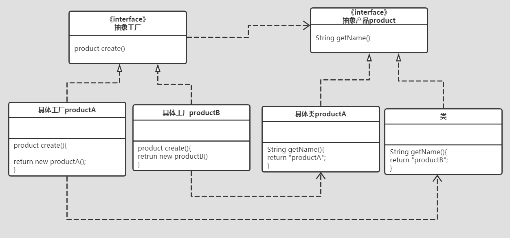
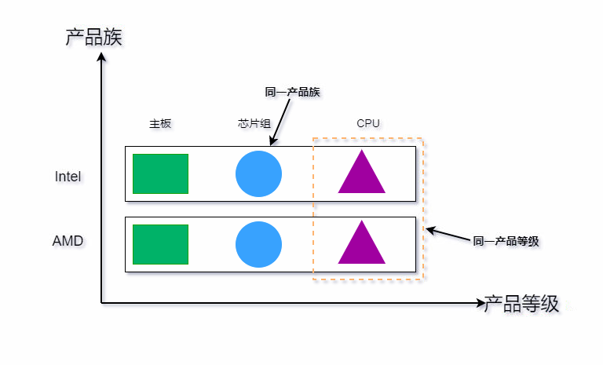
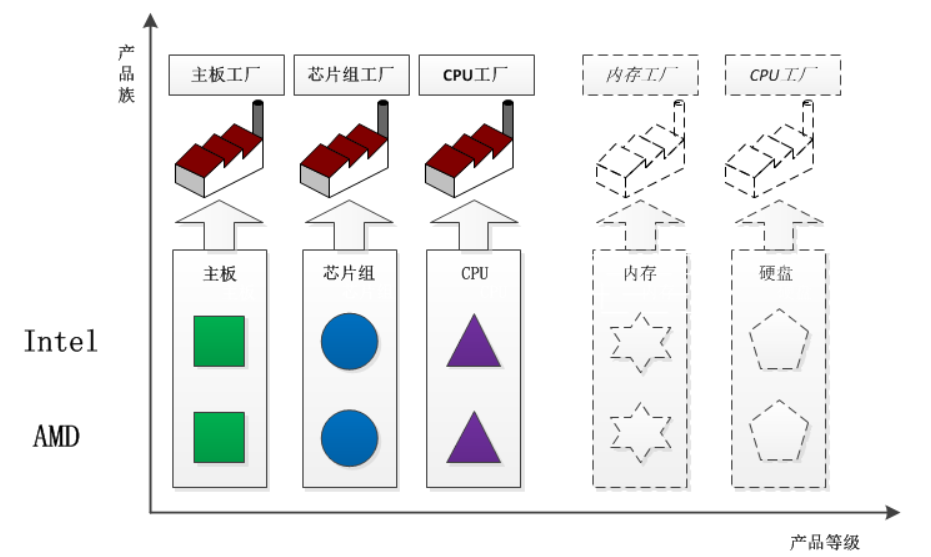
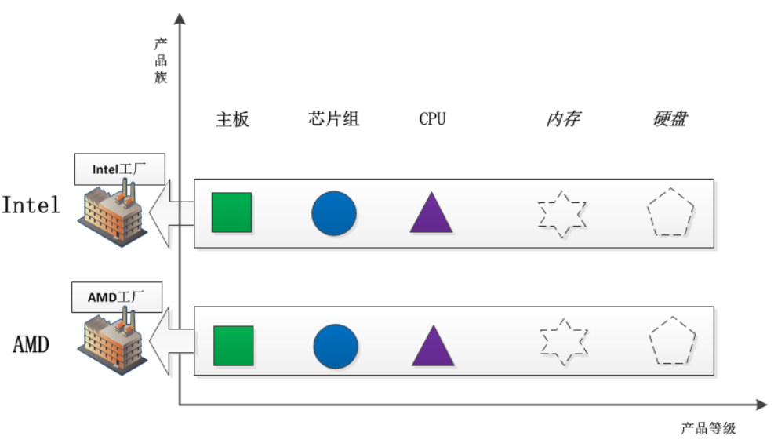
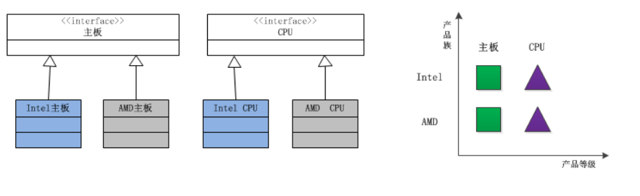
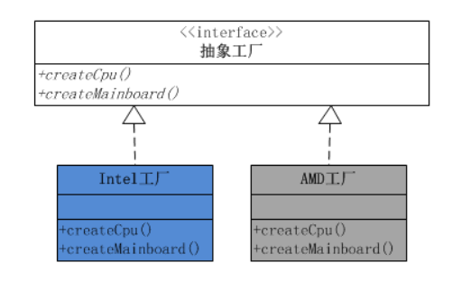
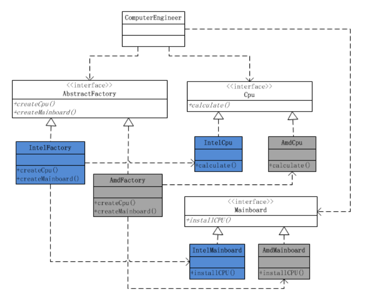
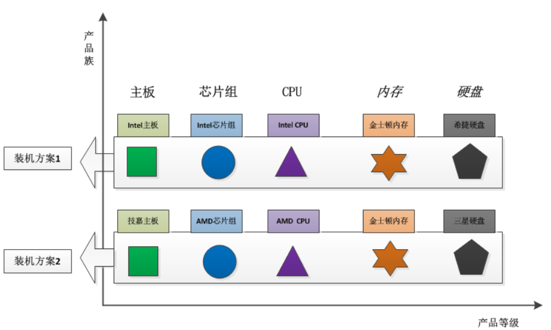
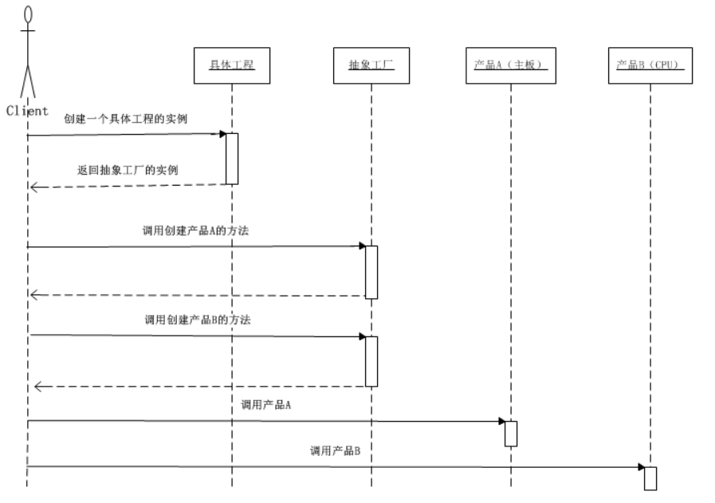

# 设计模式

## 一、设计模式介绍

`《设计模式》- GoF `一书是设计模式的开山之作

书提到了这些知识模块：

- 什么是设计模式？怎么描述设计模式？怎么选择设计模式？怎么使用设计模式？
- 通过设计一个文档编辑器的案例，介绍了设计问题与设计模式的使用
- 5 个创建型设计模式
- 7 个结构型设计模式
- 11 个行为型设计模式
- 设计模式的将来、Alexander 在建筑界的设计模式理论对软件方面的启发


设计模式（Design Patterns）——可复用面向对象软件的基础

设计模式（Design pattern）是一套被反复使用、多数人知晓的、经过分类编目的、代码设计经验的总结。


使用设计模式是为了可重用代码、让代码更容易被他人理解、保证代码可靠性。 毫无疑问，设计模式于己于他人于系统都是多赢的，设计模式使代码编制真正工程化，设计模式是软件工程的基石，如同大厦的一块块砖石一样。项目中合理的运用设计模式可以完美的解决很多问题，每种模式在现在中都有相应的原理来与之对应，每一个模式描述了一个在我们周围不断重复发生的问题，以及该问题的核心解决方案，这也是它能被广泛应用的原因。


## 二、设计模式分类

经典的《设计模式》一书归纳出23种设计模式，这23种模式又可归为，创建型、结构型和行为型3大类

### 01 | 创建型模式

前面讲过，社会化的分工越来越细，自然在软件设计方面也是如此，因此对象的创建和对象的使用分开也就成为了必然趋势。因为对象的创建会消耗掉系统的很多资源，所以 ==单独对对象的创建进行研究，从而能够高效地创建对象== 就是创建型模式要探讨的问题。

**6个具体的创建型模式：**

> 1. 简单工厂模式（Simple Factory） #说明：严格来说，简单工厂模式不是GoF总结出来的23种设计模式之一。
> 2. 工厂方法模式（Factory Method）
> 3. 抽象工厂模式（Abstract Factory）
> 4. 创建者模式（Builder）
> 5. 原型模式（Prototype）
> 6. 单例模式（Singleton）


### 02 | 结构型模式

在解决了对象的创建问题之后，==对象的组成以及对象之间的依赖关系== 就成了开发人员关注的焦点，因为如何设计对象的结构、继承和依赖关系会影响到后续程序的维护性、代码的健壮性、耦合性等。对象结构的设计很容易体现出设计人员水平的高低。

**7个具体的结构型模式：**

> 1. 适配器模式（Adapter）
> 2. 代理模式（Proxy）
> 3. 装饰模式（Decorator） 
> 4. 桥模式（Bridge、多维度）
> 5. 组合模式（Composite）  
> 6. 外观模式
> 7. 享元模式（Flyweight）


### 03 | 行为型模式

在对象的结构和对象的创建问题都解决了之后，就剩下对象的行为问题了，如果对象的行为设计的好，那么对象的行为就会更清晰，它们之间的协作效率就会提高。

**11个具体的行为型模式：**

> 1. 观察者模式（Observer）  #典型的发布订阅
> 2. 状态模式（State）
> 3. 策略模式（Strategy）
> 4. 职责链模式（Chain of Responsibility）
> 5. 命令模式（Command） 
> 6. 访问者模式（Visitor）  
> 7. 调停者模式（Mediator）
> 8. 备忘录模式（Memento） #如：虚拟机快照  #没讲（克隆：深copy、快照：浅copy）
> 9. 迭代器模式（Iterator）   
> 10. 解释器模式（Interpreter） 
> 11. 模板方法（Template Method）

   

## 三、设计模式6大原则

### 01 | 开闭原则（Open Close Principle）

开闭原则就是说 ==对扩展开放，对修改关闭== 。在程序需要进行拓展的时候，不能去修改原有的代码，实现一个热插拔的效果。

所以一句话概括就是：为了使程序的扩展性好，易于维护和升级。

想要达到这样的效果，我们需要使用接口和抽象类。

### 02 | 里氏代换原则（Liskov Substitution Principle）

里氏代换原则(Liskov Substitution Principle LSP)面向对象设计的基本原则之一。 

里氏代换原则中说，任何基类可以出现的地方，子类一定可以出现。 

LSP是继承复用的基石，只有当衍生类可以替换掉基类，软件单位的功能不受到影响时，基类才能真正被复用，而衍生类也能够在基类的基础上增加新的行为。里氏代换原则是对“开-闭”原则的补充。实现“开-闭”原则的关键步骤就是抽象化。而基类与子类的继承关系就是抽象化的具体实现，所以里氏代换原则是对实现抽象化的具体步骤的规范。—— Baidu 百科

### 03 | 依赖倒转原则（Dependence Inversion Principle）

这个是 ==开闭原则的基础==，具体内容：是对接口编程，依赖于抽象而不依赖于具体。

### 04 | 接口隔离原则（Interface Segregation Principle）

这个原则的意思是：使用多个隔离的接口，比使用单个接口要好。还是一个降低类之间的耦合度的意思。

从这儿我们看出，其实设计模式就是一个软件的设计思想，从大型软件架构出发，为了升级和维护方便。所以上文中多次出现：降低依赖，降低耦合。

### 05 | 迪米特法则（最少知道原则）（Demeter Principle）

为什么叫最少知道原则，就是说：一个实体应当尽量少的与其他实体之间发生相互作用，使得系统功能模块相对独立。

### 06 | 合成复用原则（Composite Reuse Principle）

原则是尽量使用合成/聚合的方式，而不是使用继承。


## 四、Python设计模式实例

### 01 | 创建型

#### 简单工厂模式（Simple Factory）


**角色组成：**

1. 工厂类角色：这是本模式的核心，含有一定的商业逻辑和判断逻辑，用来创建产品
2. 抽象产品角色：它一般是具体产品继承父类或者实现的接口
3. 具体产品角色：工厂类所创建的对象就是此角色的实例

> 优点：客户端不需要修改代码。
>
> 缺点： 当需要增加新的产品的时候，不仅需新加产品类，还要修改工厂类，违反了开闭原则。

代码实现：

```python
__author__ = "nanci"
# !/usr/bin/env python
# -*- coding:utf-8 -*-
"""
简单工厂模式
"""


# 1、抽象产品角色:所有产品的基类
class BaseProduct(object):
    def __init__(self, product_type, number=0, price=0):
        self.product_type = product_type
        self.number = number
        self.price = price

    def total_price(self):
        print('产品{}总价：{}'.format(self.product_type, self.number * self.price))


# 2、具体产品角色:继承自抽象产品,实现扩展
class ProductA(BaseProduct):
    def total_price(self):
        total = self.number * self.price
        reduce = 2.2
        print('产品{} 原价：{} 优惠:{} 合计：{}'.format(self.product_type, total, reduce, total - reduce))


class ProductB(BaseProduct):
    def total_price(self):
        total = self.number * self.price
        discount = 0.95
        print('产品%s 原价：%d 折扣：%0.2f 合计：%0.2f' % (self.product_type, total, discount, total * discount))


# 3、工厂类角色
class Factory(object):
    @staticmethod
    def yield_product(product_type, **kwargs) -> BaseProduct:
        if product_type == 'A':
            return ProductA('A', **kwargs)
        if product_type == 'B':
            return ProductB('B', **kwargs)


class Client(object):
    """
    客户端
    """

    def get_product(self, product_type, number, price):
        """
        获取到具体的产品对象
        :param product_type:
        :param number:
        :param price:
        :return:
        """
        return Factory.yield_product(product_type, number=number, price=price)


if __name__ == '__main__':
    product = Client().get_product('A', number=3, price=4)
    product.total_price()

    product = Client().get_product('B', number=8, price=4)
    product.total_price()


#产品A 原价：12 优惠:2.2 合计：9.8
#产品B 原价：32 折扣：0.95 合计：30.40
```


#### 工厂方法模式（Factory Method）



这个和简单工厂有区别，简单工厂模式只有一个工厂，工厂方法模式对每一个产品都有相应的工厂，能够实现最小化地修改工厂类或工厂函数。

**角色组成：**

1. 抽象工厂类角色：产品工厂类所继承的基类
2. 产品工厂类角色：创建具体的产品对象
3. 抽象产品角色：它一般是具体产品继承父类或者实现的接口
4. 具体产品角色：工厂类所创建的对象就是此角色的实例

> 优点：增加一个产品，只需要增加产品类和相对应的工厂类，不需要修改抽象工厂类。
>
> 缺点：增加产品类，会修改客户端代码，工厂方法只是把简单工厂的内部逻辑判断移到了客户端进行


具体实现：对每一个产品类再进行一次封装，封装成只生产特定产品的工厂类。

```python
__author__ = "nanci"

# !/usr/bin/env python
# -*- coding:utf-8 -*-
import abc

"""
工厂方法模式
"""


# 1、抽象产品角色:所有产品的基类
class BaseProduct(object):
    def __init__(self, product_type, number=0, price=0):
        self.product_type = product_type
        self.number = number
        self.price = price

    def total_price(self):
        print('产品{}总价：{}'.format(self.product_type, self.number * self.price))


# 2、具体产品角色:继承自抽象产品,实现自己的扩展
class ProductA(BaseProduct):
    def total_price(self):
        total = self.number * self.price
        reduce = 2.2
        print('产品{} 原价：{} 优惠:{} 合计：{}'.format(self.product_type, total, reduce, total - reduce))


class ProductB(BaseProduct):
    def total_price(self):
        total = self.number * self.price
        discount = 0.95
        print('产品%s 原价：%d 折扣：%0.2f 合计：%0.2f' % (self.product_type, total, discount, total * discount))


# 3、抽象工厂角色
class AbstractFactory(object):
    __metaclass__ = abc.ABCMeta

    @abc.abstractmethod
    def yield_product(self, number, price):
        pass


# 4、具体工厂角色
class FactoryA(AbstractFactory):

    def yield_product(self, number, price):
        return ProductA('A', number, price)


class FactoryB(AbstractFactory):

    def yield_product(self, number, price):
        return ProductB('B', number, price)


class Client(object):
    """
    客户端
    """

    def get_product(self, product_type, number, price):
        """
        获取到具体的产品对象
        :param product_type:
        :param number:
        :param price:
        :return:
        """
        # 相较于简单工厂模式，判断的逻辑移到了客户端
        if product_type == 'A':
            return FactoryA().yield_product(number=number, price=price)
        if product_type == 'B':
            return FactoryB().yield_product(number=number, price=price)


if __name__ == '__main__':
    product = Client().get_product('A', number=3, price=4)
    product.total_price()

    product = Client().get_product('B', number=8, price=4)
    product.total_price()
    
#产品A 原价：12 优惠:2.2 合计：9.8
#产品B 原价：32 折扣：0.95 合计：30.40

```

:::tip 

FactoryA，FactoryB是对类ProductA，ProductB的封装，一个工厂只负责创建一个产品遵从了单一职责原则，有利于代码的扩展和维护

:::

#### 抽象工厂（Abstract Factory）

每一个模式都是针对一定问题的解决方案。抽象工厂模式与工厂方法模式的最大区别就在于，==工厂方法模式针对的是一个产品等级结构==；而 ==抽象工厂模式则需要面对多个产品等级结构。==

在学习抽象工厂具体实例之前，应该明白两个重要的概念：`产品族`和`产品等级`。

所谓产品族，是指位于不同产品等级结构中，功能相关联的产品组成的家族。比如AMD的主板、芯片组、CPU组成一个家族，Intel的主板、芯片组、CPU组成一个家族。而这两个家族都来自于三个产品等级：主板、芯片组、CPU。一个等级结构是由相同的结构的产品组成，示意图如下：


显然，每一个产品族中含有产品的数目，与产品等级结构的数目是相等的。产品的等级结构与产品族将产品按照不同方向划分，形成一个二维的坐标系。横轴表示产品的等级结构，纵轴表示产品族，上图共有两个产品族，分布于三个不同的产品等级结构中。只要指明一个产品所处的产品族以及它所属的等级结构，就可以唯一的确定这个产品。

　　上面所给出的三个不同的等级结构具有平行的结构。因此，如果采用工厂方法模式，就势必要使用三个独立的工厂等级结构来对付这三个产品等级结构。由于这三个产品等级结构的相似性，会导致三个平行的工厂等级结构。随着产品等级结构的数目的增加，工厂方法模式所给出的工厂等级结构的数目也会随之增加。如下图：


那么，是否可以使用同一个工厂等级结构来对付这些相同或者极为相似的产品等级结构呢？当然可以的，而且这就是抽象工厂模式的好处。同一个工厂等级结构负责三个不同产品等级结构中的产品对象的创建。



可以看出，一个工厂等级结构可以创建出分属于不同产品等级结构的一个产品族中的所有对象。显然，这时候抽象工厂模式比简单工厂模式、工厂方法模式更有效率。对应于每一个产品族都有一个具体工厂。而每一个具体工厂负责创建属于同一个产品族，但是分属于不同等级结构的产品。


**抽象工厂模式结构**

抽象工厂模式（Abstract Factory Pattern）是围绕一个超级工厂创建其他工厂。该超级工厂又称为其他工厂的工厂。这种类型的设计模式属于创建型模式，它提供了一种创建对象的最佳方式，是工厂方法模式的进一步推广。

**角色组成：**

1. 抽象工厂类角色：产品工厂类所继承的基类
2. **产品族**工厂类角色：创建具体的产品对象
3. 抽象产品角色：它一般是具体产品继承父类或者实现的接口 ==（多个）==
4. 具体产品角色：工厂类所创建的对象就是此角色的实例

> 优点：
>
> 1、分离接口和实现
>
> 客户端使用抽象工厂来创建需要的对象，而客户端根本就不知道具体的实现是谁，客户端只是面向产品的接口编程而已。也就是说，客户端从具体的产品实现中解耦。
>
> 2、使切换产品族变得容易
>
> 因为一个具体的工厂实现代表的是一个产品族，比如上面例子的从Intel系列到AMD系列只需要切换一下具体工厂。

> 缺点：不太容易扩展新的产品
>
> 如果需要给整个产品族添加一个新的产品，那么就需要修改抽象工厂，这样就会导致修改所有的工厂实现类。


**抽象工厂在工厂方法基础上的改动：**

1. 产品工厂类角色扩展为产品族工厂类角色，可以创建多个产品
2. 抽象产品角色可以扩展为多个


假设一个子系统需要一些产品对象，而这些产品又属于一个以上的产品等级结构。那么为了将消费这些产品对象的责任和创建这些产品对象的责任分割开来，可以引进抽象工厂模式。这样的话，消费产品的一方不需要直接参与产品的创建工作，而只需要向一个公用的工厂接口请求所需要的产品。

通过使用抽象工厂模式，可以处理具有相同（或者相似）等级结构中的多个产品族中的产品对象的创建问题。如下图所示：


由于这两个产品族的等级结构相同，因此使用同一个工厂族也可以处理这两个产品族的创建问题，这就是抽象工厂模式。

根据产品角色的结构图，就不难给出工厂角色的结构设计图。



可以看出，每一个工厂角色都有两个工厂方法，分别负责创建分属不同产品等级结构的产品对象。



抽象工厂的功能是为一系列相关对象或相互依赖的对象创建一个接口。一定要注意，这个==接口内的方法不是任意堆砌的，而是一系列相关或相互依赖的方法==。比如上面例子中的主板和CPU，都是为了组装一台电脑的相关对象。不同的装机方案，代表一种具体的电脑系列。



由于抽象工厂定义的一系列对象通常是相关或相互依赖的，这些产品对象就构成了一个产品族，也就是抽象工厂定义了一个产品族。

这就带来非常大的灵活性，切换产品族的时候，只要提供不同的抽象工厂实现就可以了，也就是说现在是以一个产品族作为一个整体被切换。



代码实现：

```python
__author__ = "nanci"

# !/usr/bin/env python
# -*- coding:utf-8 -*-
import abc

"""
抽象工厂模式
"""


# 1-1、抽象产品角色①
class AbstractCpu(object):
    series_name = ''
    instructions = ''
    arch = ''


# 1-2、具体产品角色
class IntelCpu(AbstractCpu):
    def __init__(self, series):
        self.series_name = series


class AmdCpu(AbstractCpu):
    def __init__(self, series):
        self.series_name = series


# 2-1、抽象产品角色②
class AbstractMainBoard(object):
    series_name = ''


# 2-2、具体产品角色②
class IntelMainBoard(AbstractMainBoard):
    def __init__(self, series):
        self.series_name = series


class AmdMainBoard(AbstractMainBoard):
    def __init__(self, series):
        self.series_name = series


# 3、抽象工厂角色
class AbstractFactory(object):
    computer_name = ''

    def createCpu(self):
        pass

    def createMainBoard(self):
        pass


# 4、具体工厂角色
class IntelFactory(AbstractFactory):
    computer_name = 'Intel I7-series computer '

    def createCpu(self):
        return IntelCpu('I7-6500')

    def createMainBoard(self):
        return IntelMainBoard('Intel-6000')


class AmdFactory(AbstractFactory):
    computer_name = 'Amd 4 computer '

    def createCpu(self):
        return AmdCpu('amd444')

    def createMainBoard(self):
        return AmdMainBoard('AMD-4000')


class ComputerEngineer(object):
    """
    客户端
    """

    def makeComputer(self, factory_obj):
        self.prepareHardwares(factory_obj)

    def prepareHardwares(self, factory_obj):
        self.cpu = factory_obj.createCpu()
        self.mainboard = factory_obj.createMainBoard()

        info = '''------- computer [%s] info:
cpu: %s
mainboard: %s
-------- End --------
        ''' % (factory_obj.computer_name, self.cpu.series_name, self.mainboard.series_name)
        print(info)


if __name__ == "__main__":
    engineer = ComputerEngineer()  # 装机工程师

    intel_factory = IntelFactory()  # intel工厂
    engineer.makeComputer(intel_factory)

    amd_factory = AmdFactory()  # adm工厂
    engineer.makeComputer(amd_factory)

# 打印结果
'''
------- computer [Intel I7-series computer ] info:
cpu: I7-6500
mainboard: Intel-6000
-------- End --------
        
------- computer [Amd 4 computer ] info:
cpu: amd444
mainboard: AMD-4000
-------- End --------
'''
```


:::warning 什么时候使用抽象工厂呢?

1. 一个系统不应当依赖于产品类实例如何被创建、组合和表达的细节，这对于所有形态的工厂模式都是重要的。

2. 这个系统的产品有多于一个的产品族，而系统只消费其中某一族的产品。

3. 同属于同一个产品族的产品是在一起使用的，这一约束必须在系统的设计中体现出来。（比如：Intel主板必须使用Intel CPU、Intel芯片组）

4. 系统提供一个产品类的库，所有的产品以同样的接口出现，从而使客户端不依赖于实现。


:::


