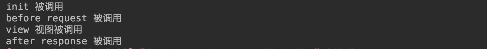
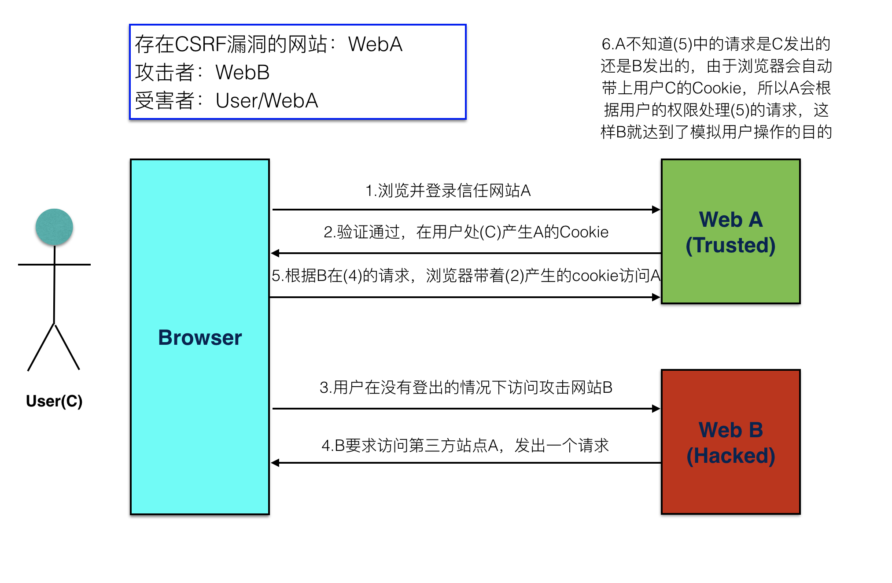
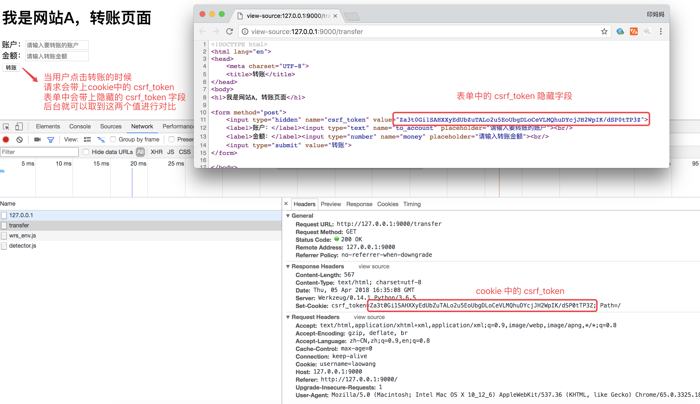
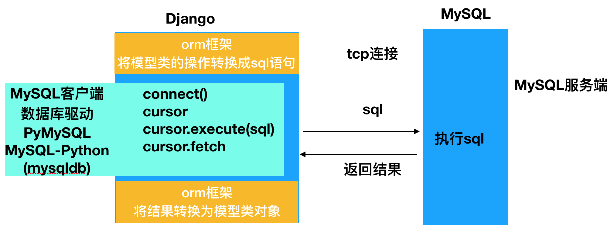
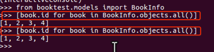

# Django基础


Django学习资料:

- [官方网站](https://www.djangoproject.com/)

- [Github源码](https://github.com/django/django)

- [2.2版英文文档](https://docs.djangoproject.com/en/2.2/)

- [2.2版中文文档](https://docs.djangoproject.com/zh-hans/2.2/)

- [Django Book 教程](http://djangobook.com/)

- [Tange With Django 教程](http://www.tangowithdjango.com/book17/)

  

## 一、Python Web 框架要点

### 01 | Web应用程序处理流程


### 02 | Web程序框架的意义

- 用于搭建Web应用程序
- 免去不同Web应用相同代码部分的重复编写，只需关心Web应用核心的业务逻辑实现

### 03 | Web应用程序的本质

- 接收并解析HTTP请求，获取具体的请求信息
- 处理本次HTTP请求，即完成本次请求的业务逻辑处理
- 构造并返回处理结果——HTTP响应

### 04 | Web框架学习方法

- 如何搭建工程程序
  - 工程的组建
  - 工程的配置
  - 路由定义
  - 视图函数定义
- 如何获取请求数据（操作request对象）
- 如何构造响应数据（构造response对象）
- 如何使用中间层
- 框架提供的其他功能组件的使用
  - 数据库
  - 模板
  - admin


## 二、Django介绍


### 01 | 简介

Django，**发音为[`dʒæŋɡəʊ]**，是用python语言写的开源web开发框架，并遵循MVC设计。劳伦斯出版集团为了开发以新闻内容为主的网站，而开发出来了这个框架，于2005年7月在BSD许可证下发布。这个名称来源于比利时的爵士音乐家DjangoReinhardt，他是一个吉普赛人，主要以演奏吉它为主，还演奏过小提琴等。**由于Django在近年来的迅速发展，应用越来越广泛，被著名IT开发杂志SDTimes评选为2013SDTimes100，位列"API、库和框架"分类第6位，被认为是该领域的佼佼者。**


Django的**主要目的是简便、快速的开发数据库驱动的网站**。它强调代码复用，多个组件可以很方便的以"插件"形式服务于整个框架，Django有许多功能强大的第三方插件，你甚至可以很方便的开发出自己的工具包。这使得Django具有很强的可扩展性。它还强调快速开发和DRY(DoNotRepeatYourself)原则。

### 2 | 特点

#### 重量级框架

对比Flask框架，Django原生提供了众多的功能组件，让开发更简便快速。

- 提供项目工程管理的自动化脚本工具

- 数据库ORM支持（对象关系映射，英语：Object Relational Mapping）
- 模板
- 表单
- Admin管理站点
- 文件管理
- 认证权限
- session机制
- 缓存

#### MVT模式

有一种程序设计模式叫**MVC**，其核心思想是**分工、解耦，让不同的代码块之间降低耦合，增强代码的可扩展性和可移植性，实现向后兼容**。

:::tip

MVC的全拼为**Model-View-Controller**，最早由TrygveReenskaug在1978年提出，是施乐帕罗奥多研究中心(Xerox PARC)在20世纪80年代为程序语言Smalltalk发明的一种软件设计模式，是为了将传统的输入（input）、处理（processing）、输出（output）任务运用到图形化用户交互模型中而设计的。随着标准输入输出设备的出现，开发人员只需要将精力集中在业务逻辑的分析与实现上。后来被推荐为Oracle旗下Sun公司Java EE平台的设计模式，并且受到越来越多的使用ColdFusion和PHP的开发者的欢迎。现在虽然不再使用原来的分工方式，但是这种分工的思想被沿用下来，广泛应用于软件工程中，是一种典型并且应用广泛的软件架构模式。后来，MVC的思想被应用在了Ｗeb开发方面，被称为Ｗeb MVC框架。

:::

**MVC模式说明**


- M全拼为Model，主要封装对数据库层的访问，对数据库中的数据进行增、删、改、查操作。
- V全拼为View，用于封装结果，生成页面展示的html内容。
- C全拼为Controller，用于接收请求，处理业务逻辑，与Model和View交互，返回结果。


**Django的MVT**


- M全拼为Model，与MVC中的M功能相同，负责和数据库交互，进行数据处理。
- V全拼为View，与MVC中的C功能相同，接收请求，进行业务处理，返回应答。
- T全拼为Template，与MVC中的V功能相同，负责封装构造要返回的html。


## 三、工程搭建

环境搭建在Win10系统上，命令跟Mac和Linux会有很大差别，使用相应命令时自行百度即可，下面使用的是git命令行操作的结果

### 01 | 环境安装

#### 准备工作

1. 检查Python环境：Django 1.11需要Python 2.7或Python 3.4以上的版本；Django 2.0需要Python 3.4以上的版本；Django 2.1需要Python 3.5以上的版本。

   ```shell
   Administrator@DESKTOP-TVEH0VN MINGW64 ~/Desktop
   $ python --version
   Python 3.8.10
   
   ```

   ```shell
   Administrator@DESKTOP-TVEH0VN MINGW64 ~/Desktop
   $ python
   Python 3.8.10 (default, May 19 2021, 13:12:57) [MSC v.1916 64 bit (AMD64)] :: An
   aconda, Inc. on win32
   
   Warning:
   This Python interpreter is in a conda environment, but the environment has
   not been activated.  Libraries may fail to load.  To activate this environment
   please see https://conda.io/activation
   
   Type "help", "copyright", "credits" or "license" for more information.
   >>> import sys
   >>> sys.version
   '3.8.10 (default, May 19 2021, 13:12:57) [MSC v.1916 64 bit (AMD64)]'
   >>> sys.version_info
   sys.version_info(major=3, minor=8, micro=10, releaselevel='final', serial=0)
   
   
   ```

2. 创建项目文件夹并切换到该目录

   ```shell
   Administrator@DESKTOP-TVEH0VN MINGW64 /d/project_study
   $ mkdir django-study
   $ cd django-study
   Administrator@DESKTOP-TVEH0VN MINGW64 /d/project_study/django-study
   ```

   

3. 创建并激活虚拟环境。

   ```shell
   Administrator@DESKTOP-TVEH0VN MINGW64 /d/project_study/django-study
   $ python -m venv venv
   $ cd venv/Scripts
   $ source venv/Scripts/activate
   (venv) 
   Administrator@DESKTOP-TVEH0VN MINGW64 /d/project_study/django-study
   $ 
   ```

   > 说明：上面使用了Python自带的venv模块完成了虚拟环境的创建，当然也可以使用virtualenv或pipenv这样的工具

4. 更新包管理工具pip。

   ```shell
   (venv) D:\project_study\django-study>pip install -U pip
   ```

   或

   ```Shell
   (venv) D:\project_study\django-study>python -m pip install --upgrade pip
   ```

   如果更新的不是虚拟环境的pip，记得一定要加参数`--user`，给足权限，否则会报错：`ERROR: Could not install packages due to an EnvironmentError: [WinError 5] 拒绝访问。: 'd:\\project_study\\django-study\\venv\\scripts\\pip.exe'
   Consider using the --user option or check the permissions.`

   ==出现这个错误的时候旧的pip也会被删除，只能使用命令` easy_install pip`将pip安装回来==

   :::tip

   请注意终端提示符发生的变化，前面的`(venv)`说明我们已经进入虚拟环境，而虚拟环境下的python和pip已经是Python3的解释器和包管理工具了。

   :::

5. 设置镜像源

   ```cmd
   pip config set global.index-url https://pypi.tuna.tsinghua.edu.cn/simple
   ```

   

#### 安装Django

安装最新版本：

```Shell
(venv)$ pip install django
```

或指定版本号来安装对应的Django的版本。

```Shell
(venv)$ pip install django==2.1.8
```


#### 复习虚拟环境和pip的命令

```shell
# 虚拟环境
python -m venv <env-name>  # 创建虚拟环境
rm -rf venv  # 直接删除虚拟环境文件夹就是删除虚拟环境
source venv/Scripts/activate  # 进入虚拟环境、查看所有虚拟环境
deactivate  # 退出虚拟环境

# pip
pip install  # 安装依赖包
pip uninstall  # 卸载依赖包
pip list  # 查看已安装的依赖库
```


### 02 | 创建工程

在django中，项目工程目录可以借助django提供的命令帮助我们创建。

####  创建

创建工程的命令为：

```shell
django-admin startproject 工程名称
```

例如：想要在桌面的code目录中创建一个名为demo的项目工程，可执行如下命令：

```shell
cd ~/Desktop/code
django-admin startproject demo
```

执行后，会多出一个新目录名为demo，此即为新创建的工程目录。

#### 工程目录说明

查看创建的工程目录，结构如下


- 与项目同名的目录，此处为demo。
- **settings.py** 是项目的整体配置文件。
- **urls.py** 是项目的URL配置文件。
- **wsgi.py** 是项目与WSGI兼容的Web服务器入口。
- **manage.py** 是项目管理文件，通过它管理项目。

#### 运行开发服务器

在开发阶段，为了能够快速预览到开发的效果，django提供了一个纯python编写的轻量级web服务器，仅在开发阶段使用。

运行服务器命令如下：

```shell
python manage.py runserver ip:端口
或：
python manage.py runserver
```

**可以不写IP和端口，默认IP是127.0.0.1，默认端口为8000**。

启动后可见如下信息：


在浏览器中输入网址“127.0.0.1:8000”便可看到效果


- django默认工作在调式Debug模式下，如果增加、修改、删除文件，服务器会自动重启。
- 按ctrl+c停止服务器。

### 03 | 创建子应用

在Web应用中，通常有一些业务功能模块是在不同的项目中都可以复用的，故在开发中通常将工程项目拆分为不同的子功能模块，各功能模块间可以保持相对的独立，在其他工程项目中需要用到某个特定功能模块时，可以将该模块代码整体复制过去，达到复用。

在Flask框架中也有类似子功能应用模块的概念，即蓝图Blueprint。

**Django的视图编写是放在子应用中的。**

#### 创建

在django中，创建子应用模块目录仍然可以通过命令来操作，即：

```shell
python manage.py startapp 子应用名称
```

**manage.py** 为上述创建工程时自动生成的管理文件。

例如，在刚才创建的demo工程中，想要创建一个用户users子应用模块，可执行：

```shell
cd ~/Desktop/code/demo
python manage.py startapp users
```

执行后，可以看到工程目录中多出了一个名为users的子目录。

#### 子应用目录说明

查看此时的工程目录，结构如下：


- **admin.py** 文件跟网站的后台管理站点配置相关。
- **apps.py** 文件用于配置当前子应用的相关信息。
- **migrations** 目录用于存放数据库迁移历史文件。
- **models.py** 文件用户保存数据库模型类。
- **tests.py** 文件用于开发测试用例，编写单元测试。
- **views.py** 文件用于编写Web应用视图。

#### 注册安装子应用

创建出来的子应用目录文件虽然被放到了工程项目目录中，但是django工程并不能立即直接使用该子应用，需要注册安装后才能使用。

在工程配置文件settings.py中，**INSTALLED_APPS**项保存了工程中已经注册安装的子应用，初始工程中的INSTALLED_APPS如下：


**注册安装一个子应用的方法，即是将子应用的配置信息文件apps.py中的Config类添加到INSTALLED_APPS列表中。**

例如，将刚创建的users子应用添加到工程中，可在INSTALLED_APPS列表中添加 **'users.apps.UsersConfig'** 


### 04 | 创建视图

同Flask框架一样，Django也用视图来编写Web应用的业务逻辑。

Django的视图是定义在子应用的views.py中的。

#### 创建

打开刚创建的users模块，在views.py中编写视图代码。

```python
from django.http import HttpResponse

def index(request):
    """
    index视图
    :param request: 包含了请求信息的请求对象
    :return: 响应对象
    """
    return HttpResponse("hello the world!")
```

说明：

- 视图函数的第一个传入参数必须定义，用于接收Django构造的包含了请求数据的**HttpReqeust**对象，通常名为**request**。
- 视图函数的返回值必须为一个响应对象，不能像Flask一样直接返回一个字符串，可以将要返回的字符串数据放到一个**HTTPResponse**对象中。

#### 定义路由URL

**1) 在子应用中新建一个urls.py文件用于保存该应用的路由**


**2) 在users/urls.py文件中定义路由信息**

```python
from django.conf.urls import url

from . import views

# urlpatterns是被django自动识别的路由列表变量
urlpatterns = [
    # 每个路由信息都需要使用url函数来构造
    # url(路径, 视图)
    url(r'^index/$', views.index),
]
```

**3) 在工程总路由demo/urls.py中添加子应用的路由数据**

```python
from django.conf.urls import url, include
from django.contrib import admin

urlpatterns = [
    url(r'^admin/', admin.site.urls),  # django默认包含的

    # 添加
    url(r'^users/', include('users.urls')), 
]
```

- 使用include来将子应用users里的全部路由包含进工程路由中；
- **r'^users/'** 决定了users子应用的所有路由都以 **/users/** 开头，如我们刚定义的视图index，其最终的完整访问路径为 **/users/index/**。

**include** 函数除了可以传递字符串之外，也可以直接传递应用的urls模块，如

```python
from django.conf.urls import url, include
from django.contrib import admin
import users.urls  # 先导入应用的urls模块

urlpatterns = [
    url(r'^admin/', admin.site.urls),
    # url(r'^users/', include('users.urls')),
    url(r'^users/', include(users.urls)),  # 添加应用的路由
]
```

**4) 启动运行**

重新启动django程序

```shell
python manage.py runserver
```

在浏览器中输入网址**127.0.0.1:8000/users/index/** 可看到返回的信息


## 四、配置

### 01 | 配置文件settings

#### BASE_DIR

当前工程的根目录，Django会依此来定位工程内的相关文件，我们也可以使用该参数来构造文件路径。

#### DEBUG

调试模式，创建工程后初始值为**True**，即默认工作在调试模式下。

作用：

- Django程序出现异常时，向前端显示详细的错误追踪信息，

**注意：部署线上运行的Django不要运行在调式模式下，记得修改DEBUG=False。**

#### 本地语言与时区

初始化的工程默认语言和时区为英语和UTC标准时区

```python
LANGUAGE_CODE = 'en-us'  # 语言
TIME_ZONE = 'UTC'  # 时区
```

将语言和时区修改为中国大陆信息

```python
LANGUAGE_CODE = 'zh-hans'
TIME_ZONE = 'Asia/Shanghai'
```


### 02 | 静态文件

项目中的CSS、图片、js都是静态文件。一般会将静态文件放到一个单独的目录中，以方便管理。在html页面中调用时，也需要指定静态文件的路径，Django中提供了一种解析的方式配置静态文件路径。静态文件可以放在项目根目录下，也可以放在应用的目录下，由于有些静态文件在项目中是通用的，所以推荐放在项目的根目录下，方便管理。

为了提供静态文件，需要配置两个参数：

- **STATICFILES_DIRS=[]** 存放查找静态文件的目录 接收的是**list**
- **STATIC_URL** 访问静态文件的URL前缀

:::tip 注意

Django 仅在调试模式下（DEBUG=True）能对外提供静态文件。

当DEBUG=False工作在生产模式时，Django不再对外提供静态文件，需要是用collectstatic命令来收集静态文件并交由其他静态文件服务器来提供。（详细在部署时会讲）

:::

### 03 | 路由说明


#### 路由定义位置

Django的主要路由信息定义在工程同名目录下的urls.py文件中，该文件是Django解析路由的入口。

每个子应用为了保持相对独立，可以在各个子应用中定义属于自己的urls.py来保存该应用的路由。然后用主路由文件包含各应用的子路由数据。

除了上述方式外，也可将工程的全部路由信息都定义在主路由文件中，子应用不再设置urls.py。如：

```
from django.conf.urls import url
from django.contrib import admin
import users.views

urlpatterns = [
    url(r'^admin/', admin.site.urls),
    url(r'^users/index/$', users.views.index)
]
```

#### 路由解析顺序

Django在接收到一个请求时，从主路由文件中的urlpatterns列表中以由上至下的顺序查找对应路由规则，如果发现规则为include包含，则再进入被包含的urls中的urlpatterns列表由上至下进行查询。

值得关注的==**由上至下**的顺序，有可能会使上面的路由屏蔽掉下面的路由，带来非预期结果==。例如：

```python
urlpatterns = [
    url(r'^say', views.say),
    url(r'^sayhello', views.sayhello),
]
```

即使访问sayhello/路径，预期应该进入sayhello视图执行，但实际优先查找到了say路由规则也与sayhello/路径匹配，实际进入了say视图执行。

:::tip 提示

**需要注意定义路由的顺序，避免出现屏蔽效应。**

:::


#### 路由命名与reverse反解析（逆向）

**1）路由命名**

在定义路由的时候，可以为路由命名，方便查找特定视图的具体路径信息。

- 在使用include函数定义路由时，可以使用namespace参数定义路由的命名空间，如

  ```python
  url(r'^users/', include('users.urls', namespace='users')),
  ```

  命名空间表示，凡是users.urls中定义的路由，均属于namespace指明的users名下。

  **命名空间的作用：避免不同应用中的路由使用了相同的名字发生冲突，使用命名空间区别开**

- 在定义普通路由时，可以使用name参数指明路由的名字，如

  ```python
  urlpatterns = [
      url(r'^index/$', views.index, name='index'),
      url(r'^say', views.say, name='say'),
  ]
  ```

  

**2）reverse反解析**

使用reverse函数，可以根据路由名称，返回具体的路径，如：

```python
from django.urls import reverse  # 注意导包路径

def index(request):
    return HttpResponse("hello the world!")

def say(request):
    url = reverse('users:index')  # 返回 /users/index/
    print(url)
    return HttpResponse('say')
```

- 对于未指明namespace的，reverse(路由name)
- 对于指明namespace的，reverse(命名空间namespace:路由name)

#### 路径结尾斜线/的说明

Django中定义路由时，通常以斜线/结尾，其好处是用户访问不以斜线/结尾的相同路径时，Django会把用户重定向到以斜线/结尾的路径上，而不会返回404不存在。如

```python
urlpatterns = [
    url(r'^index/$', views.index, name='index'),
]
```

用户访问 index 或者 index/ 网址，均能访问到index视图。

**说明：**

虽然路由结尾带/能带来上述好处，但是却违背了HTTP中URL表示资源位置路径的设计理念。

是否结尾带/以所属公司定义风格为准。


## 五、请求与响应

### 01 | 请求Request

回想一下，利用HTTP协议向服务器传参有几种途径？

- 提取URL的特定部分，如/weather/beijing/2018，可以在服务器端的路由中用正则表达式截取；
- 查询字符串（query string)，形如key1=value1&key2=value2；
- 请求体（body）中发送的数据，比如表单数据、json、xml；
- 在http报文的头（header）中。

#### URL路径参数

在定义路由URL时，可以使用正则表达式提取参数的方法从URL中获取请求参数，Django会将提取的参数直接传递到视图的传入参数中。

- 未命名参数按定义顺序传递， 如

  ```python
  url(r'^weather/([a-z]+)/(\d{4})/$', views.weather),
  
  def weather(request, city, year):
      print('city=%s' % city)
      print('year=%s' % year)
      return HttpResponse('OK')
  ```

- 命名参数按名字传递，如

  ```python
  url(r'^weather/(?P<city>[a-z]+)/(?P<year>\d{4})/$', views.weather),
  
  def weather(request, year, city):
      print('city=%s' % city)
      print('year=%s' % year)
      return HttpResponse('OK')
  ```

#### Django中的QueryDict对象

定义在django.http.QueryDict

HttpRequest对象的属性GET、POST都是QueryDict类型的对象

与python字典不同，QueryDict类型的对象用来处理同一个键带有多个值的情况

- 方法get()：根据键获取值

  ==如果一个键同时拥有多个值将获取最后一个值==

  如果键不存在则==返回None值==，可以设置默认值进行后续处理

  ```python
  dict.get('键',默认值)
  可简写为
  dict['键']
  ```

- 方法getlist()：根据键获取值，值以列表返回，可以获取指定键的所有值

  如果键不存在则==返回空列表[]==，可以设置默认值进行后续处理

  ```python
  dict.getlist('键',默认值)
  ```

#### 查询字符串Query String

获取请求路径中的查询字符串参数（形如?k1=v1&k2=v2），可以通过request.GET属性获取，返回QueryDict对象。

```python
# /qs/?a=1&b=2&a=3

def qs(request):
    a = request.GET.get('a')
    b = request.GET.get('b')
    alist = request.GET.getlist('a')
    print(a)  # 3
    print(b)  # 2
    print(alist)  # ['1', '3']
    return HttpResponse('OK')
```

**重要：查询字符串不区分请求方式，即假使客户端进行POST方式的请求，依然可以通过request.GET获取请求中的查询字符串数据。**

#### 请求体

请求体数据格式不固定，可以是表单类型字符串，可以是JSON字符串，可以是XML字符串，应区别对待。

可以发送请求体数据的请求方式有**POST**、**PUT**、**PATCH**、**DELETE**。

**Django默认开启了CSRF防护**，会对上述请求方式进行CSRF防护验证，在测试时可以关闭CSRF防护机制，方法为在settings.py文件中注释掉CSRF中间件，如：


**1）表单类型 Form Data**

前端发送的表单类型的请求体数据，可以通过request.POST属性获取，返回QueryDict对象。

```python
def get_body(request):
    a = request.POST.get('a')
    b = request.POST.get('b')
    alist = request.POST.getlist('a')
    print(a)
    print(b)
    print(alist)
    return HttpResponse('OK')
```

**重要：request.POST只能用来获取POST方式的请求体表单数据。**


**2）非表单类型 Non-Form Data**

非表单类型的请求体数据，Django无法自动解析，可以通过**request.body**属性获取最原始的请求体数据，自己按照请求体格式（JSON、XML等）进行解析。**request.body返回bytes类型。**

例如要获取请求体中的如下JSON数据

```json
{"a": 1, "b": 2}
```

可以进行如下方法操作：

```python
import json

def get_body_json(request):
    json_str = request.body
    json_str = json_str.decode()  # python3.6 无需执行此步
    req_data = json.loads(json_str)
    print(req_data['a'])
    print(req_data['b'])
    return HttpResponse('OK')
```

#### 请求头

可以通过**request.META**属性获取请求头headers中的数据，**request.META为字典类型**。

常见的请求头如：

- `CONTENT_LENGTH` – The length of the request body (as a string).
- `CONTENT_TYPE` – The MIME type of the request body.
- `HTTP_ACCEPT` – Acceptable content types for the response.
- `HTTP_ACCEPT_ENCODING` – Acceptable encodings for the response.
- `HTTP_ACCEPT_LANGUAGE` – Acceptable languages for the response.
- `HTTP_HOST` – The HTTP Host header sent by the client.
- `HTTP_REFERER` – The referring page, if any.
- `HTTP_USER_AGENT` – The client’s user-agent string.
- `QUERY_STRING` – The query string, as a single (unparsed) string.
- `REMOTE_ADDR` – The IP address of the client.
- `REMOTE_HOST` – The hostname of the client.
- `REMOTE_USER` – The user authenticated by the Web server, if any.
- `REQUEST_METHOD` – A string such as `"GET"` or `"POST"`.
- `SERVER_NAME` – The hostname of the server.
- `SERVER_PORT` – The port of the server (as a string).

具体使用如:

```python
def get_headers(request):
    print(request.META['CONTENT_TYPE'])
    return HttpResponse('OK')
```

#### 其他常用HttpRequest对象属性

- **method**：一个字符串，表示请求使用的HTTP方法，常用值包括：'GET'、'POST'。
- **user：请求的用户对象。**
- path：一个字符串，表示请求的页面的完整路径，不包含域名和参数部分。
- encoding：一个字符串，表示提交的数据的编码方式。
  - 如果为None则表示使用浏览器的默认设置，一般为utf-8。
  - 这个属性是可写的，可以通过修改它来修改访问表单数据使用的编码，接下来对属性的任何访问将使用新的encoding值。

- FILES：一个类似于字典的对象，包含所有的上传文件。

### 02 | 响应Response

视图在接收请求并处理后，必须返回HttpResponse对象或子对象。HttpRequest对象由Django创建，HttpResponse对象由开发人员创建

#### HttpResponse

可以使用**django.http.HttpResponse**来构造响应对象。

```python
HttpResponse(content=响应体, content_type=响应体数据类型, status=状态码)
```

也可通过HttpResponse对象属性来设置响应体、状态码：

- content：表示返回的内容。
- status_code：返回的HTTP响应状态码。

响应头可以直接将HttpResponse对象当做字典进行响应头键值对的设置：

```python
response = HttpResponse()
response['Itcast'] = 'Python'  # 自定义响应头Itcast, 值为Python
```

示例：

```python
from django.http import HttpResponse

def demo_view(request):
    return HttpResponse('itcast python', status=400)
    或者
    response = HttpResponse('itcast python')
    response.status_code = 400
    response['Itcast'] = 'Python'
    return response
```

#### HttpResponse子类

Django提供了一系列HttpResponse的子类，可以快速设置状态码

- HttpResponseRedirect 301
- HttpResponsePermanentRedirect 302
- HttpResponseNotModified 304
- HttpResponseBadRequest 400
- HttpResponseNotFound 404
- HttpResponseForbidden 403
- HttpResponseNotAllowed 405
- HttpResponseGone 410
- HttpResponseServerError 500

#### JsonResponse

若要返回json数据，可以使用JsonResponse来构造响应对象，作用：

- 帮助我们将数据转换为json字符串
- 设置响应头**Content-Type**为 **application/json**

```python
from django.http import JsonResponse

def demo_view(request):
    return JsonResponse({'city': 'beijing', 'subject': 'python'})
```

#### redirect重定向

```python
from django.shortcuts import redirect

def demo_view(request):
    return redirect('/index.html')
```


### 03 | Cookie

> Cookie，有时也用其复数形式Cookies，指某些网站为了辨别用户身份、进行session跟踪而储存在用户本地终端上的数据（通常经过加密）。

------

Cookie最早是网景公司的前雇员Lou Montulli在1993年3月的发明。Cookie是由服务器端生成，发送给User-Agent（一般是浏览器），浏览器会将Cookie的key/value保存到某个目录下的文本文件内，下次请求同一网站时就发送该Cookie给服务器（前提是浏览器设置为启用cookie）。Cookie名称和值可以由服务器端开发自己定义，这样服务器可以知道该用户是否是合法用户以及是否需要重新登录等。服务器可以利用Cookies包含信息的任意性来筛选并经常性维护这些信息，以判断在HTTP传输中的状态。Cookies最典型**记住用户名**。

------

Cookie是存储在浏览器中的一段纯文本信息，建议不要存储敏感信息如密码，因为电脑上的浏览器可能被其它人使用。

#### Cookie的特点

- Cookie以键值对Key-Value形势进行信息的存储。
- Cookie基于域名安全，不同域名的Cookie是不能互相访问的

#### 设置Cookie

可以通过**HttpResponse**对象中的**set_cookie**方法来设置cookie。

```python
HttpResponse.set_cookie(cookie名, value=cookie值, max_age=cookie有效期)
```

- **max_age** 单位为秒，默认为**None**。如果是临时cookie，可将max_age设置为None。

#### 读取Cookie

可以通过**HttpRequest**对象的**COOKIES**属性来读取本次请求携带的cookie值。**request.COOKIES为字典类型**。


### 05 | Session

> Session:在计算机中，尤其是在网络应用中，称为“会话控制”。Session 对象存储特定用户会话所需的属性及配置信息。这样，当用户在应用程序的 Web 页之间跳转时，存储在 Session 对象中的变量将不会丢失，而是在整个用户会话中一直存在下去。当用户请求来自应用程序的 Web 页时，如果该用户还没有会话，则 Web 服务器将自动创建一个 Session 对象。当会话过期或被放弃后，服务器将终止该会话。Session 对象最常见的一个用法就是存储用户的首选项。

#### Session 的作用

Session 的作用就是它在 Web服务器上保持用户的状态信息供在任何时间从任何设备上的页面进行访问。因为浏览器不需要存储任何这种信息，所以可以使用任何浏览器，即使是像 Pad 或手机这样的浏览器设备。

保持会话状态!

#### Session的特点

1. 依赖cookies
2. 存储敏感、重要的信息
3. 支持更多字节
4. Session共享问题


#### Session配置和存储

**1）启用Session**

==Django项目默认启用Session==

可以在settings.py文件中查看，如图所示


如需禁用session，将上图中的session中间件注释掉即可。


**2）存储方式**

在settings.py文件中，可以设置session数据的存储方式，可以保存在数据库、本地缓存等。

- 数据库

  存储在数据库中，如下设置可以写，也可以不写，**这是默认存储方式**。

  ```python
  SESSION_ENGINE='django.contrib.sessions.backends.db'
  ```

  如果存储在数据库中，需要在项INSTALLED_APPS中安装Session应用

  

  数据库中的表如图所示

  

  表结构如下:

  

  由表结构可知，操作Session包括三个数据：键，值，过期时间。

  

- 本地缓存

  存储在本机内存中，如果丢失则不能找回，比数据库的方式读写更快。

  ```python
  SESSION_ENGINE='django.contrib.sessions.backends.cache'
  ```

- 混合存储

  优先从本机内存中存取，如果没有则从数据库中存取。

  ```python
  SESSION_ENGINE='django.contrib.sessions.backends.cached_db'
  ```

- Redis

  在redis中保存session，需要引入第三方扩展，我们可以使用**django-redis**来解决。

  1） 安装扩展

  ```python
  pip install django-redis
  ```

  2）配置

  在settings.py文件中做如下设置

  ```python
  CACHES = {
      "default": {
          "BACKEND": "django_redis.cache.RedisCache",
          "LOCATION": "redis://127.0.0.1:6379/1",
          "OPTIONS": {
              "CLIENT_CLASS": "django_redis.client.DefaultClient",
          }
      }
  }
  SESSION_ENGINE = "django.contrib.sessions.backends.cache"
  SESSION_CACHE_ALIAS = "default"
  ```

  :::tip 注意

  如果redis的ip地址不是本地回环127.0.0.1，而是其他地址，访问Django时，可能出现Redis连接错误，如下：

  

  :::

解决方法：

修改redis的配置文件，添加特定ip地址。

打开redis的配置文件

```shell
sudo vim /etc/redis/redis.conf
```

在如下配置项进行修改（如要添加10.211.55.5地址）


重新启动redis服务

```shell
sudo service redis-server restart
```


#### Session操作

通过HttpRequest对象的session属性进行会话的读写操作。

1） 以键值对的格式写session。

```
request.session['键']=值
```

2）根据键读取值。

```
request.session.get('键',默认值)
```

3）清除所有session，在存储中删除值部分。

```
request.session.clear()
```

4）清除session数据，在存储中删除session的整条数据。

```
request.session.flush()
```

5）删除session中的指定键及值，在存储中只删除某个键及对应的值。

```
del request.session['键']
```

6）设置session的有效期

```
request.session.set_expiry(value)
```

- 如果value是一个整数，session将在value秒没有活动后过期。
- 如果value为0，那么用户session的Cookie将在用户的浏览器关闭时过期。
- 如果value为None，那么session有效期将采用系统默认值，**默认为两周**，可以通过在settings.py中设置**SESSION_COOKIE_AGE**来设置全局默认值。


## 六、类视图与中间件

### 01 | 类视图

#### 定义类视图

**1）类视图引入**

以函数的方式定义的视图称为**函数视图**，函数视图便于理解。但是遇到一个视图对应的路径提供了多种不同HTTP请求方式的支持时，便需要在一个函数中编写不同的业务逻辑，代码可读性与复用性都不佳。

```python
 def register(request):
    """处理注册"""

    # 获取请求方法，判断是GET/POST请求
    if request.method == 'GET':
        # 处理GET请求，返回注册页面
        return render(request, 'register.html')
    else:
        # 处理POST请求，实现注册逻辑
        return HttpResponse('这里实现注册逻辑')
```

在Django中也可以使用类来定义一个视图，称为**类视图**。

使用类视图可以将视图对应的不同请求方式以类中的不同方法来区别定义。如下所示

```python
from django.views.generic import View

class RegisterView(View):
    """类视图：处理注册"""

    def get(self, request):
        """处理GET请求，返回注册页面"""
        return render(request, 'register.html')

    def post(self, request):
        """处理POST请求，实现注册逻辑"""
        return HttpResponse('这里实现注册逻辑')
```

类视图的好处：

- **代码可读性好**
- **类视图相对于函数视图有更高的复用性**， 如果其他地方需要用到某个类视图的某个特定逻辑，直接继承该类视图即可


**2）类视图使用**

定义类视图需要继承自Django提供的父类**View**，可使用`from django.views.generic import View`或者`from django.views.generic.base import View` 导入，定义方式如上所示。

**配置路由时，使用类视图的`as_view()`方法来添加**。

```python
urlpatterns = [
    # 视图函数：注册
    # url(r'^register/$', views.register, name='register'),
    # 类视图：注册
    url(r'^register/$', views.RegisterView.as_view(), name='register'),
]
```


#### 类视图原理

```python
    @classonlymethod
    def as_view(cls, **initkwargs):
        """
        Main entry point for a request-response process.
        """
        ...省略代码...

        def view(request, *args, **kwargs):
            self = cls(**initkwargs)
            if hasattr(self, 'get') and not hasattr(self, 'head'):
                self.head = self.get
            self.request = request
            self.args = args
            self.kwargs = kwargs
            # 调用dispatch方法，按照不同请求方式调用不同请求方法
            return self.dispatch(request, *args, **kwargs)

        ...省略代码...

        # 返回真正的函数视图
        return view


    def dispatch(self, request, *args, **kwargs):
        # Try to dispatch to the right method; if a method doesn't exist,
        # defer to the error handler. Also defer to the error handler if the
        # request method isn't on the approved list.
        if request.method.lower() in self.http_method_names:
            handler = getattr(self, request.method.lower(), self.http_method_not_allowed)
        else:
            handler = self.http_method_not_allowed
        return handler(request, *args, **kwargs)
```

1.调用流程 as_view-->view-->dispatch

2.getattr('对象','字符串')


#### 类视图使用装饰器

为类视图添加装饰器，可以使用两种方法。

为了理解方便，我们先来定义一个**为函数视图准备的装饰器**（在设计装饰器时基本都以函数视图作为考虑的被装饰对象），及一个要被装饰的类视图。

```python
def my_decorator(func):
    def wrapper(request, *args, **kwargs):
        print('自定义装饰器被调用了')
        print('请求路径%s' % request.path)
        return func(request, *args, **kwargs)
    return wrapper

class DemoView(View):
    def get(self, request):
        print('get方法')
        return HttpResponse('ok')

    def post(self, request):
        print('post方法')
        return HttpResponse('ok')
```


**1）在URL配置中装饰**

```python
urlpatterns = [
    url(r'^demo/$', my_decorate(DemoView.as_view()))
]
```

此种方式最简单，但因装饰行为被放置到了url配置中，单看视图的时候无法知道此视图还被添加了装饰器，不利于代码的完整性，不建议使用。

**此种方式会为类视图中的所有请求方法都加上装饰器行为**（因为是在视图入口处，分发请求方式前）。


**2）在类视图中装饰**

在类视图中使用为函数视图准备的装饰器时，不能直接添加装饰器，需要使用**method_decorator**将其转换为适用于类视图方法的装饰器。

**method_decorator装饰器使用name参数指明被装饰的方法**

```python
# 为全部请求方法添加装饰器
@method_decorator(my_decorator, name='dispatch')
class DemoView(View):
    def get(self, request):
        print('get方法')
        return HttpResponse('ok')

    def post(self, request):
        print('post方法')
        return HttpResponse('ok')


# 为特定请求方法添加装饰器
@method_decorator(my_decorator, name='get')
class DemoView(View):
    def get(self, request):
        print('get方法')
        return HttpResponse('ok')

    def post(self, request):
        print('post方法')
        return HttpResponse('ok')
```

**如果需要为类视图的多个方法添加装饰器，但又不是所有的方法（为所有方法添加装饰器参考上面例子），可以直接在需要添加装饰器的方法上使用method_decorator，如下所示**

```python
from django.utils.decorators import method_decorator

# 为特定请求方法添加装饰器
class DemoView(View):

    @method_decorator(my_decorator)  # 为get方法添加了装饰器
    def get(self, request):
        print('get方法')
        return HttpResponse('ok')

    @method_decorator(my_decorator)  # 为post方法添加了装饰器
    def post(self, request):
        print('post方法')
        return HttpResponse('ok')

    def put(self, request):  # 没有为put方法添加装饰器
        print('put方法')
        return HttpResponse('ok')
```


#### 类视图Mixin扩展类

使用面向对象多继承的特性，可以通过定义父类（作为扩展类），在父类中定义想要向类视图补充的方法，类视图继承这些扩展父类，便可实现代码复用。

定义的扩展父类名称通常以Mixin结尾。

举例如下：

```python
class MyDecoratorMixin(object):
    @classmethod
    def as_view(cls, *args, **kwargs):
        view = super().as_view(*args, **kwargs)
        view = my_decorator(view)
        return view

class DemoView(MyDecoratorMixin, View):
    def get(self, request):
        print('get方法')
        return HttpResponse('ok')

    def post(self, request):
        print('post方法')
        return HttpResponse('ok')
    
class ListModelMixin(object):
    """
    list扩展类
    """
    def list(self, request, *args, **kwargs):
        ...
        pass

class CreateModelMixin(object):
    """
    create扩展类
    """
    def create(self, request, *args, **kwargs):
        ...
        pass

class BooksView(CreateModelMixin, ListModelMixin, View):
    """
    同时继承两个扩展类，复用list和create方法
    """
    def get(self, request):
        self.list(request)
        ...
        pass

    def post(self, request):
        self.create(request)
        ...
```


### 02 | 中间件

Django中的中间件是一个轻量级、底层的插件系统，可以介入Django的请求和响应处理过程，修改Django的输入或输出。中间件的设计为开发者提供了一种无侵入式的开发方式，增强了Django框架的健壮性。

我们可以使用中间件，在Django处理视图的不同阶段对输入或输出进行干预。

#### 中间件的定义方法

定义一个中间件工厂函数，然后返回一个可以被调用的中间件。

中间件工厂函数需要接收一个可以调用的get_response对象。

返回的中间件也是一个可以被调用的对象，并且像视图一样需要接收一个request对象参数，返回一个response对象。

```python
def simple_middleware(get_response):
    # 此处编写的代码仅在Django第一次配置和初始化的时候执行一次。

    def middleware(request):
        # 此处编写的代码会在每个请求处理视图前被调用。

        response = get_response(request)

        # 此处编写的代码会在每个请求处理视图之后被调用。

        return response

    return middleware
```

例如，在users应用中新建一个middleware.py文件，

```python
def my_middleware(get_response):
    print('init 被调用')
    def middleware(request):
        print('before request 被调用')
        response = get_response(request)
        print('after response 被调用')
        return response
    return middleware
```

**定义好中间件后，需要在settings.py 文件中添加注册中间件**

```python
MIDDLEWARE = [
    'django.middleware.security.SecurityMiddleware',
    'django.contrib.sessions.middleware.SessionMiddleware',
    'django.middleware.common.CommonMiddleware',
    # 'django.middleware.csrf.CsrfViewMiddleware',
    'django.contrib.auth.middleware.AuthenticationMiddleware',
    'django.contrib.messages.middleware.MessageMiddleware',
    'django.middleware.clickjacking.XFrameOptionsMiddleware',
    'users.middleware.my_middleware',  # 添加中间件
]
```

定义一个视图进行测试

```python
def demo_view(request):
    print('view 视图被调用')
    return HttpResponse('OK')
```

执行结果



**注意：Django运行在调试模式下，中间件init部分有可能被调用两次。**

#### 执行流程


#### 多个中间件的执行顺序

- 在请求视图被处理**前**，中间件**由上至下**依次执行
- 在请求视图被处理**后**，中间件**由下至上**依次执行


示例：

定义两个中间件

```python
def my_middleware(get_response):
    print('init 被调用')
    def middleware(request):
        print('before request 被调用')
        response = get_response(request)
        print('after response 被调用')
        return response
    return middleware

def my_middleware2(get_response):
    print('init2 被调用')
    def middleware(request):
        print('before request 2 被调用')
        response = get_response(request)
        print('after response 2 被调用')
        return response
    return middleware
```

注册添加两个中间件

```python
MIDDLEWARE = [
    'django.middleware.security.SecurityMiddleware',
    'django.contrib.sessions.middleware.SessionMiddleware',
    'django.middleware.common.CommonMiddleware',
    # 'django.middleware.csrf.CsrfViewMiddleware',
    'django.contrib.auth.middleware.AuthenticationMiddleware',
    'django.contrib.messages.middleware.MessageMiddleware',
    'django.middleware.clickjacking.XFrameOptionsMiddleware',
    'users.middleware.my_middleware',  # 添加
    'users.middleware.my_middleware2',  # 添加
]
```

执行结果

```python
init2 被调用
init 被调用
before request 被调用
before request 2 被调用
view 视图被调用
after response 2 被调用
after response 被调用
```


## 七、模板（了解）

### 01 | Django自带模板使用

#### 模板配置使用

**1）配置**

在工程中创建模板目录templates。

在settings.py配置文件中修改**TEMPLATES**配置项的DIRS值：

```python
TEMPLATES = [
    {
        'BACKEND': 'django.template.backends.django.DjangoTemplates',
        'DIRS': [os.path.join(BASE_DIR, 'templates')],  # 此处修改
        'APP_DIRS': True,
        'OPTIONS': {
            'context_processors': [
                'django.template.context_processors.debug',
                'django.template.context_processors.request',
                'django.contrib.auth.context_processors.auth',
                'django.contrib.messages.context_processors.messages',
            ],
        },
    },
]
```

**2） 定义模板**

在templates目录中新建一个模板文件，如index.html

```html
<!DOCTYPE html>
<html lang="en">
<head>
    <meta charset="UTF-8">
    <title>Title</title>
</head>
<body>
    <h1>{{ city }}</h1>
</body>
</html>
```

**3） 模板渲染**

**Django提供了一个函数render实现模板渲染。**

render(request对象, 模板文件路径, 模板数据字典)

```python
from django.shortcuts import render

def index(request):
    context={'city': '北京'}
    return render(request,'index.html',context)
```


#### 模板语法

**1）模板变量**

变量名必须由字母、数字、下划线（不能以下划线开头）和点组成。

语法如下：

```python
{{变量}}
```

模板变量可以使python的内建类型，也可以是对象。

```python
def index(request):
    context = {
        'city': '北京',
        'adict': {
            'name': '西游记',
            'author': '吴承恩'
        },
        'alist': [1, 2, 3, 4, 5]
    }
    return render(request, 'index.html', context)
<!DOCTYPE html>
<html lang="en">
<head>
    <meta charset="UTF-8">
    <title>Title</title>
</head>
<body>
    <h1>{{ city }}</h1>
    <h1>{{ adict }}</h1>
    <h1>{{ adict.name }}</h1>  注意字典的取值方法
    <h1>{{ alist }}</h1>  
    <h1>{{ alist.0 }}</h1>  注意列表的取值方法
</body>
</html>
```

**2）模板语句**

- for循环

  ```python
  
  
  循环逻辑
  {{forloop.counter}}表示当前是第几次循环，从1开始
   列表为空或不存在时执行此逻辑
  
  
  ```

- if条件

  ```python
  
  逻辑1
  
  逻辑2
  
  逻辑3
  
  ```

- 比较运算符如下：

  ```python
  ==
  !=
  <
  >
  <=
  >=
  ```

- 布尔运算符如下：

  ```python
  and
  or
  not
  ```

:::tip 注意：

运算符左右两侧不能紧挨变量或常量，必须有空格

```python
  # 正确
  # 错误
```

:::


#### 过滤器

语法如下:

- 使用管道符号|来应用过滤器，用于进行计算、转换操作，可以使用在变量、标签中。

- 如果过滤器需要参数，则使用冒号:传递参数。

  ```python
  变量|过滤器:参数
  ```

列举自带过滤器几个如下：

- **safe**，禁用转义，告诉模板这个变量是安全的，可以解释执行

- **length**，长度，返回字符串包含字符的个数，或列表、元组、字典的元素个数。

- **default**，默认值，如果变量不存在时则返回默认值。

  ```
  data|default:'默认值'
  ```

- **date**，日期，用于对日期类型的值进行字符串格式化，常用的格式化字符如下：

  - Y表示年，格式为4位，y表示两位的年。
  - m表示月，格式为01,02,12等。
  - d表示日, 格式为01,02等。
  - j表示日，格式为1,2等。
  - H表示时，24进制，h表示12进制的时。
  - i表示分，为0-59。
  - s表示秒，为0-59。

  ```
  value|date:"Y年m月j日  H时i分s秒"
  ```


::: warning 提示

template提供的内置过滤器，不够用，不灵活，就可以自己定义一个过滤器

:::

- 1、在自己的app里建一个templatetags包，在包里创建一个后面要在HTML文件引用的py文件，

- 2、在py文件中，先导入from django import template ，

  ```
    实例化对象register = template.Library()
    创建一个template能认识的函数
    对创建的每一个过滤器，都要用加上装饰器
  ```

  

- 3、在HTML文件中引用

  ```
  3.1 load mytag
  3.2 使用过滤器
  ```


**注意点: templatetags文件夹 要在各自的应用内创建**


#### 模板继承

模板继承和类的继承含义是一样的，主要是为了提高代码重用，减轻开发人员的工作量。

**父模板**

如果发现在多个模板中某些内容相同，那就应该把这段内容定义到父模板中。

标签block：用于在父模板中预留区域，留给子模板填充差异性的内容，名字不能相同。 为了更好的可读性，建议给endblock标签写上名字，这个名字与对应的block名字相同。父模板中也可以使用上下文中传递过来的数据。

```python

预留区域，可以编写默认内容，也可以没有默认内容

```

**子模板**

标签extends：继承，写在子模板文件的第一行。

```

```

子模版不用填充父模版中的所有预留区域，如果子模版没有填充，则使用父模版定义的默认值。

填充父模板中指定名称的预留区域。

```

实际填充内容
{{ block.super }}用于获取父模板中block的内容

```


#### 模板注释

1）单行注释语法如下：

```
{#...#}
```

2）多行注释使用comment标签，语法如下：

```python

...

```


### 02 | Django中使用jinja2模板

#### jinja2介绍

> Jinja2：是 Python 下一个被广泛应用的模板引擎，是由Python实现的模板语言，他的设计思想来源于 Django 的模板引擎，并扩展了其语法和一系列强大的功能，尤其是Flask框架内置的模板语言

由于django默认模板引擎功能不齐全,速度慢，所以我们也可以在Django中使用jinja2, jinja2宣称比django默认模板引擎快10-20倍。

Django主流的第三方APP基本上也都同时支持Django默认模板及jinja2，所以要用jinja2也不会有多少障碍。

#### 安装jinja2模块

```
    pip install jinja2
```

#### Django配置jinja2

1. 在项目文件中创建 jinja2_env.py 文件

```
from jinja2 import Environment

def environment(**options):
    env = Environment(**options)

    return env
```

2.在settings.py文件

```
TEMPLATES = [
    {
        'BACKEND': 'django.template.backends.jinja2.Jinja2',#修改1
        'DIRS': [os.path.join(BASE_DIR, 'templates')],
        'APP_DIRS':True,
        'OPTIONS':{
            'environment': 'jinja2_env.environment',# 修改2
            'context_processors':[
                'django.template.context_processors.debug',
                'django.template.context_processors.request',
                'django.contrib.auth.context_processors.auth',
                'django.contrib.messages.context_processors.messages',
            ],
        },
    },
]
```

#### jinja2模板的使用

inja2模板的使用绝大多数和Django自带模板一样

```
1.for循环有差异
```


#### jinja2自定义过滤器

在jinja2_env.py文件中自定义过滤器

```
from jinja2 import Environment

def environment(**options):
    env = Environment(**options)

    # 2.将自定义的过滤器添加到 环境中
    env.filters['do_listreverse'] = do_listreverse

    return env

# 1.自定义过滤器
def do_listreverse(li):
    if li == "B":
        return "哈哈"
```


### 03 | CSRF攻击

- `CSRF`全拼为`Cross Site Request Forgery`，译为跨站请求伪造。
- CSRF指攻击者盗用了你的身份，以你的名义发送恶意请求。
  - 包括：以你名义发送邮件，发消息，盗取你的账号，甚至于购买商品，虚拟货币转账......
- 造成的问题：个人隐私泄露以及财产安全。


#### CSRF攻击示意图

客户端访问服务器时没有同服务器做安全验证



#### 防止 CSRF 攻击

步骤

1. 在客户端向后端请求界面数据的时候，后端会往响应中的 cookie 中设置 csrf_token 的值
2. 在 Form 表单中添加一个隐藏的的字段，值也是 csrf_token
3. 在用户点击提交的时候，会带上这两个值向后台发起请求
4. 后端接受到请求，以会以下几件事件：
   - 从 cookie中取出 csrf_token
   - 从 表单数据中取出来隐藏的 csrf_token 的值
   - 进行对比
5. 如果比较之后两值一样，那么代表是正常的请求，如果没取到或者比较不一样，代表不是正常的请求，不执行下一步操作


#### CSRF_TOKEN的设置过程




## 八、数据库

### 01 | ORM框架

O是object，也就**类对象**的意思，R是relation，翻译成中文是关系，也就是关系数据库中**数据表**的意思，M是mapping，是**映射**的意思。在ORM框架中，它帮我们把类和数据表进行了一个映射，可以让我们**通过类和类对象就能操作它所对应的表格中的数据**。ORM框架还有一个功能，它可以**根据我们设计的类自动帮我们生成数据库中的表格**，省去了我们自己建表的过程。

django中内嵌了ORM框架，不需要直接面向数据库编程，而是定义模型类，通过模型类和对象完成数据表的增删改查操作。

使用django进行数据库开发的步骤如下：

1. 配置数据库连接信息
2. 在models.py中定义模型类
3. 迁移
4. 通过类和对象完成数据增删改查操作

**ORM作用**




### 02 | 配置

在settings.py中保存了数据库的连接配置信息，Django默认初始配置使用**sqlite**数据库。

1. 使用**MySQL**数据库首先需要安装驱动程序

   ```
   pip install PyMySQL
   ```

2. 在Django的工程同名子目录的__init__.py文件中添加如下语句

   ```python
   from pymysql import install_as_MySQLdb
   
   install_as_MySQLdb()
   ```

   作用是让Django的ORM能以mysqldb的方式来调用PyMySQL。

3. 修改**DATABASES**配置信息

   ```python
   DATABASES = {
       'default': {
           'ENGINE': 'django.db.backends.mysql',
           'HOST': '127.0.0.1',  # 数据库主机
           'PORT': 3306,  # 数据库端口
           'USER': 'root',  # 数据库用户名
           'PASSWORD': 'mysql',  # 数据库用户密码
           'NAME': 'django_demo'  # 数据库名字
       }
   }
   ```

4. 在MySQL中创建数据库

   ```mysql
   create database django_demo default charset=utf8;
   ```


### 03 | 定义模型类

- 模型类被定义在"应用/models.py"文件中。
- 模型类必须继承自Model类，位于包django.db.models中。

接下来首先以"图书-英雄"管理为例进行演示。

#### 定义

创建应用booktest，在models.py 文件中定义模型类。

```python
from django.db import models

#定义图书模型类BookInfo
class BookInfo(models.Model):
    btitle = models.CharField(max_length=20, verbose_name='名称')
    bpub_date = models.DateField(verbose_name='发布日期')
    bread = models.IntegerField(default=0, verbose_name='阅读量')
    bcomment = models.IntegerField(default=0, verbose_name='评论量')
    is_delete = models.BooleanField(default=False, verbose_name='逻辑删除')

    class Meta:
        db_table = 'tb_books'  # 指明数据库表名
        verbose_name = '图书'  # 在admin站点中显示的名称
        verbose_name_plural = verbose_name  # 显示的复数名称

    def __str__(self):
        """定义每个数据对象的显示信息"""
        return self.btitle

#定义英雄模型类HeroInfo
class HeroInfo(models.Model):
    GENDER_CHOICES = (
        (0, 'female'),
        (1, 'male')
    )
    hname = models.CharField(max_length=20, verbose_name='名称') 
    hgender = models.SmallIntegerField(choices=GENDER_CHOICES, default=0, verbose_name='性别')  
    hcomment = models.CharField(max_length=200, null=True, verbose_name='描述信息') 
    hbook = models.ForeignKey(BookInfo, on_delete=models.CASCADE, verbose_name='图书')  # 外键
    is_delete = models.BooleanField(default=False, verbose_name='逻辑删除')

    class Meta:
        db_table = 'tb_heros'
        verbose_name = '英雄'
        verbose_name_plural = verbose_name

    def __str__(self):
        return self.hname
```

**1） 数据库表名**

模型类如果未指明表名，Django默认以 **小写app应用名_小写模型类名** 为数据库表名。

可通过**db_table** 指明数据库表名。

**2） 关于主键**

==Django会为表创建自动增长的主键列==，每个模型只能有一个主键列，如果使用选项设置某属性为主键列后Django不会再创建自动增长的主键列。

默认创建的主键列属性为id，可以使用pk代替，pk全拼为primary key。

**3） 属性命名限制**

- 不能是python的保留关键字。

- 不允许使用连续的下划线，这是由django的查询方式决定的。

- 定义属性时需要指定字段类型，通过字段类型的参数指定选项，语法如下：

  ```python
  属性=models.字段类型(选项)
  ```

**4）字段类型**

| 类型             | 说明                                                         |
| :--------------- | :----------------------------------------------------------- |
| AutoField        | 自动增长的IntegerField，通常不用指定，不指定时Django会自动创建属性名为id的自动增长属性 |
| BooleanField     | 布尔字段，值为True或False                                    |
| NullBooleanField | 支持Null、True、False三种值                                  |
| CharField        | 字符串，参数max_length表示最大字符个数                       |
| TextField        | 大文本字段，一般超过4000个字符时使用                         |
| IntegerField     | 整数                                                         |
| DecimalField     | 十进制浮点数， 参数max_digits表示总位数， 参数decimal_places表示小数位数 |
| FloatField       | 浮点数                                                       |
| DateField        | 日期， 参数auto_now表示每次保存对象时，自动设置该字段为当前时间，用于"最后一次修改"的时间戳，它总是使用当前日期，默认为False； 参数auto_now_add表示当对象第一次被创建时自动设置当前时间，用于创建的时间戳，它总是使用当前日期，默认为False; 参数auto_now_add和auto_now是相互排斥的，组合将会发生错误 |
| TimeField        | 时间，参数同DateField                                        |
| DateTimeField    | 日期时间，参数同DateField                                    |
| FileField        | 上传文件字段                                                 |
| ImageField       | 继承于FileField，对上传的内容进行校验，确保是有效的图片      |

**5） 选项**

| 选项        | 说明                                                         |
| :---------- | ------------------------------------------------------------ |
| null        | 如果为True，表示允许为空，默认值是False                      |
| blank       | 如果为True，则该字段允许为空白，默认值是False                |
| db_column   | 字段的名称，如果未指定，则使用属性的名称                     |
| db_index    | 若值为True, 则在表中会为此字段创建索引，默认值是False        |
| default     | 默认                                                         |
| primary_key | 若为True，则该字段会成为模型的主键字段，默认值是False，一般作为AutoField的选项使用 |
| unique      | 如果为True, 这个字段在表中必须有唯一值，默认值是False        |

**null是数据库范畴的概念，blank是表单验证范畴的**

**6） 外键**

在设置外键时，需要通过**on_delete**选项指明主表删除数据时，对于外键引用表数据如何处理，在django.db.models中包含了可选常量：

- **CASCADE** 级联，删除主表数据时连通一起删除外键表中数据

- **PROTECT** 保护，通过抛出**ProtectedError**异常，来阻止删除主表中被外键应用的数据

- **SET_NULL** 设置为NULL，仅在该字段null=True允许为null时可用

- **SET_DEFAULT** 设置为默认值，仅在该字段设置了默认值时可用

- **SET()** 设置为特定值或者调用特定方法，如

  ```python
  from django.conf import settings
  from django.contrib.auth import get_user_model
  from django.db import models
  
  def get_sentinel_user():
      return get_user_model().objects.get_or_create(username='deleted')[0]
  
  class MyModel(models.Model):
      user = models.ForeignKey(
          settings.AUTH_USER_MODEL,
          on_delete=models.SET(get_sentinel_user),
      )
  ```

- **DO_NOTHING** 不做任何操作，如果数据库前置指明级联性，此选项会抛出**IntegrityError**异常

#### 迁移

将模型类同步到数据库中。

**1）生成迁移文件**

```python
python manage.py makemigrations
```

**2）同步到数据库中**

```python
python manage.py migrate
```

#### 添加测试数据

```mysql
insert into tb_books(btitle,bpub_date,bread,bcomment,is_delete) values
('射雕英雄传','1980-5-1',12,34,0),
('天龙八部','1986-7-24',36,40,0),
('笑傲江湖','1995-12-24',20,80,0),
('雪山飞狐','1987-11-11',58,24,0);
insert into tb_heros(hname,hgender,hbook_id,hcomment,is_delete) values
('郭靖',1,1,'降龙十八掌',0),
('黄蓉',0,1,'打狗棍法',0),
('黄药师',1,1,'弹指神通',0),
('欧阳锋',1,1,'蛤蟆功',0),
('梅超风',0,1,'九阴白骨爪',0),
('乔峰',1,2,'降龙十八掌',0),
('段誉',1,2,'六脉神剑',0),
('虚竹',1,2,'天山六阳掌',0),
('王语嫣',0,2,'神仙姐姐',0),
('令狐冲',1,3,'独孤九剑',0),
('任盈盈',0,3,'弹琴',0),
('岳不群',1,3,'华山剑法',0),
('东方不败',0,3,'葵花宝典',0),
('胡斐',1,4,'胡家刀法',0),
('苗若兰',0,4,'黄衣',0),
('程灵素',0,4,'医术',0),
('袁紫衣',0,4,'六合拳',0);
```


### 04 | 演示工具使用

#### shell工具

Django的manage工具提供了**shell**命令，帮助我们配置好当前工程的运行环境（如连接好数据库等），以便可以直接在终端中执行测试python语句。

通过如下命令进入shell

```python
python manage.py shell
```


导入两个模型类，以便后续使用

```python
from booktest.models import BookInfo, HeroInfo
```

####  

#### 查看MySQL数据库日志

查看mysql数据库日志可以查看对数据库的操作记录。 mysql日志文件默认没有产生，需要做如下配置：

```shell
sudo vi /etc/mysql/mysql.conf.d/mysqld.cnf
```


把68，69行前面的#去除，然后保存并使用如下命令重启mysql服务。

```shell
sudo service mysql restart
```

使用如下命令打开mysql日志文件。

```shell
tail -f /var/log/mysql/mysql.log  # 可以实时查看数据库的日志内容
# 如提示需要sudo权限，执行
# sudo tail -f /var/log/mysql/mysql.log
```


### 05 | 数据库操作—增

增加数据有两种方法。

#### save

通过创建模型类对象，执行对象的save()方法保存到数据库中。

```python
>>> from datetime import date
>>> book = BookInfo(
    btitle='西游记',
    bpub_date=date(1988,1,1),
    bread=10,
    bcomment=10
)
>>> book.save()
>>> hero = HeroInfo(
    hname='孙悟空',
    hgender=0,
    hbook=book
)
>>> hero.save()
>>> hero2 = HeroInfo(
    hname='猪八戒',
    hgender=0,
    hbook_id=book.id
)
>>> hero2.save()
```

#### create

通过模型类.objects.create()保存。

```python
>>> HeroInfo.objects.create(
    hname='沙悟净',
    hgender=0,
    hbook=book
)
<HeroInfo: 沙悟净>
```


### 06 | 数据库操作—删

删除有两种方法

#### 模型类对象delete

```python
hero = HeroInfo.objects.get(id=13)
hero.delete()
```

#### 模型类.objects.filter().delete()

```python
HeroInfo.objects.filter(id=14).delete()
```


### 07 | 数据库操作—改

修改更新有两种方法

#### save

**修改模型类对象的属性，然后执行save()方法**

```python
hero = HeroInfo.objects.get(hname='猪八戒')
hero.hname = '猪悟能'
hero.save()
```

#### update

**使用模型类.objects.filter().update()**，会返回受影响的行数

```python
HeroInfo.objects.filter(hname='沙悟净').update(hname='沙僧')
```


### 08 | 数据库操作—查

#### 基本查询

**get** 查询单一结果，如果不存在会抛出**模型类.DoesNotExist**异常

**all** 查询多个结果

**count** 查询结果数量

```python
>>> BookInfo.objects.all()
<QuerySet [<BookInfo: 射雕英雄传>, <BookInfo: 天龙八部>, <BookInfo: 笑傲江湖>, <BookInfo: 雪山飞狐>, <BookInfo: 西游记>]>
>>> book = BookInfo.objects.get(btitle='西游记')
>>> book.id
5

>>> BookInfo.objects.get(id=3)
<BookInfo: 笑傲江湖>
>>> BookInfo.objects.get(pk=3)
<BookInfo: 笑傲江湖>
>>> BookInfo.objects.get(id=100)
Traceback (most recent call last):
  File "<console>", line 1, in <module>
  File "/Users/delron/.virtualenv/dj/lib/python3.6/site-packages/django/db/models/manager.py", line 85, in manager_method
    return getattr(self.get_queryset(), name)(*args, **kwargs)
  File "/Users/delron/.virtualenv/dj/lib/python3.6/site-packages/django/db/models/query.py", line 380, in get
    self.model._meta.object_name
db.models.DoesNotExist: BookInfo matching query does not exist.

>>> BookInfo.objects.count()
>>>6
```


#### 过滤查询

实现SQL中的where功能，包括

- **filter** 过滤出多个结果
- **exclude** 排除掉符合条件剩下的结果
- **get** 过滤单一结果

对于过滤条件的使用，上述三个方法相同，故仅以**filter**进行讲解。

过滤条件的表达语法如下：

```python
属性名称__比较运算符=值
# 属性名称和比较运算符间使用两个下划线，所以属性名不能包括多个下划线
```

**1）相等**

**exact：表示判等。**例：查询编号为1的图书。

```python
BookInfo.objects.filter(id__exact=1)
可简写为：
BookInfo.objects.filter(id=1)
```


**2）模糊查询**

**contains：是否包含。** ==**说明：**如果要包含%无需转义，直接写即可。==

例：查询书名包含'传'的图书。

```python
BookInfo.objects.filter(btitle__contains='传')
```


**startswith、endswith：以指定值开头或结尾。**

例：查询书名以'部'结尾的图书

```python
BookInfo.objects.filter(btitle__endswith='部')
```

:::tip

以上运算符都区分大小写，在这些运算符前加上i表示不区分大小写，如iexact、icontains、istartswith、iendswith

:::


**3）空查询**

**isnull：是否为null。**例：查询书名不为空的图书。

```python
BookInfo.objects.filter(btitle__isnull=False)
```


**4）范围查询**

**in：是否包含在范围内。**例：查询编号为1或3或5的图书

```python
BookInfo.objects.filter(id__in=[1, 3, 5])
```


**5）比较查询**

**gt** 大于 (greater then)

**gte** 大于等于 (greater then equal)

**lt** 小于 (less then)

**lte** 小于等于 (less then equal)

例：查询编号大于3的图书

```python
BookInfo.objects.filter(id__gt=3)
```


**6）不等于的运算符，使用exclude()过滤器。**

例：查询编号不等于3的图书

```python
BookInfo.objects.exclude(id=3)
```


**7）日期查询**

**year、month、day、week_day、hour、minute、second：对日期时间类型的属性进行运算。**

例：查询1980年发表的图书。

```python
BookInfo.objects.filter(bpub_date__year=1980)
```

例：查询1980年1月1日后发表的图书。

```python
BookInfo.objects.filter(bpub_date__gt=date(1990, 1, 1))
```


#### F对象

之前的查询都是对象的属性与常量值比较，两个属性怎么比较呢？ 答：使用F对象，被定义在django.db.models中。

语法如下：

```
F(属性名)
```

例：查询阅读量大于等于评论量的图书。

```python
from django.db.models import F

BookInfo.objects.filter(bread__gte=F('bcomment'))
```

可以在F对象上使用算数运算。

例：查询阅读量大于2倍评论量的图书。

```python
BookInfo.objects.filter(bread__gt=F('bcomment') * 2)
```


#### Q对象

**多个过滤器逐个调用表示逻辑与关系，同sql语句中where部分的and关键字。**

例：查询阅读量大于20，并且编号小于3的图书。

```python
BookInfo.objects.filter(bread__gt=20,id__lt=3)
或
BookInfo.objects.filter(bread__gt=20).filter(id__lt=3)
```

**如果需要实现逻辑或or的查询，需要使用Q()对象结合|运算符**，Q对象被义在django.db.models中。

语法如下：

```
Q(属性名__运算符=值)
```

例：查询阅读量大于20的图书，改写为Q对象如下。

```python
from django.db.models import Q

BookInfo.objects.filter(Q(bread__gt=20))
```

Q对象可以使用&、|连接，&表示逻辑与，|表示逻辑或。

例：查询阅读量大于20，或编号小于3的图书，只能使用Q对象实现

```python
BookInfo.objects.filter(Q(bread__gt=20) | Q(pk__lt=3))
```

Q对象前可以使用~操作符，表示非not。

例：查询编号不等于3的图书。

```python
BookInfo.objects.filter(~Q(pk=3))
```


#### 聚合函数

使用aggregate()过滤器调用聚合函数。聚合函数包括：**Avg** 平均，**Count** 数量，**Max** 最大，**Min** 最小，**Sum** 求和，被定义在django.db.models中。

例：查询图书的总阅读量。

```python
from django.db.models import Sum

BookInfo.objects.aggregate(Sum('bread'))
```

注意aggregate的返回值是一个字典类型，格式如下：

```python
  {'属性名__聚合类小写':值}
  如:{'bread__sum':3}
```

使用count时一般不使用aggregate()过滤器。

例：查询图书总数。

```python
BookInfo.objects.count()
```

注意count函数的返回值是一个数字。


#### 排序

使用**order_by**对结果进行排序

```python
BookInfo.objects.all().order_by('bread')  # 升序
BookInfo.objects.all().order_by('-bread')  # 降序
```


#### 关联查询

由一到多的访问语法：

一对应的模型类对象.多对应的模型类名小写_set 例：

```python
b = BookInfo.objects.get(id=1)
b.heroinfo_set.all()
```


由多到一的访问语法:

多对应的模型类对象.多对应的模型类中的关系类属性名 例：

```python
h = HeroInfo.objects.get(id=1)
h.hbook
```

访问一对多的模型类关联对象的id语法:

多对一的模型类对象.关联类属性_id

例：

```python
h = HeroInfo.objects.get(id=1)
h.hbook_id
```


#### 关联过滤查询

**由多模型类条件查询一模型类数据**:

语法如下：

```python
关联模型类名小写__属性名__条件运算符=值
```

**注意：如果没有"__运算符"部分，表示等于。**

例：

查询图书，要求图书英雄为"孙悟空"

```python
BookInfo.objects.filter(heroinfo__hname='孙悟空')
```

查询图书，要求图书中英雄的描述包含"八"

```python
BookInfo.objects.filter(heroinfo__hcomment__contains='八')
```

**由一模型类条件查询多模型类数据**:

语法如下：

```
一模型类关联属性名__一模型类属性名__条件运算符=值
```

**注意：如果没有"__运算符"部分，表示等于。**

例：

查询书名为“天龙八部”的所有英雄。

```python
HeroInfo.objects.filter(hbook__btitle='天龙八部')
```

查询图书阅读量大于30的所有英雄

```python
HeroInfo.objects.filter(hbook__bread__gt=30)
```


#### 查询集 QuerySet

**1）概念**

Django的ORM中存在查询集的概念。

查询集，也称查询结果集、QuerySet，表示从数据库中获取的对象集合。

当调用如下过滤器方法时，Django会返回查询集（而不是简单的列表）：

- all()：返回所有数据。
- filter()：返回满足条件的数据。
- exclude()：返回满足条件之外的数据。
- order_by()：对结果进行排序。

对查询集可以再次调用过滤器进行过滤，如

```python
BookInfo.objects.filter(bread__gt=30).order_by('bpub_date')
```

也就意味着查询集可以含有零个、一个或多个过滤器。过滤器基于所给的参数限制查询的结果。

**从SQL的角度讲，查询集与select语句等价，过滤器像where、limit、order by子句。**

:::tip

**判断某一个查询集中是否有数据**：

- exists()：判断查询集中是否有数据，如果有则返回True，没有则返回False。

:::


**2）两大特性**

<font color=red>惰性执行</font>

创建查询集不会访问数据库，直到调用数据时，才会访问数据库，调用数据的情况包括迭代、序列化、与if合用

例如，当执行如下语句时，并未进行数据库查询，只是创建了一个查询集qs

```python
qs = BookInfo.objects.all()
```

继续执行遍历迭代操作后，才真正的进行了数据库的查询

```python
for book in qs:
    print(book.btitle)
```


<font color=red>缓存</font>

使用同一个查询集，第一次使用时会发生数据库的查询，然后Django会把结果缓存下来，再次使用这个查询集时会使用缓存的数据，减少了数据库的查询次数。

**情况一**：如下是两个查询集，无法重用缓存，每次查询都会与数据库进行一次交互，增加了数据库的负载。

```python
from booktest.models import BookInfo
[book.id for book in BookInfo.objects.all()]
[book.id for book in BookInfo.objects.all()]
```




**情况二**：经过存储后，可以重用查询集，第二次使用缓存中的数据。

```python
qs=BookInfo.objects.all()
[book.id for book in qs]
[book.id for book in qs]
```


**3）限制查询集**

可以对查询集进行取下标或切片操作，等同于sql中的limit和offset子句。

> 注意：不支持负数索引。

**对查询集进行切片后返回一个新的查询集，不会立即执行查询。**

如果获取一个对象，直接使用[0]，等同于[0:1].get()，但是如果没有数据，[0]引发IndexError异常，[0:1].get()如果没有数据引发DoesNotExist异常。

示例：获取第1、2项，运行查看。

```python
qs = BookInfo.objects.all()[0:2]
```


#### 管理器Manager

管理器是Django的模型进行数据库操作的接口，Django应用的每个模型类都拥有至少一个管理器。

我们在通过模型类的**objects**属性提供的方法操作数据库时，即是在使用一个管理器对象objects。当没有为模型类定义管理器时，Django会为每一个模型类生成一个名为objects的管理器，它是**models.Manager**类的对象。


我们可以自定义管理器，并应用到我们的模型类上。

**注意：一旦为模型类指明自定义的过滤器后，Django不再生成默认管理对象objects。**

自定义管理器类主要用于两种情况：

**1. 修改原始查询集，重写all()方法。**

a）打开booktest/models.py文件，定义类BookInfoManager

```python
#图书管理器
class BookInfoManager(models.Manager):
    def all(self):
        #默认查询未删除的图书信息
        #调用父类的成员语法为：super().方法名
        return super().filter(is_delete=False)
```

b）在模型类BookInfo中定义管理器

```
class BookInfo(models.Model):
    ...
    books = BookInfoManager()
```

c）使用方法

```python
BookInfo.books.all()
```

**2. 在管理器类中补充定义新的方法**

a）打开booktest/models.py文件，定义方法create。

```python
class BookInfoManager(models.Manager):
    #创建模型类，接收参数为属性赋值
    def create_book(self, title, pub_date):
        #创建模型类对象self.model可以获得模型类
        book = self.model()
        book.btitle = title
        book.bpub_date = pub_date
        book.bread=0
        book.bcommet=0
        book.is_delete = False
        # 将数据插入进数据表
        book.save()
        return book
```

b）为模型类BookInfo定义管理器books语法如下

```
class BookInfo(models.Model):
      ...
    books = BookInfoManager()
```

c）调用语法如下：

```
book=BookInfo.books.create_book("abc",date(1980,1,1))
```