# Windows上搭建Jenkins环境

## 一、安装Docker Desktop

下载并安装 [Docker Desktop for Windows](https://desktop.docker.com/win/stable/amd64/Docker%20Desktop%20Installer.exe?utm_source=docker&utm_medium=webreferral&utm_campaign=dd-smartbutton&utm_location=header)，安装完成后点击桌面的快捷方式启动docker

如果需要更新wsl2，请安装[WSL2](https://docs.microsoft.com/zh-cn/windows/wsl/install-win10)

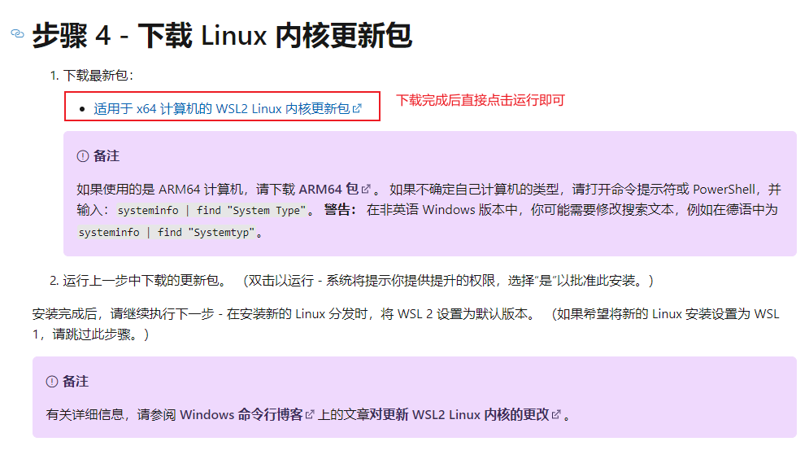

## 二、Docker 安装Jenkins

### 1 | 选择拉取中文版的Jenkins镜像

```sh
docker pull jenkinszh/jenkins-zh
```

修改标签（生成新的镜像）

```sh
docker tag jenkinszh/jenkins-zh ct_test:jenkins
```

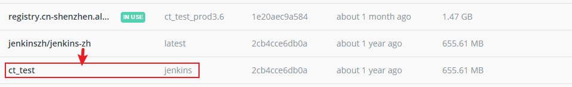

### 2 | 创建Jenkins挂载目录并授权权限

在主机上先创建容器test_jenkins的一个挂载目录` D:\env_local\docker_mount\test_jenkins`

> TIP：本机安装了[Cygwin](https://www.cygwin.com/)
>
> `D:\env_local\docker_mount\test_jenkins`会被映射为 `/cygdrive/d/env_local/docker_mount/test_jenkins`

### 3 | 创建并启动Jenkins容器

命令如下，别着急执行命令，记得改路径

```sh
docker run -d -p 1080:8080 -p 1022:22 \
-v  /d/env_local/docker_mount/test_jenkins/jenkins:/var/jenkins_home \
-v   /d/env_local/docker_mount/test_jenkins/apache-maven-3.8.1:/usr/local/maven \
--name test_jenkins ct_test:jenkins

```

 启动后报错：

```sh
touch: cannot touch '/var/jenkins_home/copy_reference_file.log': Permission denied

touch: cannot touch '/var/jenkins_home/copy_reference_file.log': Permission denied


Can not write to /var/jenkins_home/copy_reference_file.log. Wrong volume permissions?

Can not write to /var/jenkins_home/copy_reference_file.log. Wrong volume permissions?
```

解决办法：

```sh
docker run -d -p 1080:8080 -p 1022:22 \
-v  /cygdrive/d/env_local/docker_mount/test_jenkins/jenkins:/var/jenkins_home \
-v  /cygdrive/d/env_local/docker_mount/test_jenkins/apache-maven-3.8.1:/usr/local/maven \
-u 0 --name test_jenkins ct_test:jenkins
```

这命令的意思是覆盖容器中内置的帐号，该用外部传入，这里传入0代表的是root帐号Id。这样再启动的时候就应该没问题了


**标注一下几个参数的意思**

```sh
-d 后台运行镜像

-p 1080:8080 意义： 将镜像的8080端口映射到主机的1080端口

-p 1022:22 意义：将镜像的22端口映射到主机的1022端口

-v /cygdrive/d/env_local/docker_mount/jenkins:/var/jenkins_home 
意义： /var/jenkins_home目录为容器jenkins工作目录，我们将硬盘上的一个目录挂载到这个位置，方便后续更新镜像后继续使用原来的工作目录。这里我们设置的就是上面我们创建的/cygdrive/d/env_local/docker_mount/jenkins目录

-v /cygdrive/d/env_local/docker_mount/apache-maven-3.8.1:/usr/local/maven 
意义：挂载本地maven，前面是主机上的，后面是挂载到容器上的目录

-v /etc/localtime:/etc/localtime 意义：让容器使用和服务器同样的时间设置。

--name test_jenkins 意义：给容器起一个别名
```


**启动后的效果，这里会给出初始登录密码**

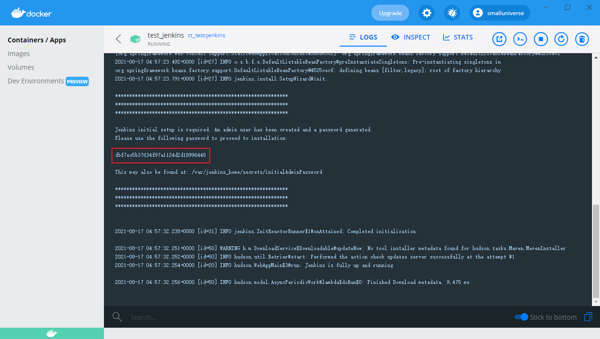

> 如果删除容器再重新执行命令，你会发现可能这里就没有密码提示，这是因为我们在命令中进行了docker卷的映射，第一次初始化容器后即使是删除了容器，我们之前的配置也会保留下来

### 4 | 登录Jenkins

启动好镜像我们就可以进行配置了，Jenkins是一个web服务，所以我们直接使用web端口访问即可。

由于我们上面docker配置的是1080端口，去访问`http://localhost:1080`即可，如果是云服务器，还需要开放**安全组**的1080端口

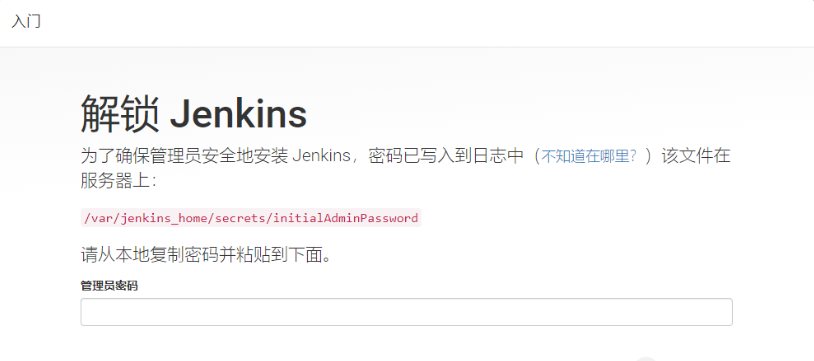

默认的登录密码放置在`/var/jenkins_home/secrets/initialAdminPassword`里，可以进入容器内查看

进入容器查看：

```sh
Administrator@DESKTOP-TVEH0VN /cygdrive/d/env_local/docker_mount
$ docker exec -it test_jenkins bash
root@396bfac65bc1:/# cat /var/jenkins_home/secrets/initialAdminPassword
dbf7ec5b37634f97a1124d2d18996448
root@396bfac65bc1:/#
```

输入密码后，选择安装推荐的插件即可

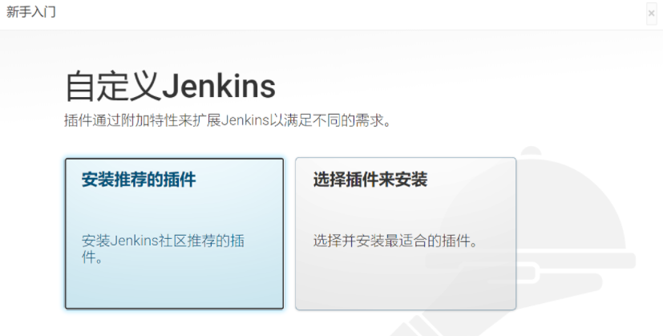

Docker容器的方式启动jenkins还是比较好的，软件安装速度比较快，应该是默认使用了国内镜像

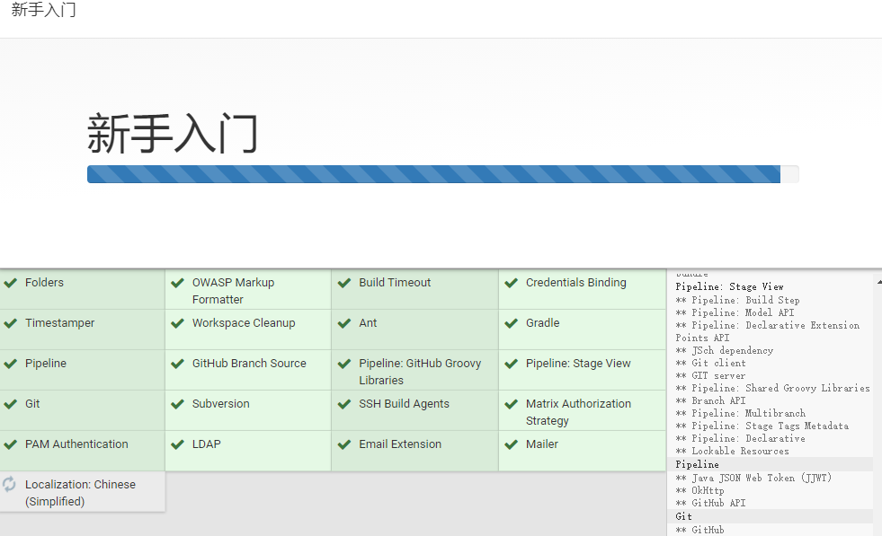

### 5 | 创建一个管理员用户

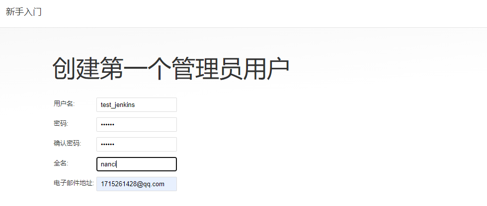

> 实例配置，暂时默认即可

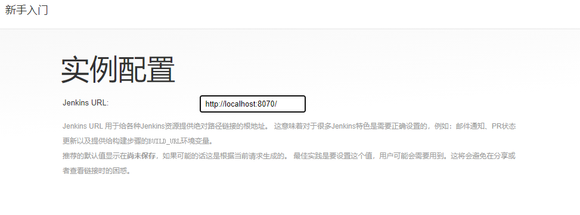

### 6 | 进入到jenkins

最后成功进入到jenkins中

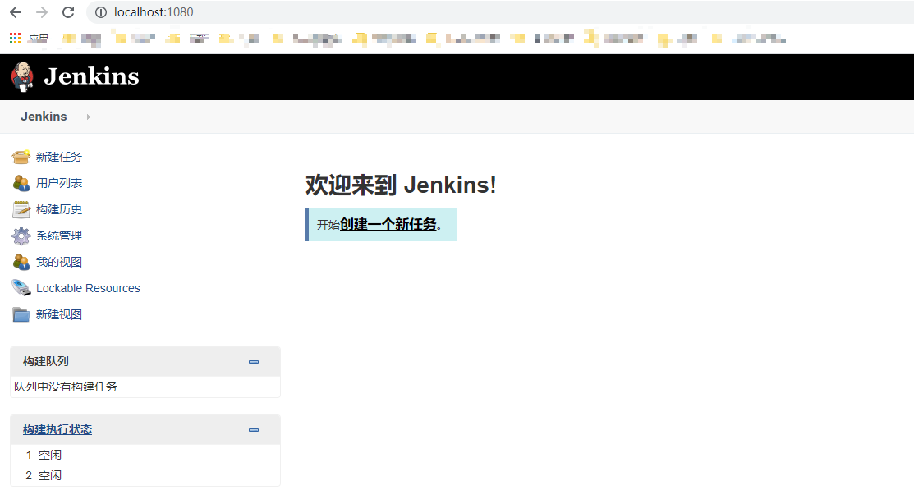


## 三、安装插件及相关配置

### 1 | 安装插件

一个是**publish over ssh**，一个是**Maven Integration**

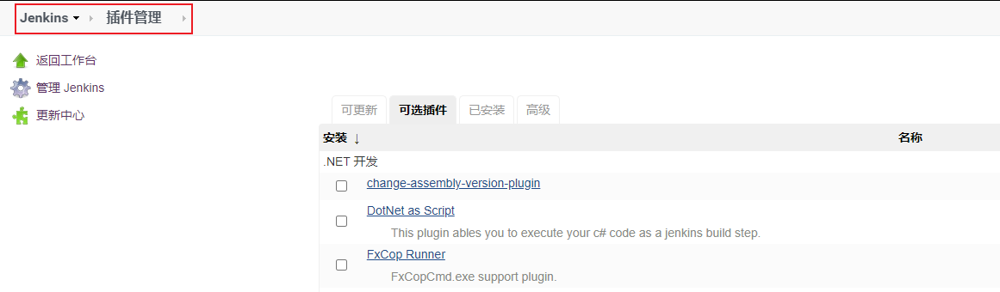


安装插件完成后我们需要配置Maven环境和JDK环境

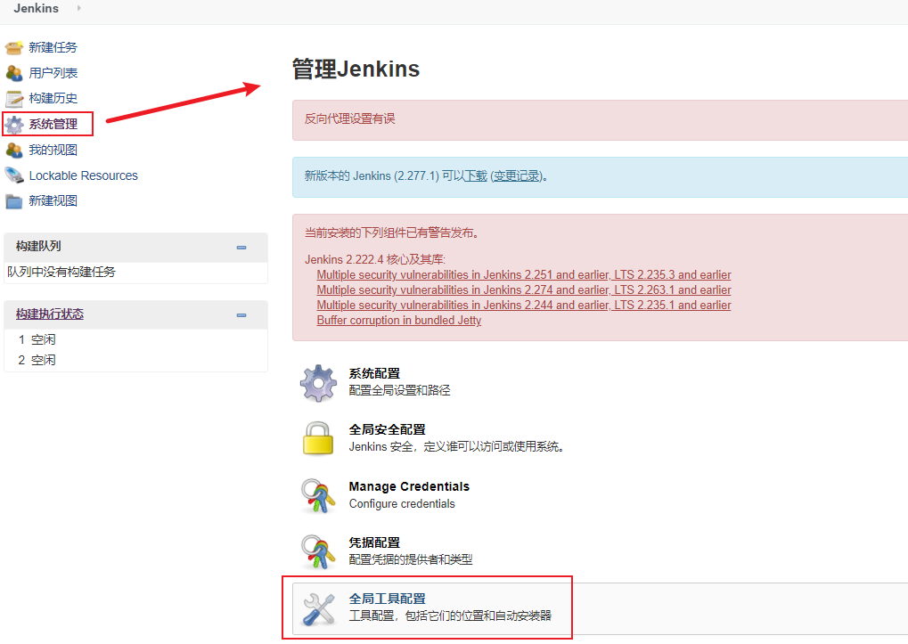

点击全局配置后进行JDK和Maven的配置

### 2 | 配置JDK

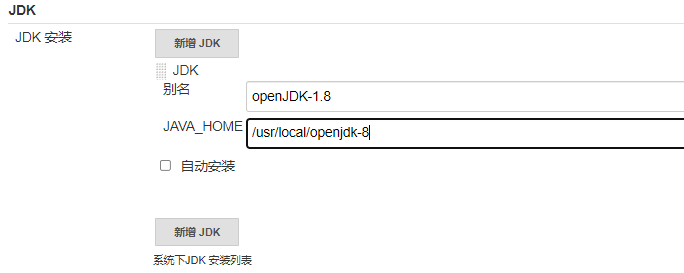


### 3 | 配置Maven

配置maven为刚才挂载的maven路径，也就是`/usr/local/maven`

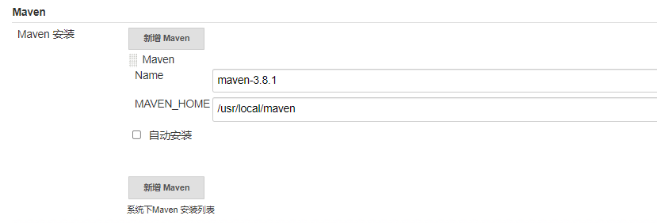
