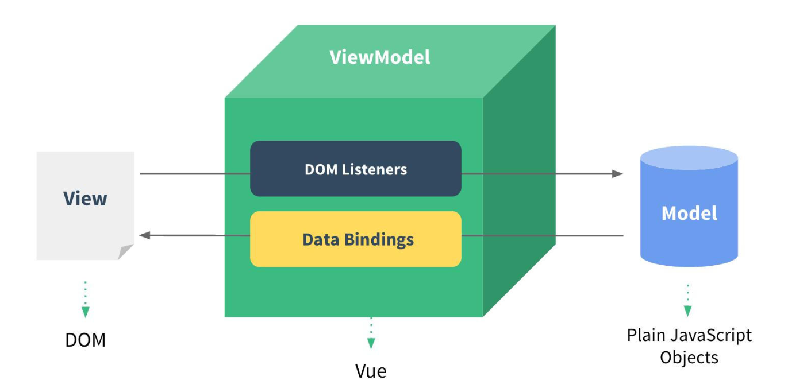
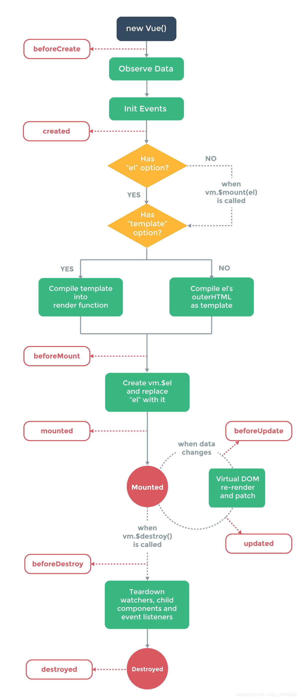

# Vue2.x

## 一、Vue 的基本认识

Vue官网：https://cn.vuejs.org/

渐进式 `JavaScript` 框架，用来动态构建用户界面

> 渐进式：渐-->组件   进--->添加 
>
> Vue开发使用Vue的核心库+Vue插件，宣传渐进式这样的概念，听起来高大上了很多，其实和react框架一样，都是基于组件式的开发

### 01 | 特点

1. 遵循 MVVM 模式
   1. 编码简洁，体积小，运行效率高，适合 移动/pc 端开发
   2. 它本身只关注 UI，可以轻松引入 vue 插件或其它第三方库开发项目

### 02 | 与其他前端 JS 框架的关联

1. 借鉴 angular 的模板 和 数据绑定技术
2. 借鉴 react 的组件化 和 虚拟 DOM 技术

### 03 | Vue 扩展插件

1. vue-cli：vue 脚手架
2. vue-resource(axios)：ajax 请求
3. vue-router：路由
4. vuex：状态管理（它是 vue 的插件但是没有用 vue-xxx 的命名规则）
5. vue-lazyload：图片懒加载
6. vue-scroller：页面滑动相关
7. mint-ui：基于 vue 的 UI 组件库（移动端）
8. element-ui：基于 vue 的 UI 组件库（PC 端）

## 二、Vue 的基本使用

### 01 | 编码

1. 引入Vue.js

2. 创建 Vue 对象

   el：指定根 element (选择器)

   data：初始化数据(页面可以访问)

3. 双向数据绑定：v-model

4. 显示数据：`{{`**xxx**`}}`

5. 理解 vue 的 mvvm 实现

```vue
<!--template模板-->
<div id="test">
  <input type="text" v-model="msg"><br><!--指令-->
  <input type="text" v-model="msg"><!--指令-->
  <p>hello {{msg}}</p><!--大括号表达式-->
</div>

<script type="text/javascript" src="../js/vue.js"></script>
<script type="text/javascript">
  const vm = new Vue({ // 配置对象 options
    // 配置选项(option)
    el: '#test',  // element: 指定用vue来管理页面中的哪个标签区域
    data: {
      msg: 'atguigu'
    }
  })
</script>
```

### 02 | 理解MVVM



MVVM --> model-view-viewModel

model：模型，数据对象（data）

view：视图，模板页面

viewModel：视图模型（vue 的实例）

MVVM 本质上是 MVC （Model-View- Controller）的改进版。即模型-视图-视图模型。

`模型`指的是后端传递的数据，`视图`指的是所看到的页面。

`视图模型`是 mvvm 模式的核心，它是连接 view 和 model 的桥梁。它有两个方向：

1. 将`模型`转化成`视图`，即**将后端传递的数据转化成所看到的页面**。实现的方式是：数据绑定。
2. 将`视图`转化成`模型`，即**将所看到的页面转化成后端的数据**。实现的方式是：DOM 事件监听。

这两个方向都实现的，我们称之为数据的**双向绑定**。


## 三、模板语法

### 01 | 模板的理解

1. 动态的 html 页面
2. 包含了一些 JS 语法代码：
   1. 双大括号表达式
   2. 指令（以 v- 开头的自定义标签属性）

### 02 | 双大括号表达式

1. 语法：` {{`**exp**`}} `
2. 功能：向页面输出数据
3. 可以调用对象的方法

**指令一：强制数据绑定**

功能：指定变化的属性值

完整写法：`v-bind:xxx='yyy`' //yyy会作为表达式解析执行

简洁写法：`:xxx='yyy'`

**指令二：绑定事件监听**

功能：绑定指定事件名的回调函数

完整写法：`v-on:keyup='xxx'`，`v-on:keyup='xxx(参数)'`，`v-on:keyup.enter='xxx'`

简洁写法：`@keyup='xxx'`，`@keyup.enter='xxx'`

## 四、计算属性和监视

### 01 | 计算属性

1. 在 `computed `属性对象中定义计算属性的方法
2. 在页面中使用` {{`**方法名**`}} `来显示计算的结果

### 02 | 监视属性

1. 通过 vm 对象的 `$watch()` 或 `watch` 配置 来监视指定的属性
2. 当属性变化时，回调函数自动调用，在函数内部进行计算

### 03 | 计算属性高级

1. 通过 `getter/setter `实现对属性数据的计算读取 和 变化监视
2. 计算属性存在缓存，多次读取只执行一次 getter 计算

## 五、class 与 style 绑定

1. 在应用界面中, 某个(些)元素的样式是变化的
2. class/style 绑定就是专门用来实现动态样式效果的技术

### 01 | class 绑定：

`:class='xxx'`

1) 表达式是字符串: 'classA'

2) 表达式是对象: {classA:isA, classB: isB}

3) 表达式是数组: ['classA', 'classB']


### 02 | style 绑定：

`:style="{ color: activeColor, fontSize: fontSize + 'px' }"`

其中 activeColor/fontSize 是 data 属性

## 六、条件渲染指令

1. `v-if` + `v-else`
2. `v-show`

> Tip:如果需要频繁切换 `v-show `较好。当条件不成立时, v-if 的所有子节点不会解析。


## 七、列表渲染

列表显示指令：

- 数组：v-for/index
- 对象：v-for/key

### 01 | 列表的更新显示

1.**删除item**：变更方法，顾名思义，会变更调用了这些方法的原始数组。

```js
// 两种更新方式
this.persons[index] = newP  
// 这样只更新persons中的某一个数据，vue根本就不知道，视图不会更新
this.persons.splice(index, 1, newP)
// splice方法被 Vue 将进行了包裹，所以也将会触发视图更新。
```

这些被包裹过的方法包括：

- `push()`
- `pop()`
- `shift()`
- `unshift()`
- `splice()`
- `sort()`
- `reverse()`

2.**替换item**：相比之下，也有非变更方法，例如 `filter()`、`concat()` 和 `slice()`。它们不会变更原始数组，而**总是返回一个新数组**。当使用非变更方法时，可以用新数组替换旧数组。

```js
let fpersons = persons.filter(
  p => p.name.includes(searchName)
)
```

### 02 | 列表的高级处理：

列表过滤

列表排序

```js
fpersons.sort(function (p1, p2) {
  if (orderType === 1) { // 降序
    return p2.age - p1.age
  } else { // 升序
    return p1.age - p2.age
  }
})
```


## 八、事件处理

### 01 | 绑定监听

1) v-on:xxx="fun"

2) @xxx="fun"

3) @xxx="fun(参数)"

4) 默认事件形参: event， 隐含属性对象:

`$event` 就是当前触发事件的元素，即使不传 `$event`，在回调函数中也可以使用 event 这个参数。

### 02 | 事件修饰符

事件修饰符用来控制事件的==冒泡==和==默认行为==。

1) .prevent : 阻止事件的默认行为`event.preventDefault()`

2) .stop : 停止事件冒泡`event.stopPropagation()`

```vue
<!-- 阻止事件冒泡 -->
<div id="big" @click="test">
    <div id="small" @click.stop="test2"></div>
</div>

<!-- 提交事件不再重载页面 -->
<form v-on:submit.prevent="onSubmit"></form>

<!-- 点击事件将只会触发一次 -->
<a v-on:click.once="doThis"></a>
```

### 03 | 按键修饰符

1) .keycode : 操作的是某个 keycode 值的键

2) .keyName : 操作的某个按键名的键(少部分)

```vue
<!-- 任何按键按下都会触发回调函数 -->
<textarea @keyup="testKeyup"></textarea>

<!-- 下面的两种写法效果是一致的 -->
<!-- 使用按键码，回车键的keyCode是13 -->
<textarea @keyup.13="testKeyup"></textarea>
<!-- 使用按键修饰符，因为回车键比较常用，所以vue为他设置了名称，可以直接使用enter来代替 -->
<textarea @keyup.enter="testKeyup"></textarea>
```


## 九、表单输入绑定

使用 v-model 对表单数据自动收集

1) text/textarea

2) checkbox

3) radio

4) select

## 十、vue 实例生命周期

**生命周期流程图**



### 01 | vue 生命周期分析

1. 初始化显示
   - beforeCreate()
   - created()
   - beforeMount()
   - mounted()
2. 更新显示：this.xxx = value
   - beforeUpdate()
   - updated()
3. 销毁 vue 实例：vm.$destroy()
   - beforeDestory()
   - destoryed()

### 02 | 常用的生命周期方法

1. created()/mounted()：发送 ajax 请求，启动定时器等异步任务
2. beforeDestroy()：做收尾工作，如：清除定时器

## 十一、过滤器

### 01 | 理解过滤器

1) 功能: 对要显示的数据进行特定格式化后再显示

2) 注意: 并没有改变原本的数据, 可是产生新的对应的数据

### 02 | 定义和使用过滤器

定义过滤器：

```js
Vue.filter(filterName, function(value[,arg1,arg2,...]){ 
    // 进行一定的数据处理 
    return newValue 
}) 
```

使用过滤器 ：

`<div>{{myData | filterName}}</div>`

`<div>{{myData | filterName(arg)}}</div>`

其中，myData 会作为 value 传入 filter 中。

## 十二、内置指令与自定义指令

### 01 | 常用内置指令

1) v-text : 更新元素的 textContent

2) v-html : 更新元素的 innerHTML

3) v-if : 如果为 true, 当前标签才会输出到页面

4) v-else: 如果为 false, 当前标签才会输出到页面

5) v-show : 通过控制 display 样式来控制显示/隐藏

6) v-for : 遍历数组/对象

7) v-on : 绑定事件监听, 一般简写为@

8) v-bind : 强制绑定解析表达式, 可以省略 v-bind

9) v-model : 双向数据绑定

10) ref : 指定唯一标识, vue 对象通过$els 属性访问这个元素对象

11) v-cloak : 防止闪现, 与 css 配合: [v-cloak] { display: none }

### 02 | 自定义指令

el：指令所在的标签对象

binding：包含指令相关数据的容器对象

1) 注册全局指令 ：

```js
Vue.directive('my-directive', function(el, binding){ 
    el.innerHTML = binding.value.toupperCase() 
}) 
```

2) 注册局部指令 ：

```js
directives: {     
    'my-directive'(el, binding) { 
        el.innerHTML = binding.value.toupperCase()     
    } 
} 
```

3) 使用指令 ：v-my-directive='xxx'

（binding.value 就是 xxx 的值）
